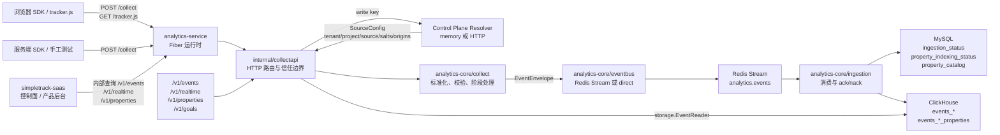

# analytics-core 与 analytics-service 源码解读

本文解读范围：

- `src/analytics-core`：SimpleTrack 分析数据面的核心库，负责采集协议标准化、事件消息契约、队列抽象、入库处理、ClickHouse/MySQL 存储适配、Events/Realtime 查询计划。
- `src/analytics-service`：SimpleTrack 分析运行时服务，负责 HTTP 路由、write key 解析、control-plane 配置解析、CORS/来源校验、tracker.js 输出、Redis/ClickHouse/MySQL 运行时装配、内部查询 API。

一句话理解：`analytics-service` 是面向外部 HTTP 和部署配置的运行时壳，`analytics-core` 是不依赖 HTTP 框架的分析数据管道内核。

## 0. 当前同步基线

本目录已同步到 2026-05-10 的 P1 收口状态。源码引用基线：

| 子仓 | commit id | 说明 |
| --- | --- | --- |
| `src/analytics-core` | `f84024acfab8eb7fd5c00019e7571e0070a1ae51` | P1 数据管道、`visit_id` 持久化、Events/Realtime query builder、P1.5 query evidence、property catalog 基础契约、cataloging writer、source-scoped catalog reader、Goal count read-side 契约、builder-only benchmark、真实 ClickHouse EventReader / BatchWriter benchmark、Redis Stream publish / subscribe+ack benchmark、`collect.Handler` 热路径 benchmark、GORM `CreateInBatches` 对照 benchmark、读侧优化引入门槛策略、ClickHouse explain 证据、limit / offset / time window 查询形状证据，以及 value-free property filter shape evidence 均已收口；`QueryEvidence()` 已补快照语义；`collect.ValidateEventName` 现在有 accepted/rejected contract samples，和 SaaS Goal 校验样例一一对齐；最新又把 typed property filters 收口到 query-builder guardrail：必须显式带 `from/to`，且 direct fact-table 查询窗口默认不超过 7 天；历史章节内保留早期 commit 引用作为当时源码证据 |
| `src/analytics-service` | `6f6f74278c415f50d50373a1f21056aaeb602a12` | Fiber runtime、`/collect`、`/tracker.js`、内部 `/v1/realtime` / `/v1/events` / `/v1/properties` / `/v1/goals`、HTTP resolver、readback API、ingestion 属性目录运行时装配、property metadata readback、Goal count readback、query shape evidence 透出、Goal 服务层回归，以及 source-scoped `readback_policy` fail-closed 路由控制均已收口；`property_filters` 只透出 scope/name/value_type/operator，不返回属性值；pressure 仅作为 read-side triage 桶公开；最新又用真实 `analytics-core` query builder 把 typed property filter 的 7 天窗口护栏锁到 `/v1/events` handler 回归 |
| `src/simpletrack-saas` | `ffdb254b917292bde4a2b1bb2e068cb2165cdd71` | runtime-source API、Websites 控制面、Realtime/Events/Goals server-side readback helper、Events 属性目录读回、filter builder 接入、Goal 数据模型、并发唯一约束回归、`duplicate_event` 冲突映射、Goals readback UI 的 true no-data / service failure 状态拆分、Goal event-name contract samples、Goal readback fan-out 的 25 条上限、runtime-source `readback_policy` 显式契约，以及 authenticated readback 页面 selector / 空态 / 错误态收口均已完成；最新又把 Next dev `allowedDevOrigins` 与 Better Auth loopback trusted origins 收口到共享 helper，真实验证 `localhost:3005` 与 `127.0.0.1:3005` 都能完成登录跳转；`ffdb254` 进一步把 Websites 页面 UI 收口为紧凑来源行 + write key 面板 + accordion 设置区，并补上编辑成功/失败后重新展开目标来源；目标 Vitest（115 tests）、type-check、oxfmt、DeepSeek 代码片段审查 `APPROVE` 和 Codex native verifier `PASS` 均已完成 |

P1 当前结论：

- `/collect` 写入链路、Redis Stream、ingestion、ClickHouse event / `_properties` 表、Realtime / Events 读回链路已经形成闭环。
- `visit_id` 是 canonical analytics visit key，也就是分析口径里的“一次访问”稳定主键：collect 写入前确定，入库存储，Realtime / Events 直接读取，不再做 readback 临时派生。
- `analytics-service` 的 HTTP 入口是 Fiber v3；`analytics-core/collect` 仍保持框架无关。
- `/v1/events`、`/v1/realtime`、`/v1/properties` 和 `/v1/goals` 是默认内部 readback 路径；Events / Realtime / Goals 可分别通过 `ANALYTICS_SERVICE_EVENTS_PATH`、`ANALYTICS_SERVICE_REALTIME_PATH`、`ANALYTICS_SERVICE_GOALS_PATH` 改路由。
- `readback_policy` 现在是 SaaS control plane 明确输出的 runtime-source 字段：analytics-service 会在 query token、write key、origin 校验后按 route fail closed；当策略缺失或对应路由为 false 时，`/v1/realtime`、`/v1/events`、`/v1/properties`、`/v1/goals` 返回 `403 readback is disabled`，不会进入 `EventReader` 或属性目录 reader。
- `analytics-service` 的 readback 响应现在会透出 `query_evidence`，帮助判断 query family、read path、optimization、effective limit、offset、time lower/upper bound、time window、过滤数量、属性表参与情况、value-free property filter shapes 和初始 pressure 分档；其中 `pressure` 只是 triage 桶，不是 SLA，也不是自动扩缩容信号。它们来自 `analytics-core` 的 `EventQueryPlan.QueryEvidence()`，不是 SQL 文本。
- `analytics-core` 现在把 typed property filters 进一步收口到 query-builder guardrail：属性过滤必须显式带 `from/to`，并且在 direct fact-table 路径上默认只允许 7 天内窗口。更宽的 property 历史窗口要先回到实施决策评审，而不是由 handler 或页面直接放开。
- `analytics-service` 现在也有 service-boundary regression 来守住这条护栏：`/v1/events` handler 测试不靠 stub 返回，而是把 service 映射后的 `EventListQuery` 送进真实 `analytics-core` ClickHouse query builder；因此 7 天整窗口会带着 `query_evidence` 正常通过，8 天属性过滤窗口会稳定返回 core planner 的 `400`，避免后续 service 或 SaaS 改动绕开真正的读侧约束。
- 更复杂的聚合分析、Breakdown / Compare / Funnels / Journeys、salt 轮换、Sessions 专页和 retention 产品化放 P1.5/P2。
- P1.5 ClickHouse 读侧优化采用长期分层路线：先做属性治理和 query plan 约束，保持 `EventQueryBuilder` / `EventReader` 为唯一读侧入口；projection 只用于热点明细路径，materialized view / 小时聚合表用于稳定指标和趋势查询。
- 读侧规范已经固化到 `simpletrack/docs/实施决策/analytics-core实施方案.md`：ClickHouse 物理结构只能留在 `analytics-core/storage/clickhouse` adapter 内，service handler 和 SaaS 页面不得拼 SQL 或物理表名。
- 当前第一步实现是 `readSidePolicy`：在 ClickHouse query builder 内统一管理 query limit、filter cap 和 property allowlist，外部 `storage.EventQueryBuilder` / `storage.EventReader` 接口不变。
- 当前第二步实现是 `EventQueryEvidence`：`storage.EventQueryPlan.QueryEvidence()` 会暴露 query family、read path、optimization、effective limit、offset、time lower/upper bound、time window、filter count、property table usage、value-free property filter shapes 和 sort evidence，用来支持后续读侧取舍；`pressure` 只是这组证据的派生分档，当前分为 low / medium / high 三档。`QueryEvidence()` 返回的是快照，slice-backed `PropertyFilters` 不允许被调用方反向修改计划内证据。
- 当前第三步验证已经补到真实依赖执行层：`analytics-core` 新增 opt-in `BenchmarkEventReaderClickHouseExecution`，用真实本地 ClickHouse、路由事件表和属性表验证短窗口 Realtime、宽时间窗 Realtime、recent-window Events、wide-window Events、recent-window typed property Events 和 wide-window typed property Events 六种读形状的稳定性；新增 `BenchmarkBatchWriterClickHouseExecution`，验证当前 `BatchWriter.WriteEvent` 单事件 native batch 写入热路径；新增 `BenchmarkGORMCreateInBatchesClickHouseExecution`，用同样的 route + JSON marshal + 单事件 insert 边界对照 GORM；新增 `BenchmarkNativePrepareBatchRowsClickHouseExecution` 与 `BenchmarkGORMCreateInBatchesRowsClickHouseExecution`，用 100 行批量写入对比 native `PrepareBatch` 与 GORM `CreateInBatches`；新增 `BenchmarkBusPublish` 和 `BenchmarkBusSubscribeAck`，验证 Redis Stream publish 与 subscribe/decode/ack 成本；新增 `BenchmarkHandlerHandleNormalizePublish`、`BenchmarkHandlerHandleIdentityStages` 和 `BenchmarkHandlerHandleIdentityAndClientEnrichment`，验证不含 Redis 的 collect 标准化、identity resolver 和 client enrich 热路径成本。
- 当前第四步把读侧优化引入门槛落成 `analytics-core` 仓库内策略文档：新增 projection、materialized view 或小时聚合表前，必须先给出产品能力、`QueryEvidence`、benchmark 数据、预期数据量、写入影响和回归计划；`pressure=high` 只能作为 triage 信号，不能单独作为新增物理结构的依据。
- 当前第五步把 query shape evidence 补全到代码契约和服务响应：`analytics-core` 生成 effective limit、offset、time lower/upper bound 和 bounded time window；`analytics-service` 的内部 readback API 与 OpenAPI 透出这些字段，后续评审 projection / MV / 小时聚合表时不用从 SQL 字符串或 URL 参数反推查询形状。
- 当前第六步记录真实 ClickHouse reader benchmark 基线：2026-05-08 到 2026-05-09 在本机 `clickhouse/clickhouse-server:25.3` 上执行 `BenchmarkEventReaderClickHouseExecution`，10k 行下 low realtime 约 8.6-10.4ms/op，medium scalar events 约 8.6-9.7ms/op，high property events 约 15.2-16.3ms/op；100k 行 pressure run 两轮下 high property 稳定在约 29.8-34.2ms/op；500k 行复测后，短窗口 `low_realtime_recent_window` 稳定在约 7.9-9.0ms/op，宽时间窗 `low_realtime_wide_since` 约 37.4-54.7ms/op，recent-window scalar Events 约 8.2-9.0ms/op，wide-window scalar Events 约 40.3-42.1ms/op，recent-window typed property Events 约 21.4-23.4ms/op，wide-window typed property Events 约 43.0-44.1ms/op；详见 [read-side-benchmark-baseline.md](read-side-benchmark-baseline.md)。
- 当前第七步把 ClickHouse explain 证据纳入仓库工作流：`analytics-core` 新增 opt-in `TestEventReaderClickHouseExplain`，复用 reader benchmark 的同一套 routed table fixture 和 query plan，直接记录各类读形状的 `EXPLAIN indexes = 1` 输出；当前结论是短窗口 Realtime 与 recent-window Events 在 500k fixture 下只读 `Granules: 2/62`，wide-since Realtime 和 wide-window Events 压力查询读 `Granules: 62/62`；high property 路径已出现 value-free property filter shape、`CreatingSets` 和 3 个 `event_id in 5000-element set` 条件，但这仍然只是后续评审 projection / MV / 小时聚合表的证据，不是立即触发器。
- 代码证据：`EventQueryEvidence` / `EventPropertyFilterEvidence` 位于 `仓库: analytics-core, commit: b693d62, file: storage/event_query.go:84-94` 和 `storage/event_query.go:149-163`；`NewEventQueryPlan` / `QueryEvidence()` 的 snapshot copy 位于 `storage/event_query.go:181-203`，不可变性回归和 value-free example 位于 `storage/event_query_test.go:5-39`、`storage/event_query_example_test.go:9-33`；ClickHouse evidence 生成位于 `仓库: analytics-core, commit: b693d62, file: storage/clickhouse/query_builder.go:390-451`；read-side shape benchmark 位于 `仓库: analytics-core, commit: b693d62, file: storage/clickhouse/query_builder_benchmark_test.go:1-222`；真实 ClickHouse EventReader benchmark 的 Realtime / Events shape 纠偏位于 `仓库: analytics-core, commit: caf314d, file: internal/e2e/clickhouse_reader_benchmark_test.go:81-215`，真实 plan 时间边界断言位于 `internal/e2e/clickhouse_reader_benchmark_test.go:852-884`；真实 ClickHouse BatchWriter benchmark 位于 `仓库: analytics-core, commit: 26762c6, file: internal/e2e/clickhouse_writer_benchmark_test.go:1-149`；GORM / native 写入对照 benchmark 位于 `仓库: analytics-core, commit: c868b5d, file: internal/e2e/clickhouse_writer_benchmark_test.go:102-492`；Redis Stream benchmark 位于 `仓库: analytics-core, commit: 0bbfd08, file: eventbus/redisstream/redisstream_benchmark_test.go:1-235`；collect handler benchmark 位于 `仓库: analytics-core, commit: d1f0516, file: collect/handler_benchmark_test.go:16-224`；pressure triage、`property_filters` 响应转换、OpenAPI 描述与测试位于 `仓库: analytics-service, commit: 64b0bda, file: internal/collectapi/query.go:83-106`、`internal/collectapi/query.go:671-710`、`api/openapi.yaml:466-538` 和 `internal/collectapi/handler_test.go:573-668`。
- service 边界护栏证据：`仓库: analytics-service, commit: 6f6f742, file: internal/collectapi/handler_test.go:973-1031` 覆盖 `/v1/events` 的 7 天 typed property filter success / 8 天 rejection；`internal/collectapi/handler_test.go:1847-1950` 定义 `corePlanningQueryReader`，把 handler 映射后的 `EventListQuery` 送进真实 `analytics-core` ClickHouse query builder，只做 planning 不做本地 ClickHouse 执行，从而验证 service boundary 没有绕过 core guardrail。
- 读侧优化策略证据：`仓库: analytics-core, commit: 1e65684, file: docs/read-side-optimization-policy.md:12-33` 定义必须提交的证据材料，并把 explain-plan evidence 纳入强制项；`docs/read-side-optimization-policy.md:40-64` 定义 direct fact table、projection、materialized view、小时聚合表的适用边界和初始门槛；`docs/read-side-optimization-policy.md:78-118` 记录标准测试、explain、读侧 benchmark 和写入对照 benchmark 命令。
- 查询形状证据：`仓库: analytics-core, commit: b693d62, file: storage/event_query.go:149-163` 定义 evidence 字段；`storage/clickhouse/query_builder.go:390-451` 从归一化 query plan 填充 effective limit、offset、时间窗和 value-free property filter shape；`storage/clickhouse/query_builder_test.go:79-99`、`139-160`、`403-459` 覆盖 Events、Realtime 和复杂属性查询；`storage/clickhouse/query_builder_benchmark_test.go:90-222` 把 benchmark 场景绑定到新的 evidence 形状。`仓库: analytics-service, commit: 64b0bda, file: internal/collectapi/query.go:83-106` 透出 readback 响应字段；`api/openapi.yaml:397-538` 同步 OpenAPI schema；`internal/collectapi/handler_test.go:404-414` 和 `573-668` 验证序列化后的 Realtime / Events evidence。
- explain 证据入口：`仓库: analytics-core, commit: caf314d, file: internal/e2e/clickhouse_reader_benchmark_test.go:221-356` 定义 `TestEventReaderClickHouseExplain` 六个场景并记录 Realtime / Events eligible row evidence；`internal/e2e/clickhouse_reader_benchmark_test.go:750-772` 说明 explain 直接复用 sealed query plan SQL 和 bound args，不额外拼装第二套 SQL。
- 当前第四步实现是属性字典基础契约和 ingestion 装配：`PropertyCatalogEntry` / `PropertyCatalog` 把 event/user property 的 source-scoped selector、value type、first_seen_at 和 last_seen_at 抽成治理模型，MySQL adapter 落到 `property_catalog` 初始化表；`PropertyCatalogingEventWriter` 在主事件写入成功后做 replay-safe metadata upsert，不记录会被重试放大的计数字段。
- 代码证据：storage-neutral catalog 位于 `仓库: analytics-core, commit: 423d58c, file: storage/property_catalog.go:10-38`；MySQL adapter 位于 `仓库: analytics-core, commit: 423d58c, file: storage/mysql/property_catalog.go:13-91`；cataloging writer 位于 `仓库: analytics-core, commit: e775e3e8764378261ce94cbd3a8d38dd3d3c0410, file: storage/property_cataloging_writer.go:11-70`；运行时装配位于 `仓库: analytics-service, commit: 14f8aaabb80e52de4849704671124229ba3be339, file: internal/runtime/worker.go:81-127`；启动期 MySQL 表校验位于 `仓库: analytics-service, commit: 14f8aaabb80e52de4849704671124229ba3be339, file: internal/runtime/worker.go:130-151`。
- 当前第八步把属性字典从“只写入”补齐为“可读取”：`analytics-core` 新增 `PropertyCatalogReader` / `PropertyCatalogQuery` 和 MySQL `ListPropertyCatalogEntries`，读侧强制带 tenant/project/source 边界并校验 scope/value type 枚举；`simpletrack-anaysitics-service` 新增内部 `/v1/properties`，复用 query token 和 write key source resolution，返回 source-scoped property metadata。
- 属性字典读回证据：`仓库: analytics-core, commit: b693d62, file: storage/property_catalog.go:31-55` 定义 query/reader/writer 分离契约；`storage/property_catalog.go:185-280` 定义 entry/query 校验，拒绝非 event/user 和非 null/string/number/bool 枚举；`storage/mysql/property_catalog.go:108-146` 执行 source-scoped list query；`storage/mysql/property_catalog.go:165-180` 将 MySQL row 转回 storage-neutral entry 并再次校验。`仓库: analytics-service, commit: 64b0bda, file: internal/collectapi/handler.go:30-41` 定义 `/v1/properties` 路由和 catalog reader 依赖；`internal/collectapi/query.go:240-285` 处理 property catalog readback；`internal/runtime/runtime.go:148-175` 装配 MySQL catalog reader，且读侧不依赖写侧 `PropertyCataloging` flag；`api/openapi.yaml:234-264` 和 `api/openapi.yaml:436-466` 记录 OpenAPI route/schema。
- 当前第九步把属性目录读回接入 SaaS Events filter builder：`simpletrack-saas` 新增 server-only `getEventsPropertyCatalog`，Events 页面在服务端并行读取 `/v1/events` 和 `/v1/properties`，再把 catalog items 传给 client filter controls。浏览器只拿到已过滤后的属性元数据，不接触内部 query token；如果 `/v1/properties` 返回非法字段，SaaS helper 会显示 service error，避免把契约漂移伪装成空字典。随后 `resolveCatalogSelectionPatch` 把 catalog 选中行为抽成纯函数：选中已观测属性时同步 scope/type，null 属性强制 `eq` 且清空 value；手工输入未命中 catalog 时保留 freeform 属性名。
- SaaS filter builder 证据：`仓库: simpletrack-saas, commit: a48ce44, file: apps/saas/modules/simpletrack/lib/analytics-readback-core.ts:300-360` 定义 `/v1/properties` readback helper 和 invalid contract fail-soft；`apps/saas/modules/simpletrack/lib/analytics-readback.ts:110-139` 定义 server-only wrapper；`apps/saas/app/(authenticated)/(main)/(organizations)/[organizationSlug]/events/page.tsx:77-101` 并行读取 Events 与 property catalog；`apps/saas/app/(authenticated)/(main)/(organizations)/[organizationSlug]/events/page.tsx:185-189` 把 catalog items 传入筛选控件；`apps/saas/modules/simpletrack/components/events-property-filter-controls.tsx:52-60` 渲染属性建议 datalist；`apps/saas/modules/simpletrack/components/events-property-filter-controls.tsx:117-130` 将属性名输入绑定到 catalog suggestions；`apps/saas/modules/simpletrack/components/events-property-filter-controls.tsx:336-381` 将 catalog 选中行为收口到 `resolveCatalogSelectionPatch`。回归证据位于 `apps/saas/modules/simpletrack/lib/analytics-readback-core.test.ts:652-766`、`apps/saas/app/(authenticated)/(main)/(organizations)/[organizationSlug]/readback-pages.test.tsx:268-313` 和 `apps/saas/modules/simpletrack/components/events-property-filter-controls.test.tsx:54-156`。
- 当前第十步把 Goal 最小闭环接入真实读侧：`analytics-core` 新增 `EventCountQuery`、`BuildEventCountQuery`、`CountEvents` 和 evidence-aware count，让 Goal 只做 source-scoped exact count，不在 SaaS 或 service handler 写 ClickHouse SQL；`analytics-service` 新增内部 `/v1/goals`，复用 query token、write key source resolution 和 `collect.ValidateEventName`；`simpletrack-saas` 新增 Goal 数据模型、创建校验、组织内 Goals 页面和 server-only goal readback helper。其后 `simpletrack-saas` commit `9c56e96` 又把 Goal readback fan-out 用 `MAX_WEBSITE_GOALS=25` 同时固化在 Prisma query 和页面 `Promise.all` 两层，避免后续重构把单页 Goals 读回放重新放大成无界线性请求；随后 `simpletrack-saas` commit `9c8ba37` 又把 Realtime / Events / Goals 的 Website selector 文案、Events 重复消息，以及 `4xx` / `5xx` / network failure 的 readback 状态文案收口成更稳定的企业分析控制台呈现。版本标记：`analytics-core` commit `1ea78f3`，`analytics-service` commit `3b8d27c`，`simpletrack-saas` commit `9c8ba37`。此前架构审查中的 `readback_policy` 控制面闭环已经收口完成，剩余 `WATCH` 继续收敛到生成式共享契约、更细粒度内部读权限和 live browser / e2e 全链路验证；更大规模批量 Goal count 放 P1.5/P2。
- Goal 最小闭环证据：`仓库: analytics-core, commit: b820f7e, file: storage/event_query.go:114-123` 定义 `EventCountQuery`；`storage/event_query.go:252-279` 把 count 加入 `EventQueryBuilder` / `EventReader` 契约；`storage/clickhouse/query_builder.go:178-194` 通过同一 `buildFilteredEventsScope` 生成 `count()` plan；`storage/clickhouse/event_reader.go:33-55` 执行 evidence-aware count。`仓库: analytics-core, commit: 1ea78f3, file: collect/request_test.go:81-118` 用 accepted/rejected samples 锁定 `ValidateEventName`，覆盖 digit-first、mixed-case、长度边界和非法前导符号。`仓库: analytics-service, commit: f60ac59, file: internal/collectapi/query.go:260-313` 定义 `/v1/goals` handler；`internal/collectapi/query.go:394-405` 选择 `CountEventsWithEvidence` fallback；`internal/collectapi/handler.go:29-30`、`internal/collectapi/handler.go:103-104`、`internal/collectapi/handler.go:166-173` 定义并注册 Goal 路由；`api/openapi.yaml:234-291` 和 `api/openapi.yaml:491-513` 记录 OpenAPI path/schema。`仓库: simpletrack-saas, commit: 9c56e96, file: packages/database/prisma/queries/goals.ts:4-22` 定义 `MAX_WEBSITE_GOALS` 和数据库层 `take` 上限；`apps/saas/app/(authenticated)/(main)/(organizations)/[organizationSlug]/goals/page.tsx:81-97` 在页面层再次切片并只对前 25 个 Goal 发起 readback；`apps/saas/app/(authenticated)/(main)/(organizations)/[organizationSlug]/readback-pages.test.tsx:505-531` 锁定页面 fan-out 上限；`apps/saas/modules/simpletrack/lib/goal-database.test.ts:159-186` 锁定 Prisma query 的 25 条上限。此前 `仓库: simpletrack-saas, commit: e86ba88, file: packages/database/prisma/queries/goals.ts:23-105` 定义 Goal 创建和并发唯一约束冲突映射；`apps/saas/modules/simpletrack/lib/goal-management.ts:51-103` 定义创建校验；`apps/saas/modules/simpletrack/lib/analytics-readback-core.ts:389-446` 定义 `/v1/goals` server-side readback；`apps/saas/app/(authenticated)/(main)/(organizations)/[organizationSlug]/goals/page.tsx:218-320` 组织 Goals 页面 readback 状态映射，确保 ready/no-data 仍显示 `0`，service failure 显示 `-`。`仓库: simpletrack-saas, commit: 6416a51, file: apps/saas/modules/simpletrack/lib/goal-management.test.ts:44-97` 用同一组样例锁定 Goal event-name 保存前校验。

## 0.1 术语速查

- `ingestion`：指消费 Redis Stream 后把事件真正写入 ClickHouse / MySQL checkpoint / 属性索引的入库层，对应 `analytics-core/ingestion` 和 `analytics-service/internal/runtime/worker.go` 的装配逻辑。它只负责“把已接受事件落库”，不负责 HTTP 路由，也不负责 collect 标准化。
- `canonical analytics visit key`：指分析口径里“一次访问”的稳定主键，也就是 `visit_id`。它在 collect 写入前确定，进入 `EventEnvelope`、ClickHouse event / `_properties` 表和 `EventReader`，不再依赖 readback 临时派生。

## 1. 整体架构图



核心交互关系：

- 浏览器或服务端只提交“事件事实”：`event_name`、`distinct_id`、`properties` 等。
- 租户、项目、数据源这些边界字段最终以 control-plane 的 `SourceConfig` 为准，客户端提交的同名字段会被覆盖。
- `/collect` 成功返回 `202` 的含义是：事件已经通过校验并发布到 EventBus。默认 Redis 模式下，它代表事件已经写入 Redis Stream。
- ingestion worker 从 Redis Stream 消费，先用 MySQL checkpoint 做幂等保护，再写 ClickHouse 事件表和属性表。
- `/v1/events` 与 `/v1/realtime` 是内部读接口，先校验内部 query token，再用 write key 解析到同一个 source 边界，最后走 ClickHouse reader。

## 2. 整体代码结构图

```text
src/
├── analytics-core/
│   ├── collect/
│   │   ├── request.go              # collect.Request 校验、Normalize、正则规则、event_time/received_at 处理
│   │   ├── handler.go              # collect.Handler：标准化后执行 Stage，再 Publish 到 EventBus
│   │   ├── stage.go                # Stage 接口与 HandlerOption
│   │   ├── traffic_filter.go       # bot / 内部 IP 过滤，返回 FilteredError
│   │   ├── enrichment.go           # 从临时 ClientInfo 派生 user_agent/referrer/ip_hash 属性
│   │   ├── session.go              # 缺失 session_id / visit_id 时按时间窗口派生稳定身份
│   │   ├── client.go               # ClientInfo 传输侧临时元数据
│   │   └── httpapi/                # core 内部的 Fiber collect adapter 示例/测试边界
│   ├── contracts/
│   │   └── event.go                # EventEnvelope：collect、queue、ingestion 共用事件契约
│   ├── eventbus/
│   │   ├── eventbus.go             # EventBus、Message、ConsumerGroup 抽象
│   │   ├── redisstream/            # Redis Stream 实现、pending 优先重试、dead-letter
│   │   └── direct/                 # 测试/本地直接总线实现
│   ├── ingestion/
│   │   └── processor.go            # Processor：Subscribe 后调用 EventWriter，错误交给 EventBus retry/nack
│   ├── storage/
│   │   ├── event_writer.go         # EventWriter 与 EventWriteGuard 幂等接口
│   │   ├── event_query.go          # Events/Realtime 查询输入、过滤、排序、返回记录契约
│   │   ├── property.go             # properties/user_properties 扁平化为 typed property rows
│   │   ├── property_indexing_writer.go # 事件写入 + 属性索引组合 writer
│   │   ├── property_catalog.go         # 属性目录治理读写契约
│   │   ├── property_cataloging_writer.go # 事件写入 + 属性目录 upsert 组合 writer
│   │   ├── clickhouse/             # ClickHouse 表路由、DDL、事件写入、属性写入、查询构建与执行
│   │   └── mysql/                  # MySQL checkpoint：事件幂等与属性索引幂等
│   └── internal/e2e/               # collect -> bus -> ingestion -> storage 的端到端测试
└── analytics-service/
    ├── cmd/simpletrack-anaysitics-service/
    │   └── main.go                 # 进程入口，加载配置、启动 runtime、处理信号
    ├── public/
    │   └── tracker.js              # 浏览器采集 SDK 静态资源
    └── internal/
        ├── config/                 # 从环境变量加载运行时配置
        ├── controlplane/           # SourceConfig、memory resolver、HTTP resolver、schema-bound resolver
        ├── collectapi/             # Fiber 路由、collect/query API、认证、CORS、响应格式
        └── runtime/                # Redis/MySQL/ClickHouse/tracker/handler/worker 装配
```

## 3. 模块职责总览

| 模块 | 主要文件 | 功能 | 不负责什么 |
| --- | --- | --- | --- |
| `analytics-service/cmd` | `main.go` | 进程生命周期：加载环境变量、创建 runtime、启动 Fiber app、监听 SIGINT/SIGTERM | 不写业务逻辑，不解析事件 |
| `analytics-service/internal/config` | `config.go` | 环境变量到 `Config` 的映射和启动前校验 | 不连接 Redis/MySQL/ClickHouse |
| `analytics-service/internal/controlplane` | `resolver.go`, `http_resolver.go` | 根据 write key 获取 `SourceConfig`，定义租户/项目/来源/盐/域名/过滤规则 | 不接收事件，不写存储 |
| `analytics-service/internal/collectapi` | `handler.go`, `query.go`, `query_auth.go` | HTTP 路由、write key 优先级、CORS、来源校验、query token、响应 JSON | 不决定 ClickHouse SQL 细节 |
| `analytics-service/internal/runtime` | `runtime.go`, `worker.go` | 装配 Redis EventBus、ClickHouse reader/writer、MySQL guard、ingestion worker | 不改变 core 协议 |
| `analytics-core/collect` | `request.go`, `handler.go`, `stage.go` | 事件标准化、字段校验、预入队阶段处理 | 不依赖 HTTP 框架，不知道 SaaS 控制面 |
| `analytics-core/contracts` | `event.go` | 定义跨 collect、queue、storage 的 `EventEnvelope` | 不做校验 |
| `analytics-core/eventbus` | `eventbus.go`, `redisstream/` | 队列抽象、Redis Stream 发布/消费、ack/nack/dead-letter | 不写 ClickHouse |
| `analytics-core/ingestion` | `processor.go` | 消费 EventBus 消息并调用 `storage.EventWriter` | 不知道 ClickHouse/MySQL 具体实现 |
| `analytics-core/storage` | `event_writer.go`, `event_query.go`, `property.go`, `property_catalog.go` | 存储中立接口、事件查询契约、属性扁平化、属性目录治理读写契约；`EventQueryPlan.QueryEvidence()` 记录读路径与过滤证据 | 不依赖 HTTP 框架或 Redis |
| `analytics-core/storage/clickhouse` | `batch_writer.go`, `query_builder.go`, `event_reader.go`, `schema.go` | ClickHouse 物理表路由、DDL、写入、查询；`query_builder.go` 内部用 `readSidePolicy` 管理 query limit、filter cap 和 property allowlist | 不处理 write key 和 control-plane |
| `analytics-core/storage/mysql` | `ingestion_status_guard.go`, `property_indexing_status_guard.go`, `property_catalog.go` | MySQL 幂等 checkpoint、属性目录 metadata upsert 和 source-scoped 属性目录读取 | 不写分析事件表 |

## 4. 内部功能模块拆解

### 4.1 采集入口模块

入口在 `analytics-service/internal/collectapi/handler.go`：

1. `NewApp` 创建 Fiber app，`registerRoutes` 注册 `/collect`、`/tracker.js`、Realtime / Events 等 route。
2. `handleCollect` 解析 JSON body 到 `collectPayload`。
3. `writeKey` 从 header、Authorization、query、body 中按优先级拿 write key。
4. `Resolver.ResolveSource` 用 write key 找 `SourceConfig`。
5. `SourceConfig.AllowsOrigin` 校验浏览器来源。
6. 客户端提交的 `tenant_id/project_id/source_id/source_type` 被 control-plane 返回值覆盖。
7. 构造 collect stages：流量过滤、客户端信息派生、session 派生、visit 派生。
8. 调用 `analytics-core/collect.Handler.Handle`。

### 4.2 核心标准化模块

入口在 `analytics-core/collect/request.go` 与 `handler.go`：

- `Normalize(request, receivedAt)` 做字段 trim、必填校验、正则校验、属性数量和类型限制、时间字段归一化。
- `Handler.Handle(ctx, request)` 在 Normalize 后执行 stages，然后 `EventBus.Publish`。
- `EventEnvelope` 是 Normalize 的输出，也是 Redis Stream 和 ClickHouse 写入的输入。

### 4.3 预入队 Stage 模块

`collect.Stage` 是一个在入队前处理 envelope 的扩展点：

- `TrafficFilterStage`：根据 user agent、内部 IP、CIDR 判断是否过滤。过滤返回 `FilteredError`，HTTP 层仍返回 `202`，但 `filtered=true`，事件不会进入 EventBus。
- `ClientEnrichmentStage`：把 user agent、referrer、IP hash 派生进 `Properties`。原始 IP 不进入 envelope。
- `SessionResolverStage`：如果客户端没有传 `session_id`，按 `tenant/project/source/distinct_id/event_time bucket` 派生一个稳定 session。
- `VisitResolverStage`：如果客户端没有传 `visit_id`，按服务端 `visit_salt`、时间窗口和最终 `session_id` 派生一个 canonical visit key。

### 4.4 消息队列模块

`analytics-core/eventbus/eventbus.go` 定义：

- `Publish(ctx, EventEnvelope)`：写入一个事件。
- `Subscribe(ctx, ConsumerGroup, Handler)`：按 consumer group 消费消息。
- `Message`：包含队列消息 ID、投递次数、事件 envelope、Ack/Nack 回调。

Redis 实现在 `eventbus/redisstream/redisstream.go`：

- 发布时把 envelope JSON 放到 Redis Stream 字段 `envelope`。
- 消费时先读 pending 消息 ID `0`，没有 pending 再读新消息 `>`。
- handler 成功后 Ack。
- handler 失败后 Nack；超过 `MaxAttempts` 且配置了 dead-letter stream 时，把原 envelope、attempt、consumer、error 等写入死信队列并 Ack 原消息。

### 4.5 入库与幂等模块

`analytics-core/ingestion/processor.go` 只做一件事：

```go
_, err := p.store.WriteEvent(ctx, msg.Envelope)
return err
```

这很关键：processor 不知道 ClickHouse，也不知道 MySQL，只知道 `storage.EventWriter`。

实际写入链路由 service runtime 装配：

- MySQL `IngestionStatusGuard`：用 `tenant_id + project_id + source_id + event_id` 做事件幂等 checkpoint。
- ClickHouse `BatchWriter`：写入事件主表。
- MySQL `PropertyIndexingStatusGuard`：用同一业务 key 做属性索引 checkpoint。
- ClickHouse `PropertyBatchWriter`：写入 typed property 表。
- `PropertyIndexingEventWriter`：把主事件写入和属性写入组合起来。
- MySQL `PropertyCatalog`：记录每个 source 观测到的 event/user property selector 和类型，并提供 source-scoped list readback 给后续 UI filter builder。
- `PropertyCatalogingEventWriter`：把属性目录治理接入 `EventWriter` 链路。主事件或属性索引失败时不写目录；目录写失败时返回错误，让 Redis 重试修复“事件已写入、目录未写入”的部分结果。
- `simpletrack-saas` Events filter builder：服务端通过 `/v1/properties` 读取 source-scoped 属性目录，传给浏览器控件作为字段建议；真正的事件过滤仍走 `/v1/events` 的 repeatable `property_filter`。

### 4.6 查询模块

查询入口在 `analytics-service/internal/collectapi/query.go`：

- `/v1/realtime`：内部 token 认证后，默认查询最近 30 分钟，走 `storage.RealtimeQuery`。
- `/v1/events`：要求显式 `from` 和 `to`，支持 event_name、distinct_id、visit_id、分页、排序、property_filter。
- `/v1/properties`：内部 token 认证后，用 write key 解析同一个 source 边界，再从 MySQL `property_catalog` 读取 event/user property selector、类型和 first/last seen 时间。
- property filter 必须先通过 `SourceConfig.AllowsPropertyFilter`，再传给 analytics-core query builder。

ClickHouse 查询核心在：

- `storage/event_query.go`：查询参数和返回 record 的中立契约。
- `storage/clickhouse/query_builder.go`：构建 SQL plan，但默认 dry-run，不直接执行。
- `storage/clickhouse/event_reader.go`：执行 plan 并把 ClickHouse row 转成 `storage.EventRecord`。

### 4.7 ingestion 模块

`ingestion` 指的是“消费 Redis Stream 后把事件真正写入持久化存储”的入库层，对应代码主要在：

- `analytics-core/ingestion`：消费处理、事件写入、属性索引、checkpoint、重试与 dead-letter。
- `analytics-service` 的 runtime 装配：把 EventBus、MySQL checkpoint、ClickHouse writer 和 processor 串起来。

它只负责把已接受事件落库，不负责 HTTP 路由，也不负责 collect 标准化。

## 5. 继续阅读

- [接口与数据格式](./interfaces-and-formats.md)：HTTP、Redis、MySQL、ClickHouse、control-plane 的交互格式。
- [数据流与处理时序](./data-flow-analysis.md)：关键数据点、处理动作、时序图和数据流图。
