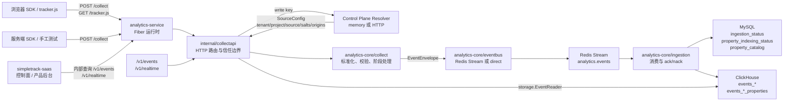

# analytics-core 与 analytics-service 源码解读

本文解读范围：

- `src/analytics-core`：SimpleTrack 分析数据面的核心库，负责采集协议标准化、事件消息契约、队列抽象、入库处理、ClickHouse/MySQL 存储适配、Events/Realtime 查询计划。
- `src/analytics-service`：SimpleTrack 分析运行时服务，负责 HTTP 路由、write key 解析、control-plane 配置解析、CORS/来源校验、tracker.js 输出、Redis/ClickHouse/MySQL 运行时装配、内部查询 API。

一句话理解：`analytics-service` 是面向外部 HTTP 和部署配置的运行时壳，`analytics-core` 是不依赖 HTTP 框架的分析数据管道内核。

## 0. 当前同步基线

本目录已同步到 2026-05-08 的 P1 收口状态。源码引用基线：

| 子仓 | commit id | 说明 |
| --- | --- | --- |
| `src/analytics-core` | `e775e3e8764378261ce94cbd3a8d38dd3d3c0410` | P1 数据管道、`visit_id` 持久化、Events/Realtime query builder、P1.5 query evidence、property catalog 基础契约和 cataloging writer 均已收口；历史章节内保留早期 commit 引用作为当时源码证据 |
| `src/analytics-service` | `14f8aaabb80e52de4849704671124229ba3be339` | Fiber runtime、`/collect`、`/tracker.js`、内部 `/v1/realtime` / `/v1/events`、HTTP resolver、readback API 和 ingestion 属性目录运行时装配均已收口 |
| `src/simpletrack-saas` | `bce33354ae27dcba80e2f1ce77ff7ac2c5ed8765` | runtime-source API、Websites 控制面、Realtime/Events server-side readback helper 均已收口 |

P1 当前结论：

- `/collect` 写入链路、Redis Stream、ingestion、ClickHouse event / `_properties` 表、Realtime / Events 读回链路已经形成闭环。
- `visit_id` 是 canonical analytics visit key，也就是分析口径里的“一次访问”稳定主键：collect 写入前确定，入库存储，Realtime / Events 直接读取，不再做 readback 临时派生。
- `analytics-service` 的 HTTP 入口是 Fiber v3；`analytics-core/collect` 仍保持框架无关。
- `/v1/events` 和 `/v1/realtime` 是默认内部 readback 路径，但可通过 `ANALYTICS_SERVICE_EVENTS_PATH`、`ANALYTICS_SERVICE_REALTIME_PATH` 改路由。
- `analytics-service` 的 readback 响应现在会透出 `query_evidence`，帮助判断 query family、read path、optimization、过滤数量、属性表参与情况和初始 pressure 分档；这些证据来自 `analytics-core` 的 `EventQueryPlan.QueryEvidence()`，不是 SQL 文本。
- 更复杂的聚合分析、Breakdown / Compare / Funnels / Journeys、salt 轮换、Sessions 专页和 retention 产品化放 P1.5/P2。
- P1.5 ClickHouse 读侧优化采用长期分层路线：先做属性治理和 query plan 约束，保持 `EventQueryBuilder` / `EventReader` 为唯一读侧入口；projection 只用于热点明细路径，materialized view / 小时聚合表用于稳定指标和趋势查询。
- 读侧规范已经固化到 `simpletrack/docs/实施决策/analytics-core实施方案.md`：ClickHouse 物理结构只能留在 `analytics-core/storage/clickhouse` adapter 内，service handler 和 SaaS 页面不得拼 SQL 或物理表名。
- 当前第一步实现是 `readSidePolicy`：在 ClickHouse query builder 内统一管理 query limit、filter cap 和 property allowlist，外部 `storage.EventQueryBuilder` / `storage.EventReader` 接口不变。
- 当前第二步实现是 `EventQueryEvidence`：`storage.EventQueryPlan.QueryEvidence()` 会暴露 query family、read path、optimization、filter count、property table usage 和 sort evidence，用来支持后续读侧取舍。
- 代码证据：`EventQueryEvidence` / `QueryEvidence()` 位于 `仓库: analytics-core, commit: ee455ac, file: storage/event_query.go:132-172`；ClickHouse evidence 生成位于 `仓库: analytics-core, commit: ee455ac, file: storage/clickhouse/query_builder.go:388-411`。
- 当前第三步实现是属性字典基础契约和 ingestion 装配：`PropertyCatalogEntry` / `PropertyCatalog` 把 event/user property 的 source-scoped selector、value type、first_seen_at 和 last_seen_at 抽成治理模型，MySQL adapter 落到 `property_catalog` 初始化表；`PropertyCatalogingEventWriter` 在主事件写入成功后做 replay-safe metadata upsert，不记录会被重试放大的计数字段。
- 代码证据：storage-neutral catalog 位于 `仓库: analytics-core, commit: 423d58c, file: storage/property_catalog.go:10-38`；MySQL adapter 位于 `仓库: analytics-core, commit: 423d58c, file: storage/mysql/property_catalog.go:13-91`；cataloging writer 位于 `仓库: analytics-core, commit: e775e3e8764378261ce94cbd3a8d38dd3d3c0410, file: storage/property_cataloging_writer.go:11-70`；运行时装配位于 `仓库: analytics-service, commit: 14f8aaabb80e52de4849704671124229ba3be339, file: internal/runtime/worker.go:81-127`；启动期 MySQL 表校验位于 `仓库: analytics-service, commit: 14f8aaabb80e52de4849704671124229ba3be339, file: internal/runtime/worker.go:130-151`。

## 1. 整体架构图



核心交互关系：

- 浏览器或服务端只提交“事件事实”：`event_name`、`distinct_id`、`properties` 等。
- 租户、项目、数据源这些边界字段最终以 control-plane 的 `SourceConfig` 为准，客户端提交的同名字段会被覆盖。
- `/collect` 成功返回 `202` 的含义是：事件已经通过校验并发布到 EventBus。默认 Redis 模式下，它代表事件已经写入 Redis Stream。
- ingestion worker 从 Redis Stream 消费，先用 MySQL checkpoint 做幂等保护，再写 ClickHouse 事件表和属性表。
- `/v1/events` 与 `/v1/realtime` 是内部读接口，先校验内部 query token，再用 write key 解析到同一个 source 边界，最后走 ClickHouse reader。

## 2. 整体代码结构图

```text
src/
├── analytics-core/
│   ├── collect/
│   │   ├── request.go              # collect.Request 校验、Normalize、正则规则、event_time/received_at 处理
│   │   ├── handler.go              # collect.Handler：标准化后执行 Stage，再 Publish 到 EventBus
│   │   ├── stage.go                # Stage 接口与 HandlerOption
│   │   ├── traffic_filter.go       # bot / 内部 IP 过滤，返回 FilteredError
│   │   ├── enrichment.go           # 从临时 ClientInfo 派生 user_agent/referrer/ip_hash 属性
│   │   ├── session.go              # 缺失 session_id / visit_id 时按时间窗口派生稳定身份
│   │   ├── client.go               # ClientInfo 传输侧临时元数据
│   │   └── httpapi/                # core 内部的 Fiber collect adapter 示例/测试边界
│   ├── contracts/
│   │   └── event.go                # EventEnvelope：collect、queue、ingestion 共用事件契约
│   ├── eventbus/
│   │   ├── eventbus.go             # EventBus、Message、ConsumerGroup 抽象
│   │   ├── redisstream/            # Redis Stream 实现、pending 优先重试、dead-letter
│   │   └── direct/                 # 测试/本地直接总线实现
│   ├── ingestion/
│   │   └── processor.go            # Processor：Subscribe 后调用 EventWriter，错误交给 EventBus retry/nack
│   ├── storage/
│   │   ├── event_writer.go         # EventWriter 与 EventWriteGuard 幂等接口
│   │   ├── event_query.go          # Events/Realtime 查询输入、过滤、排序、返回记录契约
│   │   ├── property.go             # properties/user_properties 扁平化为 typed property rows
│   │   ├── property_indexing_writer.go # 事件写入 + 属性索引组合 writer
│   │   ├── property_catalog.go         # 属性目录治理契约
│   │   ├── property_cataloging_writer.go # 事件写入 + 属性目录 upsert 组合 writer
│   │   ├── clickhouse/             # ClickHouse 表路由、DDL、事件写入、属性写入、查询构建与执行
│   │   └── mysql/                  # MySQL checkpoint：事件幂等与属性索引幂等
│   └── internal/e2e/               # collect -> bus -> ingestion -> storage 的端到端测试
└── analytics-service/
    ├── cmd/simpletrack-anaysitics-service/
    │   └── main.go                 # 进程入口，加载配置、启动 runtime、处理信号
    ├── public/
    │   └── tracker.js              # 浏览器采集 SDK 静态资源
    └── internal/
        ├── config/                 # 从环境变量加载运行时配置
        ├── controlplane/           # SourceConfig、memory resolver、HTTP resolver、schema-bound resolver
        ├── collectapi/             # Fiber 路由、collect/query API、认证、CORS、响应格式
        └── runtime/                # Redis/MySQL/ClickHouse/tracker/handler/worker 装配
```

## 3. 模块职责总览

| 模块 | 主要文件 | 功能 | 不负责什么 |
| --- | --- | --- | --- |
| `analytics-service/cmd` | `main.go` | 进程生命周期：加载环境变量、创建 runtime、启动 Fiber app、监听 SIGINT/SIGTERM | 不写业务逻辑，不解析事件 |
| `analytics-service/internal/config` | `config.go` | 环境变量到 `Config` 的映射和启动前校验 | 不连接 Redis/MySQL/ClickHouse |
| `analytics-service/internal/controlplane` | `resolver.go`, `http_resolver.go` | 根据 write key 获取 `SourceConfig`，定义租户/项目/来源/盐/域名/过滤规则 | 不接收事件，不写存储 |
| `analytics-service/internal/collectapi` | `handler.go`, `query.go`, `query_auth.go` | HTTP 路由、write key 优先级、CORS、来源校验、query token、响应 JSON | 不决定 ClickHouse SQL 细节 |
| `analytics-service/internal/runtime` | `runtime.go`, `worker.go` | 装配 Redis EventBus、ClickHouse reader/writer、MySQL guard、ingestion worker | 不改变 core 协议 |
| `analytics-core/collect` | `request.go`, `handler.go`, `stage.go` | 事件标准化、字段校验、预入队阶段处理 | 不依赖 HTTP 框架，不知道 SaaS 控制面 |
| `analytics-core/contracts` | `event.go` | 定义跨 collect、queue、storage 的 `EventEnvelope` | 不做校验 |
| `analytics-core/eventbus` | `eventbus.go`, `redisstream/` | 队列抽象、Redis Stream 发布/消费、ack/nack/dead-letter | 不写 ClickHouse |
| `analytics-core/ingestion` | `processor.go` | 消费 EventBus 消息并调用 `storage.EventWriter` | 不知道 ClickHouse/MySQL 具体实现 |
| `analytics-core/storage` | `event_writer.go`, `event_query.go`, `property.go`, `property_catalog.go` | 存储中立接口、事件查询契约、属性扁平化、属性目录治理契约；`EventQueryPlan.QueryEvidence()` 记录读路径与过滤证据 | 不依赖 HTTP 框架或 Redis |
| `analytics-core/storage/clickhouse` | `batch_writer.go`, `query_builder.go`, `event_reader.go`, `schema.go` | ClickHouse 物理表路由、DDL、写入、查询；`query_builder.go` 内部用 `readSidePolicy` 管理 query limit、filter cap 和 property allowlist | 不处理 write key 和 control-plane |
| `analytics-core/storage/mysql` | `ingestion_status_guard.go`, `property_indexing_status_guard.go`, `property_catalog.go` | MySQL 幂等 checkpoint 和属性目录 metadata upsert | 不写分析事件表 |

## 4. 内部功能模块拆解

### 4.1 采集入口模块

入口在 `analytics-service/internal/collectapi/handler.go`：

1. `NewApp` 创建 Fiber app，`registerRoutes` 注册 `/collect`、`/tracker.js`、Realtime / Events 等 route。
2. `handleCollect` 解析 JSON body 到 `collectPayload`。
3. `writeKey` 从 header、Authorization、query、body 中按优先级拿 write key。
4. `Resolver.ResolveSource` 用 write key 找 `SourceConfig`。
5. `SourceConfig.AllowsOrigin` 校验浏览器来源。
6. 客户端提交的 `tenant_id/project_id/source_id/source_type` 被 control-plane 返回值覆盖。
7. 构造 collect stages：流量过滤、客户端信息派生、session 派生、visit 派生。
8. 调用 `analytics-core/collect.Handler.Handle`。

### 4.2 核心标准化模块

入口在 `analytics-core/collect/request.go` 与 `handler.go`：

- `Normalize(request, receivedAt)` 做字段 trim、必填校验、正则校验、属性数量和类型限制、时间字段归一化。
- `Handler.Handle(ctx, request)` 在 Normalize 后执行 stages，然后 `EventBus.Publish`。
- `EventEnvelope` 是 Normalize 的输出，也是 Redis Stream 和 ClickHouse 写入的输入。

### 4.3 预入队 Stage 模块

`collect.Stage` 是一个在入队前处理 envelope 的扩展点：

- `TrafficFilterStage`：根据 user agent、内部 IP、CIDR 判断是否过滤。过滤返回 `FilteredError`，HTTP 层仍返回 `202`，但 `filtered=true`，事件不会进入 EventBus。
- `ClientEnrichmentStage`：把 user agent、referrer、IP hash 派生进 `Properties`。原始 IP 不进入 envelope。
- `SessionResolverStage`：如果客户端没有传 `session_id`，按 `tenant/project/source/distinct_id/event_time bucket` 派生一个稳定 session。
- `VisitResolverStage`：如果客户端没有传 `visit_id`，按服务端 `visit_salt`、时间窗口和最终 `session_id` 派生一个 canonical visit key。

### 4.4 消息队列模块

`analytics-core/eventbus/eventbus.go` 定义：

- `Publish(ctx, EventEnvelope)`：写入一个事件。
- `Subscribe(ctx, ConsumerGroup, Handler)`：按 consumer group 消费消息。
- `Message`：包含队列消息 ID、投递次数、事件 envelope、Ack/Nack 回调。

Redis 实现在 `eventbus/redisstream/redisstream.go`：

- 发布时把 envelope JSON 放到 Redis Stream 字段 `envelope`。
- 消费时先读 pending 消息 ID `0`，没有 pending 再读新消息 `>`。
- handler 成功后 Ack。
- handler 失败后 Nack；超过 `MaxAttempts` 且配置了 dead-letter stream 时，把原 envelope、attempt、consumer、error 等写入死信队列并 Ack 原消息。

### 4.5 入库与幂等模块

`analytics-core/ingestion/processor.go` 只做一件事：

```go
_, err := p.store.WriteEvent(ctx, msg.Envelope)
return err
```

这很关键：processor 不知道 ClickHouse，也不知道 MySQL，只知道 `storage.EventWriter`。

实际写入链路由 service runtime 装配：

- MySQL `IngestionStatusGuard`：用 `tenant_id + project_id + source_id + event_id` 做事件幂等 checkpoint。
- ClickHouse `BatchWriter`：写入事件主表。
- MySQL `PropertyIndexingStatusGuard`：用同一业务 key 做属性索引 checkpoint。
- ClickHouse `PropertyBatchWriter`：写入 typed property 表。
- `PropertyIndexingEventWriter`：把主事件写入和属性写入组合起来。
- MySQL `PropertyCatalog`：记录每个 source 观测到的 event/user property selector 和类型。
- `PropertyCatalogingEventWriter`：把属性目录治理接入 `EventWriter` 链路。主事件或属性索引失败时不写目录；目录写失败时返回错误，让 Redis 重试修复“事件已写入、目录未写入”的部分结果。

### 4.6 查询模块

查询入口在 `analytics-service/internal/collectapi/query.go`：

- `/v1/realtime`：内部 token 认证后，默认查询最近 30 分钟，走 `storage.RealtimeQuery`。
- `/v1/events`：要求显式 `from` 和 `to`，支持 event_name、distinct_id、visit_id、分页、排序、property_filter。
- property filter 必须先通过 `SourceConfig.AllowsPropertyFilter`，再传给 analytics-core query builder。

ClickHouse 查询核心在：

- `storage/event_query.go`：查询参数和返回 record 的中立契约。
- `storage/clickhouse/query_builder.go`：构建 SQL plan，但默认 dry-run，不直接执行。
- `storage/clickhouse/event_reader.go`：执行 plan 并把 ClickHouse row 转成 `storage.EventRecord`。

### 4.7 ingestion 模块

`ingestion` 指的是“消费 Redis Stream 后把事件真正写入持久化存储”的入库层，对应代码主要在：

- `analytics-core/ingestion`：消费处理、事件写入、属性索引、checkpoint、重试与 dead-letter。
- `analytics-service` 的 runtime 装配：把 EventBus、MySQL checkpoint、ClickHouse writer 和 processor 串起来。

它只负责把已接受事件落库，不负责 HTTP 路由，也不负责 collect 标准化。

## 5. 继续阅读

- [接口与数据格式](./interfaces-and-formats.md)：HTTP、Redis、MySQL、ClickHouse、control-plane 的交互格式。
- [数据流与处理时序](./data-flow-analysis.md)：关键数据点、处理动作、时序图和数据流图。
