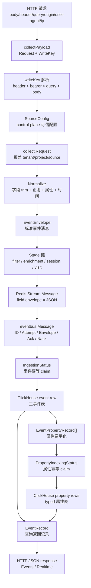
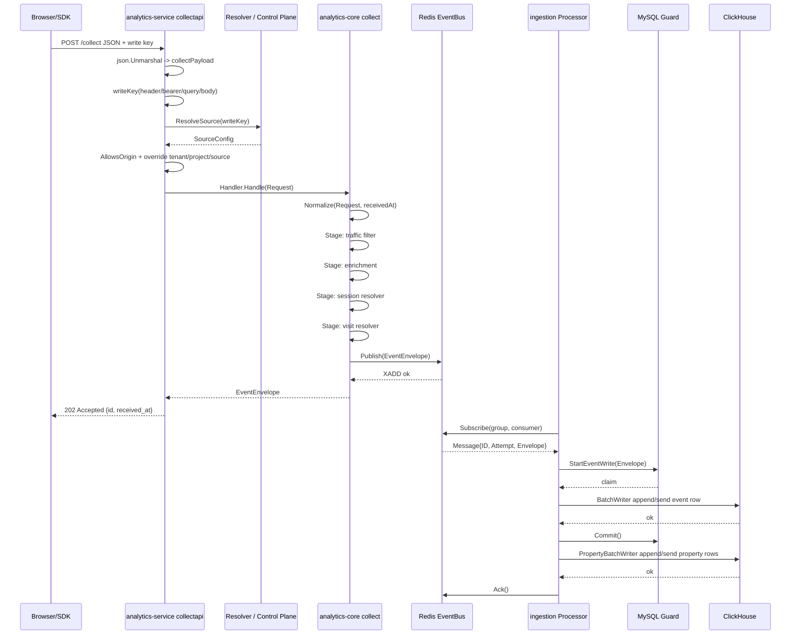
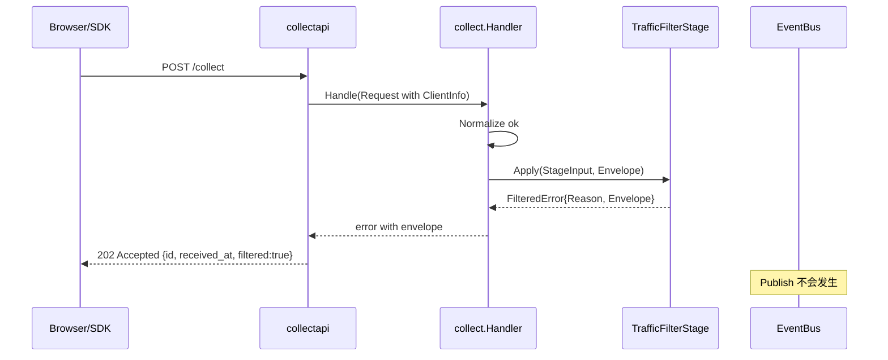
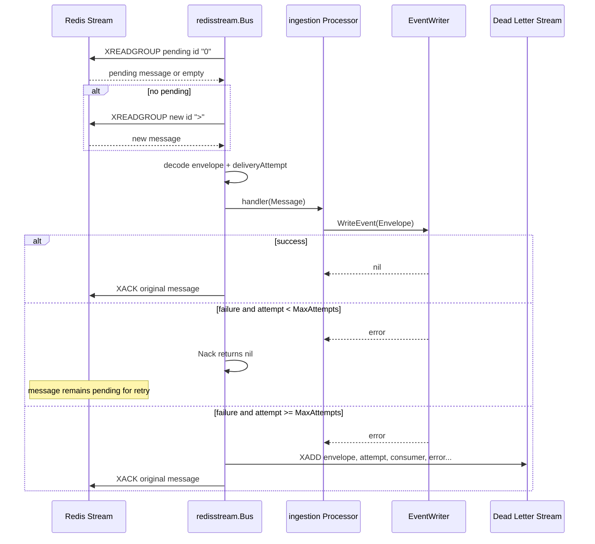
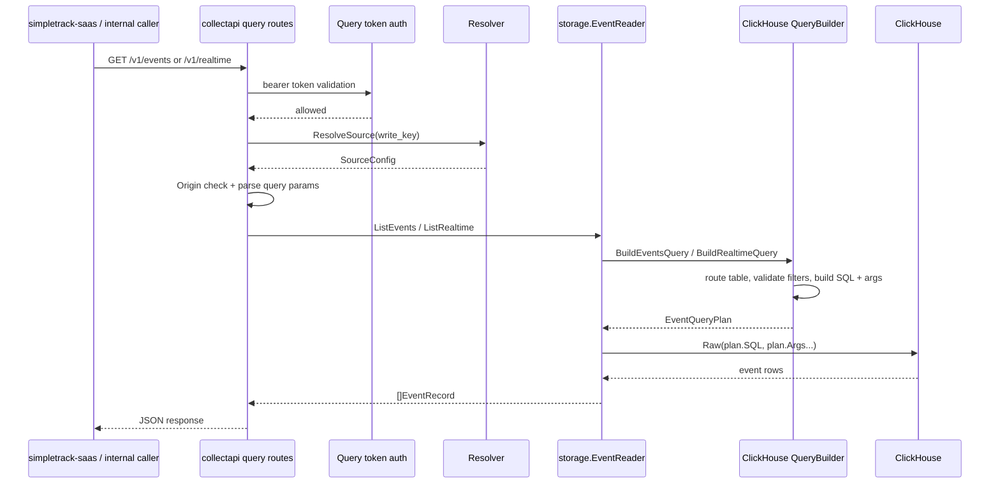

# 数据流与处理时序分析

本文按“数据点 -> 处理动作 -> 流转路径”的方式解读源码。重点不是列文件名，而是说明数据如何在代码里被创建、校验、转换、持久化和查询出来。

## 1. 总数据流图



关键控制点：

- `writeKey` 决定使用哪份 `SourceConfig`，但 write key 本身不直接成为 tenant/project/source。
- `SourceConfig` 覆盖客户端边界字段，这是最重要的信任边界。
- `Normalize` 决定什么能进入队列，非法事件不会进入 Redis。
- `Stage` 决定合法事件是否要被过滤、补充属性、派生 session 或派生 canonical `visit_id`。
- `EventBus` 的 ack/nack 决定消息何时从 pending 状态释放或进入重试/死信。
- MySQL checkpoint 决定 ClickHouse append 是否幂等。
- Query API 决定内部读取是否被 token、write key、origin、属性 allowlist 限制。

## 2. 数据点分析

### 2.1 HTTP 请求数据点

| 数据点 | 定义位置 | 代码段 | 类型 | 用途 |
| --- | --- | --- | --- | --- |
| HTTP method/path | `analytics-service/internal/collectapi/handler.go` `registerRoutes` | `app.Post(h.opts.CollectPath, h.handleCollect)` | Fiber route | 路由分发：health、tracker、collect、query |
| request body | `handleCollect` | `json.Unmarshal(ctx.Body(), &payload)` | `[]byte -> collectPayload` | 解析公开采集事件 |
| `Origin` | `requestOrigin` | `ctx.Get("Origin")` | `string` | CORS 与来源校验 |
| User-Agent | `clientInfo` | `ctx.Get("User-Agent")` | `string` | bot 过滤、可选属性派生 |
| Client IP | `clientIP` | `X-Forwarded-For` / `X-Real-IP` / `RemoteIP` | `string` | 内部流量过滤、IP hash 派生、可选 session fingerprint |
| Referrer | `clientInfo` | `Referer` header | `string` | 可选属性派生 |

数据变化：

1. 原始 HTTP 数据都在 `analytics-service` 层读取。
2. 只有 `ClientInfo` 以 transient 形式放入 `collect.Request.Client`。
3. 原始 IP 不会进入 `EventEnvelope`，最多被派生为 `client.ip_hash`。

### 2.2 write key 数据点

| 数据点 | 定义位置 | 代码段 | 类型 | 用途 |
| --- | --- | --- | --- | --- |
| header write key | `handler.go` `writeKey` | `Peek("X-SimpleTrack-Write-Key")` | `string` | 最高优先级采集 key |
| bearer write key | `handler.go` `writeKey` / `bearerToken` | `Authorization: Bearer ...` | `string` | 服务端 SDK 常用承载方式 |
| query write key | `handler.go` `writeKey` | `QueryArgs().Peek("write_key")` | `string` | 调试或 GET query API 使用 |
| body write key | `collectPayload.WriteKey` | ``WriteKey string `json:"write_key"` `` | `string` | body 兜底来源 |

处理动作：

```go
writeKey := h.writeKey(ctx, payload.WriteKey)
source, err := h.opts.Resolver.ResolveSource(ctx, writeKey)
```

变化说明：

- write key 是查询 `SourceConfig` 的索引。
- 它不会被写入 `EventEnvelope`。
- HTTP resolver 会把 write key 发送给 control-plane，返回完整 source runtime config。

### 2.3 SourceConfig 数据点

| 数据点 | 定义位置 | 代码段 | 类型 | 用途 |
| --- | --- | --- | --- | --- |
| `SourceConfig` | `analytics-service/internal/controlplane/resolver.go` | `type SourceConfig struct { ... }` | struct | SaaS 控制面对 runtime 的可信配置视图 |
| `AllowedOrigins` | `SourceConfig.AllowsOrigin` | `allowed == "*" || EqualFold(allowed, origin)` | `[]string` | 浏览器来源限制 |
| `AllowedPropertyFilters` | `AllowsPropertyFilter` | `scope/name/valueType` 匹配 | `[]AllowedPropertyFilter` | 内部查询属性过滤 allowlist |
| `SessionSalt` | `stages(source)` | `SessionResolverConfig{Salt: source.SessionSalt}` | `string` | session_id 派生 |
| `VisitSalt` | `stages(source)` | `VisitResolverConfig{Salt: source.VisitSalt}` | `string` | visit_id 派生 |
| `VisitWindow` | `stages(source)` | `VisitResolverConfig{Window: source.VisitWindow}` | `time.Duration` | canonical visit 时间桶 |
| `ClientHashSalt` | `stages(source)` | `ClientEnrichmentConfig{HashSalt: source.ClientHashSalt}` | `string` | IP hash 派生 |
| bot/internal rules | `stages(source)` | `TrafficFilterConfig{...}` | slices | 入队前过滤噪音流量 |

处理动作：

1. `MemoryResolver` 从 `ANALYTICS_SERVICE_SOURCES_JSON` 解码的配置中查找。
2. `HTTPResolver` 请求 control-plane runtime API，并可用 ETag revalidate。
3. `SchemaBoundResolver` 在 ingestion + HTTP resolver 场景下，确保动态 source 没有越过启动时校验过的 ClickHouse schema surface。

### 2.4 collect.Request 数据点

| 字段 | 定义位置 | 代码段 | 类型 | 用途 |
| --- | --- | --- | --- | --- |
| `ID` | `collect/request.go` `Request` | `ID string json:"id"` | string | 事件幂等 ID |
| `TenantID` | 同上 | `TenantID string` | string | 租户边界，service 会覆盖 |
| `ProjectID` | 同上 | `ProjectID string` | string | 项目/站点边界，service 会覆盖 |
| `SourceID` | 同上 | `SourceID string` | string | source 边界，service 会覆盖 |
| `SourceType` | 同上 | `SourceType string` | string | `web/server/mobile` 等来源类别，service 会覆盖 |
| `EventName` | 同上 | `EventName string` | string | 分析事件名 |
| `DistinctID` | 同上 | `DistinctID string` | string | 访客或用户标识 |
| `SessionID` | 同上 | `SessionID string` | string | 可选 session key，不传时可派生 |
| `VisitID` | 同上 | `VisitID string` | string | 可选 canonical visit key，不传时由服务端派生 |
| `EventTime` | 同上 | `EventTime time.Time` | time | 事件源发生时间 |
| `Properties` | 同上 | `map[string]any` | map | 事件属性 |
| `UserProps` | 同上 | `map[string]any` | map | 用户属性 |
| `Client` | 同上 | `ClientInfo json:"-"` | struct | 只在 stage 中使用的 HTTP 临时上下文 |

变化说明：

- JSON body 先成为 `collectPayload.Request`。
- service 用 `SourceConfig` 覆盖边界字段。
- `trimRequest` 清理字符串空白。
- `Normalize` 校验后生成 `EventEnvelope`。

### 2.5 EventEnvelope 数据点

| 数据点 | 定义位置 | 代码段 | 类型 | 用途 |
| --- | --- | --- | --- | --- |
| `EventEnvelope` | `analytics-core/contracts/event.go` | `type EventEnvelope struct { ... }` | struct | collect、queue、ingestion、storage 的统一事件消息 |
| `SessionID` | `Normalize` 或 `SessionResolverStage` | `SessionID: request.SessionID` / `envelope.SessionID = ...` | `string` | 会话来源语义，缺失时可补齐 |
| `VisitID` | `Normalize` 或 `VisitResolverStage` | `VisitID: request.VisitID` / `envelope.VisitID = ...` | `string` | 长期分析口径的一次访问 key，入库后查询直接读取 |
| `EventTime` | `Normalize` | `eventTime := request.EventTime` | `time.Time` | 事件发生时间，用于 Events/Realtime 时间窗 |
| `ReceivedAt` | `Normalize` 参数 | `ReceivedAt: receivedAt.UTC()` | `time.Time` | 服务端接收时间，用于接受确认和诊断 |
| `Properties/UserProps` | `Normalize` | `cloneMap(...)` | map | 进入 Redis、ClickHouse JSON、属性扁平化 |

时间处理：

```go
eventTime := request.EventTime
if eventTime.IsZero() {
    eventTime = receivedAt
}
if eventTime.After(receivedAt.Add(maxClockSkew)) {
    return ValidationError{Field: "event_time", Reason: "too far in the future"}
}
```

例子：

- 浏览器点击时间：`event_time = 2026-05-03T10:00:02Z`
- 服务收到时间：`received_at = 2026-05-03T10:00:04Z`
- ClickHouse 查询最近事件通常按 `event_time` 看“用户行为发生时间”，诊断采集延迟时看 `received_at`。

### 2.6 StageInput 与 ClientInfo 数据点

| 数据点 | 定义位置 | 代码段 | 类型 | 用途 |
| --- | --- | --- | --- | --- |
| `StageInput` | `collect/stage.go` | `Request Request; ReceivedAt time.Time` | struct | 给 Stage 提供已 trim 请求和接收时间 |
| `ClientInfo` | `collect/client.go` | `UserAgent/IP/Referrer` | struct | 过滤、属性派生、session fingerprint |
| `FilteredError` | `collect/traffic_filter.go` | `Reason; Envelope` | error struct | 表示合法事件被主动过滤，不发布到队列 |

处理动作：

- Traffic filter 读取 `ClientInfo.UserAgent/IP`。
- Enrichment 读取 `ClientInfo.UserAgent/IP/Referrer`，只写派生属性。
- Session resolver 读取 `DistinctID/EventTime`，可选读取 `ClientInfo` 加入 hash material。

### 2.7 EventBus Message 数据点

| 数据点 | 定义位置 | 代码段 | 类型 | 用途 |
| --- | --- | --- | --- | --- |
| `ConsumerGroup` | `eventbus/eventbus.go` | `Name, Consumer` | struct | Redis consumer group 与 consumer 实例 |
| `Message.ID` | `eventbus.Message` | `ID string` | string | 队列原生消息 ID，如 Redis Stream ID |
| `Message.Attempt` | `eventbus.Message` | `Attempt int` | int | 当前投递/重试次数 |
| `Message.Envelope` | `eventbus.Message` | `Envelope contracts.EventEnvelope` | struct | 事件业务数据 |
| `Ack/Nack` | `eventbus.Message` | funcs | callback | 成功确认或失败处理 |

Redis 转换：

```go
payload, _ := json.Marshal(envelope)
XADD analytics.events envelope payload
```

消费转换：

```go
raw := message.Values["envelope"]
json.Unmarshal(payload, &envelope)
attempt := b.deliveryAttempt(...)
return eventbus.Message{ID, Attempt, Envelope, Ack, Nack}
```

### 2.8 MySQL 幂等状态数据点

| 数据点 | 定义位置 | 代码段 | 类型 | 用途 |
| --- | --- | --- | --- | --- |
| `IngestionStatus` | `storage/mysql/ingestion_status_guard.go` | composite primary key | GORM model | 主事件写入 checkpoint |
| `PropertyIndexingStatus` | `storage/mysql/property_indexing_status_guard.go` | composite primary key | GORM model | 属性索引 checkpoint |
| `statusKey` | `ingestion_status_guard.go` | `TenantID/ProjectID/SourceID/EventID` | struct | Redis/Kafka 无关的业务幂等 key |
| `Attempt` | 两个 status model | `Attempt int` | int | 重试/claim 次数 |
| `LastError` | 两个 status model | `LastError string` | string | 最近失败原因 |

状态变化：

```text
不存在 -> processing -> inserted
不存在 -> processing -> failed -> processing -> inserted
inserted -> duplicate no-op
property processing -> 不自动 reclaim，因为 ClickHouse 可能已写入但 MySQL commit 失败
```

### 2.9 ClickHouse 写入数据点

| 数据点 | 定义位置 | 代码段 | 类型 | 用途 |
| --- | --- | --- | --- | --- |
| `RoutingKey` | `storage/clickhouse/table_router.go` | `TenantID/ProjectID/SourceID` | struct | 路由物理表 |
| `Table` | 同上 | `Logical/Physical` | struct | 逻辑表名和物理表名 |
| event insert values | `batch_writer.go` | `eventInsertValues(envelope)` | `[]any` | 事件主表列值 |
| property records | `storage/property.go` | `FlattenEventProperties` | `[]EventPropertyRecord` | 属性 typed rows |
| property insert values | `property_writer.go` | `propertyInsertValues(record)` | `[]any` | 属性表列值 |

数据变化：

- `EventEnvelope.Properties` 原样 JSON marshal 到主表 `properties` 字符串列。
- 同时被 `FlattenEventProperties` 展开成 typed property rows，便于后续属性过滤。
- 事件表和属性表使用同一 routing key，属性表只是在事件物理表后加 `_properties`。

### 2.10 查询数据点

| 数据点 | 定义位置 | 代码段 | 类型 | 用途 |
| --- | --- | --- | --- | --- |
| `QueryCredential` | `collectapi/query_auth.go` | token lifecycle | struct | 内部 readback bearer token |
| `RealtimeQuery` | `storage/event_query.go` | `TenantID/ProjectID/SourceID/Since/Limit` | struct | 最近事件查询 |
| `EventListQuery` | `storage/event_query.go` | from/to/filter/sort/pagination | struct | Events 列表查询 |
| `EventPropertyFilter` | `storage/event_query.go` | scope/name/type/operator/value | struct | typed property 过滤 |

这里的 `readback` 指“读回”链路：由受信服务端用内部 token 从查询存储读取已经接收并落库的事件，供 Realtime / Events 页面展示。它不是浏览器上报，也不是把历史事件重新投递消费的 replay。
| `EventQueryPlan` | `storage/event_query.go` | SQL/Args/PhysicalTable/Limit | struct | ClickHouse 查询计划 |
| `EventRecord` | `storage/event_query.go` | row record | struct | storage-neutral 查询返回记录 |
| `queryEventResponse` | `collectapi/query.go` | JSON response | struct | HTTP 输出格式 |

查询数据变化：

1. HTTP query string 解析成 `storage.EventListQuery` 或 `storage.RealtimeQuery`。
2. `EventQueryBuilder` 校验时间窗、limit、offset、filter 数量、排序字段、filter 字段、property allowlist。
3. builder 生成 SQL + bound args，不执行。
4. `EventReader` 执行 SQL，把 `eventRowModel` 转成 `storage.EventRecord`。
5. service 把 `EventRecord` 转成 JSON response，并把 properties 字符串转成 `json.RawMessage`。

## 3. 处理动作分析

| 处理动作 | 代码位置 | 涉及数据点 | 数据变化 |
| --- | --- | --- | --- |
| 加载配置 | `config.LoadFromEnv` | 环境变量 -> `Config` | 字符串环境变量变成 typed config；缺 Redis/MySQL/ClickHouse 等必要配置时启动失败 |
| 装配 runtime | `runtime.New` | `Config` -> resolver/bus/queryReader/handler/processor | 把部署配置变成运行时依赖图 |
| HTTP 路由 | `NewApp` / `registerRoutes` | method/path | Fiber app 分流到 health、tracker、collect、query |
| 解码 collect body | `handleCollect` | request body -> `collectPayload` | JSON 变成 Go struct；无效 JSON 直接 400 |
| 提取 write key | `writeKey` | header/bearer/query/body | 按优先级得到一个 string |
| 解析 source | `Resolver.ResolveSource` | write key -> `SourceConfig` | public key 变成可信租户/项目/来源配置 |
| 来源校验 | `SourceConfig.AllowsOrigin` | Origin + AllowedOrigins | 不允许的浏览器来源 403 |
| 覆盖边界字段 | `handleCollect` | `payload.Request` + `SourceConfig` | 客户端边界字段被 control-plane 可信字段替换 |
| 构建 stages | `stages(source)` | `SourceConfig` | 生成 filter/enrichment/session/visit stage |
| 标准化 | `collect.Normalize` | `collect.Request`, `receivedAt` | trim、正则、属性、时间校验后生成 `EventEnvelope` |
| 过滤流量 | `TrafficFilterStage.Apply` | `ClientInfo`, `EventEnvelope` | bot/internal IP 变成 `FilteredError`，不入队 |
| 派生客户端属性 | `ClientEnrichmentStage.Apply` | `ClientInfo`, `Properties` | 添加 `client.user_agent/referrer/ip_hash`，不覆盖用户已有 key |
| 派生 session | `SessionResolverStage.Apply` | `DistinctID`, `EventTime`, optional ClientInfo | 缺失 `session_id` 时生成 `ses_...` |
| 派生 visit | `VisitResolverStage.Apply` | `TenantID`, `ProjectID`, `SourceID`, `DistinctID`, `SessionID`, `EventTime` | 缺失 `visit_id` 时生成 `vis_...`，并作为后续分析查询的稳定字段 |
| 发布事件 | `EventBus.Publish` | `EventEnvelope` | envelope marshal 成 JSON 写入 Redis Stream |
| 消费消息 | `EventBus.Subscribe` | Redis stream records | pending 优先，然后新消息；decode 成 `eventbus.Message` |
| 写事件 claim | `IngestionStatusGuard.StartEventWrite` | `EventEnvelope` | MySQL 插入/读取/重置 checkpoint，判断是否 duplicate |
| 写 ClickHouse 事件 | `BatchWriter.WriteEvent` | `EventEnvelope`, `TableRouter` | 路由物理表，append/send 主事件行 |
| 提交或回滚事件 claim | `Commit/Rollback` | `IngestionStatus` | 成功标记 inserted，失败标记 failed |
| 扁平化属性 | `FlattenEventProperties` | `Properties`, `UserProps` | map 变成排序稳定的 typed property rows |
| 写属性 claim | `PropertyIndexingStatusGuard.StartPropertyWrite` | `EventEnvelope` | 判断属性是否已写，或能否 reclaim failed |
| 写 ClickHouse 属性 | `PropertyBatchWriter.WriteEventProperties` | `EventPropertyRecord[]` | 按路由表分组写属性表 |
| ack/nack | `redisstream.consume` | `Message.Ack/Nack` | 成功 XACK；失败保留 pending 或 dead-letter |
| 查询认证 | `requireQueryToken` | bearer token + credentials | 拒绝未知/过期/未生效 token |
| 查询 source | `resolveQuerySource` | write key -> `SourceConfig` | 查询也绑定同一个 source 边界 |
| 解析查询参数 | `handleEvents/handleRealtime` | query string | 生成 `EventListQuery` / `RealtimeQuery` |
| 构建 SQL plan | `EventQueryBuilder` | query + table router + allowlist | 输出 SQL、args、physical table、limit |
| 执行查询 | `EventReader` | `EventQueryPlan` | Raw SQL -> row model -> `EventRecord` |
| 响应转换 | `toQueryEventResponse` | `EventRecord` | 时间格式化，JSON 字符串转 RawMessage |

## 4. 写入时序图



## 5. 过滤时序图



这里“过滤”不是协议错误。事件结构有效，但来源被运行时策略判定为 bot 或内部流量，所以不入队。

## 6. Redis 重试与死信时序图



## 7. 查询时序图



## 8. 数据转换关键节点

### 8.1 HTTP JSON -> collectPayload

转换位置：`handleCollect`

```go
var payload collectPayload
json.Unmarshal(ctx.Body(), &payload)
```

失败控制：无效 JSON 直接 `400 invalid collect payload`，不解析 write key，不访问 resolver。

### 8.2 collectPayload -> trusted collect.Request

转换位置：`handleCollect`

```go
request := payload.Request
request.TenantID = source.TenantID
request.ProjectID = source.ProjectID
request.SourceID = source.SourceID
request.SourceType = source.SourceType
request.Client = h.clientInfo(ctx)
```

控制逻辑：source 来自 write key 解析，所以租户/项目/来源边界由 control-plane 控制，不由客户端控制。

### 8.3 collect.Request -> EventEnvelope

转换位置：`collect.Normalize`

主要变化：

- trim 字符串。
- identifier/event/source/property 正则校验。
- 属性数量和值类型校验。
- `event_time` 为空时设为 `received_at`。
- 时间统一转 UTC。
- map clone，避免下游修改原 request map。

### 8.4 EventEnvelope -> Redis Stream

转换位置：`redisstream.Publish`

```go
payload, err := json.Marshal(envelope)
XAdd(... Values: map[string]any{"envelope": payload})
```

控制逻辑：只有 Normalize 和 Stage 成功后的 envelope 才会发布。HTTP 返回 `202` 依赖 Publish 成功。

### 8.5 Redis Stream -> eventbus.Message

转换位置：`redisstream.decode`

主要变化：

- Redis field `envelope` 反序列化回 `contracts.EventEnvelope`。
- Redis 消息 ID 成为 `Message.ID`。
- Redis pending metadata 计算为 `Message.Attempt`。
- 生成 Ack/Nack 回调，绑定当前 stream/group/message。

### 8.6 EventEnvelope -> ClickHouse event row

转换位置：`clickhouse.BatchWriter.WriteEvent` 与 `eventInsertValues`

主要变化：

- `TableRouter` 根据 tenant/project/source 计算物理表名。
- `Properties/UserProps` marshal 成 JSON 字符串。
- 时间转 UTC。
- 写入前先 claim MySQL checkpoint。
- ClickHouse `Send` 成功后再 commit MySQL checkpoint。

### 8.7 EventEnvelope -> EventPropertyRecord[]

转换位置：`storage.FlattenEventProperties`

主要变化：

- event properties 先输出，user properties 后输出。
- 每个 scope 内 key 排序，保证测试/回放/元数据更新稳定。
- 每个属性写成 typed slot：`string_value`、`number_value`、`bool_value` 或 `null` type marker。

### 8.8 EventQueryPlan -> EventRecord -> JSON

转换位置：

- plan：`clickhouse.EventQueryBuilder`
- 执行：`clickhouse.EventReader`
- HTTP 输出：`collectapi.toQueryEventResponse`

主要变化：

- query string 变成 typed query struct。
- query struct 变成 SQL + bound args。
- ClickHouse row 变成 storage-neutral `EventRecord`。
- `Properties/UserProperties` 字符串如果是合法 JSON，就作为 JSON 返回；否则作为字符串 JSON 返回。

## 9. 数据流控制逻辑

### 9.1 fail closed

代码多处采用 fail closed：

- Redis 未配置但 eventbus=redis：启动失败。
- direct memory bus 没有显式允许：启动失败。
- ingestion 开启但缺 MySQL/ClickHouse/source list：启动失败。
- Query enabled 但缺 query token 或 ClickHouse：启动失败。
- HTTP resolver 缺 control-plane token：启动失败。
- control-plane HTTP 非 HTTPS：除非显式允许 loopback，否则启动失败。

### 9.2 信任边界

最核心的信任边界在 `handleCollect`：

```text
客户端 body 字段不可信
write key -> SourceConfig 可信
SourceConfig 覆盖 tenant/project/source/source_type
```

也就是说，客户端可以说“我是哪个事件、哪个用户、有哪些属性”，但不能决定事件写进哪个租户、项目、source。

### 9.3 幂等边界

幂等 key：

```text
tenant_id + project_id + source_id + event_id
```

不使用 Redis Stream ID，是为了让 Redis、Kafka、回放、未来其他 EventBus 实现都能收敛到同一个业务幂等语义。

### 9.4 查询控制

查询不是直接拼 SQL：

1. 先鉴权 query token。
2. 再解析 write key，绑定 source。
3. 再检查 Origin。
4. 再解析 query 参数。
5. 再检查 property filter 是否在 source allowlist。
6. 最后由 ClickHouse builder 只使用 allowlisted columns/operators/sort fields 构建 SQL。

## 10. 按业务视角理解完整链路

假设浏览器访问 `/pricing` 并发送 pageview：

1. SDK 发送：

```json
{
  "write_key": "wk_live",
  "id": "evt_100",
  "event_name": "pageview",
  "distinct_id": "visitor_abc",
  "event_time": "2026-05-03T10:00:02Z",
  "properties": {"page.path": "/pricing", "plan": "pro"}
}
```

2. service 根据 `wk_live` 找到：

```json
{
  "tenant_id": "tenant_1",
  "project_id": "project_marketing",
  "source_id": "source_web",
  "source_type": "web",
  "allowed_origins": ["https://simpletrack.example"]
}
```

3. core 输出 envelope：

```json
{
  "id": "evt_100",
  "tenant_id": "tenant_1",
  "project_id": "project_marketing",
  "source_id": "source_web",
  "source_type": "web",
  "event_name": "pageview",
  "distinct_id": "visitor_abc",
  "session_id": "ses_...",
  "visit_id": "vis_...",
  "event_time": "2026-05-03T10:00:02Z",
  "received_at": "2026-05-03T10:00:04Z",
  "properties": {
    "page.path": "/pricing",
    "plan": "pro",
    "client.referrer": "https://google.example",
    "client.ip_hash": "ip_..."
  }
}
```

4. Redis Stream 保存 envelope。
5. worker claim MySQL `ingestion_status`。
6. ClickHouse 主表写一行事件。
7. `properties` 被扁平化为多行属性：

```text
event/page.path/string="/pricing"
event/plan/string="pro"
event/client.referrer/string="https://google.example"
event/client.ip_hash/string="ip_..."
```

8. 查询 `/v1/events` 时，service 用同一个 write key 找到 source，再查这个 source 对应的物理表，返回事件列表。

## 11. 读源码时的抓手

如果你只想快速定位一条链路：

- “事件为什么没进库”：先看 `collectapi.handleCollect` -> `collect.Handler.Handle` -> `redisstream.Publish` -> `ingestion.Processor.handle` -> `BatchWriter.WriteEvent`。
- “为什么 202 但 ClickHouse 没数据”：看 Redis Stream 是否有消息、ingestion 是否启用、MySQL checkpoint 状态、ClickHouse table 是否存在、消息是否 dead-letter。
- “为什么 query 查不到”：看 query token、write key source、from/to 时间窗、表路由、property filter allowlist、ClickHouse 物理表名。
- “字段为什么被改掉”：看 `handleCollect` 覆盖 tenant/project/source/source_type 的逻辑，这是设计上的信任边界。
- “session_id 哪来的”：看 `SessionResolverStage`，它按 event_time 窗口和 distinct_id 派生。
- “visit_id 哪来的”：看 `VisitResolverStage`，它在 session 派生后按 visit salt、最终 session_id 和事件时间窗口派生。
- “client.ip_hash 哪来的”：看 `ClientEnrichmentStage`，它用服务端 salt 对 transient IP 做 hash。
