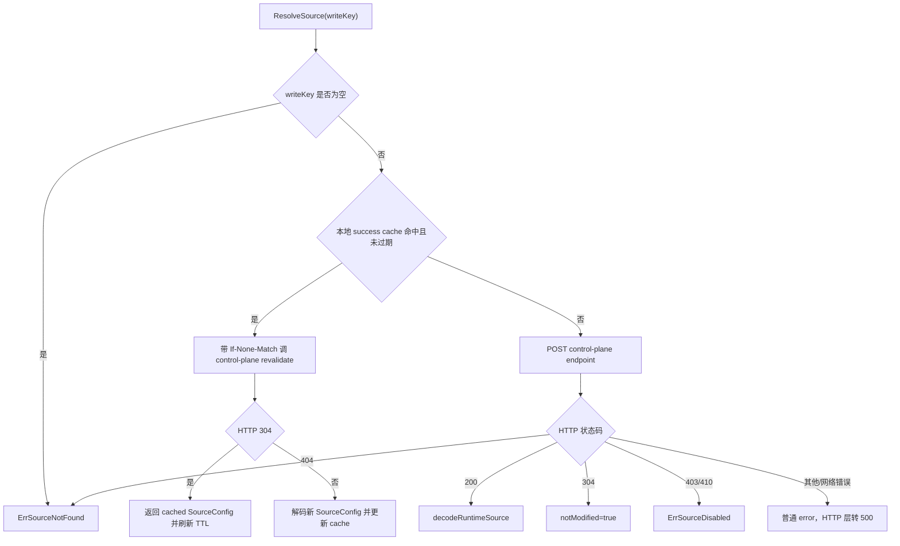
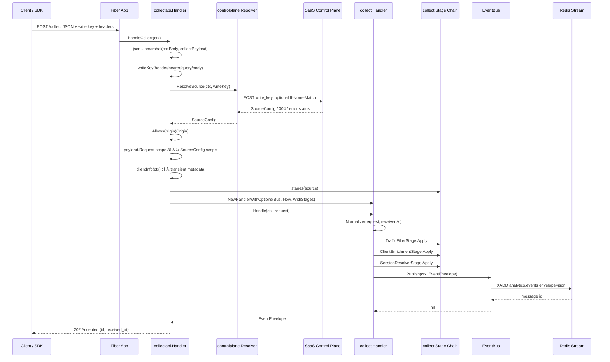
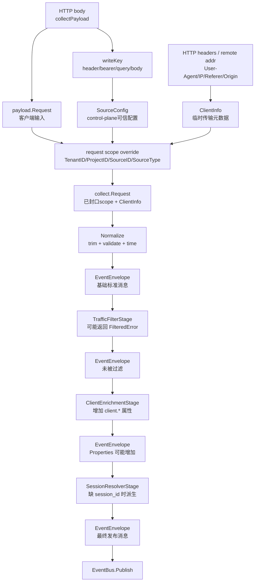
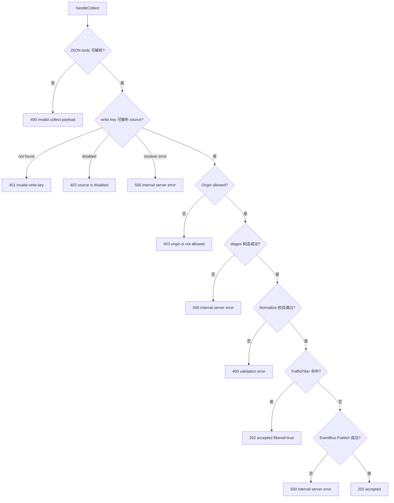

# handleCollect 路由数据流源码解读

> 分析范围：`simpletrack-anaysitics-service` 的生产 `/collect` 路由，以及它调用的 `analytics-core/collect` 标准化、过滤、补充属性、会话派生和 EventBus 发布链路。
>
> 重点入口：`仓库: analytics-service, commit: b2247d5, file: internal/collectapi/handler.go:175` 的 `handleCollect`。
>
> 关键代码点来自本次指定的 10 个位置：`runtime.New` 装配、`NewApp` / `registerRoutes`、`handleCollect`、`stages`、`HTTPResolver.ResolveSource`、`collect.Handler.Handle`、`TrafficFilterStage`、`SessionResolverStage`、`ClientEnrichmentStage`。

## 0. 版本基线与引用规则

本文源码证据按以下子仓版本读取：

| 子仓 | commit id | 工作区状态说明 |
| --- | --- | --- |
| `src/analytics-service` | `b2247d5389c2fdf2ebf6643926473619fa179e09` | `git status --short` 仅显示未跟踪 `.idea/`，本文引用的源码文件与 `HEAD` 一致 |
| `src/analytics-core` | `58668c9c17ea` | `git status --short` 仅显示未跟踪 `.idea/`，本文引用的源码文件与 `HEAD` 一致 |
| `src/simpletrack-saas` | `fa822d1a86b2` | 当前存在 `packages/database/prisma/zod/index.ts` 未提交改动和未跟踪 `.omx/`；本文引用的 runtime-source 相关源码文件与 `HEAD` 一致 |

后文引用具体代码时使用格式：`仓库: <repo>, commit: <sha>, file: <path>:<line>`；跨多行使用 `<path>:<start>-<end>`。

## 1. 整体架构图

`handleCollect` 不是单独一个 HTTP handler，它是整个分析数据面写入链路的入口。它把公开上报请求转换成 `analytics-core` 能理解的 `collect.Request`，再经过标准化、预队列 stage 处理，最后发布到 EventBus。默认生产配置里 EventBus 是 Redis Stream，后续可由 ingestion worker 写入 MySQL / ClickHouse。

本文有时会提到 `readback`。它的意思是“读回”：从 ClickHouse / storage 读取已经被 `/collect` 接收并入库的事件，用于 Realtime / Events 页面展示。它不是事件写入链路，也不是 event replay / 重放；在本文里只作为 `runtime.New` 同时装配读接口依赖的背景出现。

```mermaid
flowchart LR
    Browser["Browser SDK / Server SDK / 手工请求"] --> Fiber["analytics-service Fiber App"]
    Fiber --> CollectAPI["internal/collectapi Handler"]
    CollectAPI --> Resolver["controlplane.Resolver"]
    Resolver --> SaaS["SimpleTrack SaaS Control Plane<br/>runtime source config"]
    CollectAPI --> CoreCollect["analytics-core/collect.Handler"]
    CoreCollect --> Normalize["Normalize<br/>字段校验 + EventEnvelope"]
    Normalize --> Filter["TrafficFilterStage<br/>bot / internal IP 过滤"]
    Filter --> Enrich["ClientEnrichmentStage<br/>UA / referrer / IP hash"]
    Enrich --> Session["SessionResolverStage<br/>session_id 派生"]
    Session --> EventBus["eventbus.EventBus"]
    EventBus --> Redis["Redis Stream<br/>analytics.events"]
    Redis --> Worker["ingestion.Processor<br/>可选同进程 worker"]
    Worker --> MySQL["MySQL<br/>ingestion_status / property_indexing_status"]
    Worker --> ClickHouse["ClickHouse<br/>事件表 / 属性表"]
```



### 什么是 SaaS control-plane

`SaaS control-plane` 可以翻译成“控制面”或“管理面”。在这套系统里，它指的是 SimpleTrack SaaS 后台里负责管理配置的那一侧，而不是负责接收高频事件的那一侧。

通俗地说：

- `control-plane` 管“规则和档案”：有哪些 Website / Source、write key 属于谁、source 是否启用、允许哪些域名上报、bot/internal traffic 怎么过滤、session 和 IP hash 用什么 salt。
- `analytics-service` 管“执行和收数”：收到 `/collect` 请求后，拿 write key 去 control-plane 查档案，然后按档案里的规则决定能不能收、收进哪个 tenant/project/source。
- `analytics-core` 管“标准化和管道”：把已授权的 collect 请求变成 `EventEnvelope`，过滤、补属性、派生 session，然后发布到 EventBus。

可以类比成公司前台和门禁系统：

```text
访客拿门禁卡(write key)来到前台(/collect)
        |
        v
前台不相信访客自己说“我要去 A 部门”
        |
        v
前台去门禁系统(control-plane)查这张卡的真实档案
        |
        v
门禁系统返回：这张卡属于哪个租户、哪个项目、哪个 source、是否启用、允许哪些入口
        |
        v
前台按档案放行或拒绝，并把访客记录送入后续管道
```

所以，`SaaS control-plane` 在这里不是一个 Go 包名，而是一个架构角色：它是配置和权限的来源。代码里对应的本地抽象是 `controlplane.Resolver`，例如 `HTTPResolver` 会调用 SaaS 后台的 runtime source API；`MemoryResolver` 则是在本地开发/测试时用内存配置模拟这个控制面。

在当前代码里，真正承担这个 `SaaS control-plane` 角色的程序在 `src/simpletrack-saas`，不是 `src/analytics-service` 里的 Go 程序。具体入口是 SimpleTrack SaaS 后台的内部 runtime-source API：

位置：`仓库: simpletrack-saas, commit: fa822d1a86b2, file: packages/api/modules/simpletrack/runtime-source.ts:55-170`

```ts
export const runtimeSourcePath = "/internal/analytics/runtime-source";

export async function handleRuntimeSourceRequest(...) {
  ...
}
```

这段程序负责接收 `analytics-service` 发来的 write key 查询请求，校验服务端 bearer token，然后按 write key 查 Website 记录，最后返回运行时需要的 source 配置。

它被挂到 SaaS API 的位置是：

位置：`仓库: simpletrack-saas, commit: fa822d1a86b2, file: packages/api/index.ts:33-34`

```ts
.post(runtimeSourcePath, async (c) => handleRuntimeSourceRequest(c.req.raw))
```

因为 `@repo/api` 的 Hono app 设置了 `.basePath("/api")`，并由 Next.js API route 统一转发：

位置：`仓库: simpletrack-saas, commit: fa822d1a86b2, file: apps/saas/app/api/[[...rest]]/route.ts:1-7`

```ts
import { app } from "@repo/api";
import { handle } from "hono/vercel";

const handler = handle(app);

export const GET = handler;
export const POST = handler;
```

所以部署后的完整控制面接口路径是：

```text
/api/internal/analytics/runtime-source
```

`analytics-service` 里的 `ANALYTICS_SERVICE_CONTROL_PLANE_URL` 就应该指向这个地址。例如本地或部署环境中可能配置成：

```text
ANALYTICS_SERVICE_CONTROL_PLANE_URL=https://saas.example.com/api/internal/analytics/runtime-source
```

这条链路可以这样理解：

```text
analytics-service /collect
  -> HTTPResolver
  -> ANALYTICS_SERVICE_CONTROL_PLANE_URL
  -> simpletrack-saas /api/internal/analytics/runtime-source
  -> handleRuntimeSourceRequest
  -> Website record
  -> RuntimeSourceResponse / SourceConfig
```

其中 `handleRuntimeSourceRequest` 返回的数据格式和 `analytics-service` 的 `controlplane.SourceConfig` 对齐，核心字段包括：

| runtime-source 返回字段 | 给 `analytics-service` 的用途 |
| --- | --- |
| `write_key` | 确认控制面响应和请求里的 write key 一致 |
| `enabled` | 判断 source 是否还能接收事件 |
| `tenant_id` | 覆盖客户端传入的 tenant 边界 |
| `project_id` | 覆盖客户端传入的 project / website 边界 |
| `source_id` | 覆盖客户端传入的 source 边界 |
| `source_type` | 指定 source 类别，例如 `web` |
| `allowed_origins` | `/collect` 的浏览器 Origin allowlist |
| `bot_user_agents` | bot UA 过滤规则 |
| `internal_cidrs` / `internal_ips` | 内部流量过滤规则 |
| `session_salt` | 派生匿名 `session_id` |
| `client_hash_salt` | 派生 `client.ip_hash` |
| `include_client_fingerprint` | session 派生时是否加入 UA/IP 指纹 |

因此，本文里说的 `control-plane`，落到当前源码中就是：`simpletrack-saas` 的 `packages/api/modules/simpletrack/runtime-source.ts` 这条内部 API；`analytics-service/internal/controlplane` 是 Go 侧的客户端抽象和响应模型，不是控制面本体。

### 模块职责

| 模块 | 主要文件 | 职责 | 不负责什么 |
| --- | --- | --- | --- |
| `analytics-service/cmd/simpletrack-anaysitics-service` | `cmd/.../main.go` | 加载配置、创建 runtime、启动 Fiber、处理进程退出 | 不写业务校验，不解析 collect payload |
| `analytics-service/internal/config` | `internal/config/config.go` | 从环境变量读取路由、Redis、控制面、查询、Swagger 等配置 | 不直接创建 HTTP route |
| `analytics-service/internal/runtime` | `internal/runtime/runtime.go` | 组装 Resolver、EventBus、tracker asset、query reader、Fiber app、可选 ingestion worker | 不处理单个请求 |
| `analytics-service/internal/collectapi` | `internal/collectapi/handler.go` | 注册 HTTP route，处理 `/collect`，执行 runtime source enforcement，调用 `analytics-core` | 不直接写 ClickHouse，不拥有 SaaS source 生命周期 |
| `analytics-service/internal/controlplane` | `internal/controlplane/resolver.go`、`http_resolver.go` | 根据 write key 读取 runtime source config，校验 source enabled、origin、salt、过滤配置 | 不创建、修改或删除 source |
| `analytics-core/collect` | `collect/*.go` | 框架无关的 collect 请求标准化、校验、stage 处理、EventBus 发布 | 不知道 Fiber、HTTP header、SaaS 控制面 |
| `analytics-core/eventbus` | `eventbus/*.go` | 抽象队列发布与订阅，默认可用 Redis Stream | 不做字段校验 |
| `analytics-core/ingestion` | `ingestion/processor.go` | 消费 EventBus 消息并写存储 | 不接收 HTTP 请求 |
| `analytics-core/storage` | `storage/*` | ClickHouse / MySQL 写入、查询、幂等 guard | 不解析 write key |

## 2. 整体代码结构图

下面只列和 `handleCollect` 数据流直接相关的目录。

```text
src/analytics-service/
├─ cmd/simpletrack-anaysitics-service/
│  └─ main.go                          # 进程入口，启动 runtime.App().Listen
├─ api/
│  └─ openapi.yaml                     # Swagger UI 使用的 OpenAPI 文件
├─ public/
│  └─ tracker.js                       # 浏览器 SDK 静态资源
└─ internal/
   ├─ config/
   │  └─ config.go                     # ANALYTICS_SERVICE_* 环境变量解析
   ├─ runtime/
   │  ├─ runtime.go                    # 装配 Fiber app、EventBus、Resolver、worker
   │  ├─ worker.go                     # ingestion worker 装配
   │  └─ memory_bus.go                 # direct EventBus demo / test 模式
   ├─ collectapi/
   │  ├─ handler.go                    # /collect、/healthz、/tracker.js、Swagger、query route
   │  ├─ query.go                      # /v1/events、/v1/realtime 读接口
   │  └─ query_auth.go                 # internal query token 校验
   └─ controlplane/
      ├─ resolver.go                   # SourceConfig、MemoryResolver、SchemaBoundResolver
      └─ http_resolver.go              # HTTPResolver，调用 SaaS control-plane runtime API

src/analytics-core/
├─ collect/
│  ├─ request.go                       # collect.Request、Normalize、字段校验
│  ├─ handler.go                       # collect.Handler.Handle
│  ├─ stage.go                         # Stage / StageInput / WithStages
│  ├─ traffic_filter.go                # bot / internal traffic 过滤
│  ├─ enrichment.go                    # client.* 派生属性
│  ├─ session.go                       # session_id 派生
│  └─ client.go                        # ClientInfo、saltedDigest
├─ collect/httpapi/
│  └─ fiber.go                         # core 自带的最小 Fiber collect adapter
├─ contracts/
│  └─ event.go                         # EventEnvelope 稳定消息契约
├─ eventbus/
│  ├─ eventbus.go                      # EventBus interface
│  ├─ redisstream/redisstream.go       # Redis Stream Publish / Subscribe
│  └─ direct/direct.go                 # 内存同步 EventBus
├─ ingestion/
│  └─ processor.go                     # 消费队列并写入 storage
└─ storage/
   ├─ clickhouse/
   └─ mysql/
```

## 3. 内部功能模块

### 3.1 Runtime 装配层

位置：`仓库: analytics-service, commit: b2247d5, file: internal/runtime/runtime.go:32-109`

`runtime.New(cfg)` 按顺序装配：

1. `newSourceResolver(cfg)`：创建 `controlplane.Resolver`，用于根据 public write key 查出服务端可信的 source 配置。
2. `newEventBus(cfg)`：创建 `eventbus.EventBus`，默认 Redis Stream，只有显式允许才用 direct 内存模式。
3. `os.ReadFile(cfg.TrackerFile)`：启动时读取 tracker asset。
4. `newQueryReader(cfg)`：仅当 query enabled 时创建 ClickHouse readback reader，也就是给内部 Realtime / Events 读接口使用的“读回”查询器。
5. `collectapi.NewApp(collectapi.Options{...})`：把配置和依赖交给 HTTP 层，生成 Fiber app。
6. `newIngestionProcessor(...)`：仅当 ingestion enabled 时创建后台消费 worker。

关键代码点：

```go
app, err := collectapi.NewApp(collectapi.Options{
    CollectPath: cfg.CollectPath,
    EventsPath: cfg.EventsPath,
    RealtimePath: cfg.RealtimePath,
    Resolver: resolver,
    Bus: bus,
    QueryReader: queryReader,
})
```

含义：`runtime` 只负责把依赖接起来，单个 HTTP 请求的 write key、origin、payload 校验都不在这里做。

#### 3.1.1 `newSourceResolver` 通俗解释和代码走读

位置：`仓库: analytics-service, commit: b2247d5, file: internal/runtime/runtime.go:308-350`

先把这句话说白一点：

> “用于把 write key 换成可信 source 配置”

这里的“换成”不是说把字符串 `wk_xxx` 真的改造成另一个字符串，而是说：客户端只拿着一个公开上报 key，服务端要用这个 key 去查“这条 key 到底属于哪个站点、哪个项目、允许哪些域名、要用哪些过滤规则”。查出来的这整包信息就是 `SourceConfig`。

可以把它理解成门禁流程：

1. 客户端拿着一张门禁卡：`write key`。
2. 服务端不相信客户端自己说“我是 A 公司 / B 项目 / C 站点”。
3. 服务端拿门禁卡去门禁系统查档案。
4. 门禁系统返回这张卡绑定的真实信息：租户、项目、source、是否启用、允许的 Origin、过滤规则、隐私 salt。
5. 后面的 `/collect` 处理只相信这份查出来的档案，不相信请求体里客户端自己填的 scope 字段。

所以 `write key` 的角色是“查询凭证”，`SourceConfig` 的角色是“服务端可信档案”。

##### 第一步：函数说明

代码位置：`仓库: analytics-service, commit: b2247d5, file: internal/runtime/runtime.go:308-313`

```go
// newSourceResolver builds the write-key lookup boundary used by /collect.
//
// A public write key is only a lookup credential. The returned resolver turns it
// into a trusted SourceConfig owned by the control plane, including tenant,
// project, source, origin, filtering, and privacy-salt settings.
func newSourceResolver(cfg config.Config) (controlplane.Resolver, error) {
```

这里明确了两个边界：

- `write key` 只是公开查询凭证，不是租户边界本身。
- `SourceConfig` 才是可信边界数据，因为它来自服务端配置或 SaaS control-plane。

##### 第二步：选择 source 配置来源

代码位置：`仓库: analytics-service, commit: b2247d5, file: internal/runtime/runtime.go:314-320`

```go
// Select the backing source of truth before HTTP routes are exposed. Memory
// mode indexes the startup JSON source list for tests and local demos; HTTP
// mode calls the SaaS control plane at request time and keeps source CRUD
// outside this runtime service.
var resolver controlplane.Resolver
var err error
switch cfg.SourceResolver {
```

这一步是在服务启动阶段决定：以后 `/collect` 收到 write key 时，到哪里查它对应的 source 配置。

| `cfg.SourceResolver` | 查哪里 | 适合场景 |
| --- | --- | --- |
| `""` 或 `"memory"` | 启动时加载的 `cfg.Sources` 内存列表 | 本地开发、测试、单机 demo |
| `"http"` | SaaS control-plane HTTP API | 生产或接近生产的动态配置 |

##### 第三步：memory 模式

代码位置：`仓库: analytics-service, commit: b2247d5, file: internal/runtime/runtime.go:321-325`

```go
case "", "memory":
    // Memory mode still validates and normalizes every SourceConfig up front,
    // so a bad tenant/project/source mapping fails startup instead of
    // accepting events under the wrong analytics boundary.
    resolver, err = controlplane.NewMemoryResolver(cfg.Sources)
```

memory 模式的意思是：所有 source 配置已经在启动环境变量里给好了，例如 `ANALYTICS_SERVICE_SOURCES_JSON`。服务启动时把这些配置整理成一个 map：

```text
write_key -> SourceConfig
```

比如：

```text
wk_demo_123 -> {
  tenant_id: tenant_1,
  project_id: proj_docs,
  source_id: src_web,
  allowed_origins: [...]
}
```

它的关键点是“启动时就校验”。如果配置里 `tenant_id` 为空、`source_type` 不合法、两个 source 使用了同一个 write key，服务会启动失败，而不是等收到事件以后才乱写数据。

##### 第四步：http 模式

代码位置：`仓库: analytics-service, commit: b2247d5, file: internal/runtime/runtime.go:326-336`

```go
case "http":
    // HTTP mode sends only the presented write key to the control plane. The
    // trusted response supplies the scope and runtime policy used later by
    // handleCollect to override client-supplied scope fields.
    resolver, err = controlplane.NewHTTPResolver(controlplane.HTTPResolverOptions{
        Endpoint:              cfg.ControlPlaneURL,
        BearerToken:           cfg.ControlPlaneToken,
        Timeout:               cfg.ControlPlaneTimeout,
        CacheTTL:              cfg.ControlPlaneCacheTTL,
        AllowInsecureLoopback: cfg.ControlPlaneAllowInsecureLoopback,
    })
```

http 模式下，`analytics-service` 自己不保存完整 source 列表，而是在请求时问 SaaS control-plane：

```text
/collect 收到 write key: wk_live_abc
        |
        v
HTTPResolver -> POST Control Plane
        |
        v
Control Plane 返回 SourceConfig
```

这时 runtime service 只发送 write key，不让客户端传入的 `tenant_id`、`project_id`、`source_id` 决定数据归属。可信的归属信息来自 control-plane 返回值。

这里几个配置字段的作用：

| 字段 | 作用 |
| --- | --- |
| `Endpoint` | control-plane runtime source 查询地址 |
| `BearerToken` | analytics-service 调 control-plane 时使用的服务端认证 token |
| `Timeout` | 防止 control-plane 慢请求拖住 collect 热路径 |
| `CacheTTL` | 缓存已解析的 source config，降低热路径控制面压力 |
| `AllowInsecureLoopback` | 仅允许本地开发使用 HTTP loopback，生产默认要求 HTTPS |

##### 第五步：不支持的 resolver 类型直接拒绝

代码位置：`仓库: analytics-service, commit: b2247d5, file: internal/runtime/runtime.go:337-342`

```go
default:
    return nil, configError("unsupported source resolver")
}
if err != nil {
    return nil, err
}
```

如果配置写成了别的值，比如 `database`、`redis`，当前代码不会猜测怎么处理，而是启动失败。这能避免服务在“配置含糊”的状态下开始接收事件。

##### 第六步：ingestion worker 开启时的 schema bound 保护

代码位置：`仓库: analytics-service, commit: b2247d5, file: internal/runtime/runtime.go:343-350`

```go
if cfg.IngestionEnabled && cfg.SourceResolver == "http" {
    // Same-process ingestion validates ClickHouse tables only for the startup
    // source list. Bind dynamic HTTP responses to that surface so a freshly
    // created control-plane source cannot be accepted until its routed tables
    // have been included in startup schema validation.
    return controlplane.NewSchemaBoundResolver(resolver, cfg.Sources)
}
return resolver, nil
```

这段是一个额外保险。

背景是：如果服务同时开启了同进程 ingestion worker，那么启动时会检查 ClickHouse 里有哪些 source 对应的表已经准备好。但 http resolver 是动态的，control-plane 随时可能新增一个 source。

如果不加这层保护，就可能发生：

1. 服务启动时只校验了 `source A` 的 ClickHouse 表。
2. 服务运行中 control-plane 新增了 `source B`。
3. `/collect` 立刻接受 `source B` 的事件。
4. ingestion worker 消费到 `source B`，但 ClickHouse 表还没校验或创建，写入失败。

`SchemaBoundResolver` 的作用就是防止这种情况：即使 HTTP control-plane 返回了新 source，也必须确认这个 source 在启动时的 schema surface 里，否则 `/collect` 不接受它。

通俗点说：control-plane 可以动态告诉你“这张门禁卡有效”，但如果本进程的仓库货架还没给这个 source 准备好位置，就先不能收货。

##### 小结

`newSourceResolver` 最终返回的是一个统一接口：

```go
type Resolver interface {
    ResolveSource(context.Context, string) (SourceConfig, error)
}
```

`handleCollect` 不需要关心 source config 是从内存 map 查出来的，还是从 SaaS control-plane HTTP API 查出来的。它只需要做一件事：

```text
write key -> ResolveSource -> SourceConfig -> 覆盖 request scope -> 进入 analytics-core
```

这就是“把 write key 换成可信 source 配置”的完整含义。

### 3.2 Collect API 路由层

位置：`仓库: analytics-service, commit: b2247d5, file: internal/collectapi/handler.go:61-83`、`仓库: analytics-service, commit: b2247d5, file: internal/collectapi/handler.go:153-169`

`NewApp(opts)` 创建 Fiber app，并安装 Fiber CORS middleware，然后调用 `registerRoutes(app)`。

```go
app := fiber.New(...)
app.Use(cors.New(...))
h.registerRoutes(app)
```

`registerRoutes` 注册：

```go
app.Get(h.opts.HealthPath, h.handleHealth)
app.Get(h.opts.TrackerPath, h.writeTracker)
app.Post(h.opts.CollectPath, h.handleCollect)
app.Get(h.opts.RealtimePath, h.handleRealtime)
app.Get(h.opts.EventsPath, h.handleEvents)
```

默认路径来自 `config.go`：

| 环境变量 | 默认值 | 用途 |
| --- | --- | --- |
| `ANALYTICS_SERVICE_COLLECT_PATH` | `/collect` | 事件上报 |
| `ANALYTICS_SERVICE_HEALTH_PATH` | `/healthz` | 健康检查 |
| `ANALYTICS_SERVICE_TRACKER_PATH` | `/tracker.js` | 浏览器 SDK |
| `ANALYTICS_SERVICE_EVENTS_PATH` | `/v1/events` | 内部 Events 查询 |
| `ANALYTICS_SERVICE_REALTIME_PATH` | `/v1/realtime` | 内部 Realtime 查询 |
| `ANALYTICS_SERVICE_SWAGGER_PATH` | `/swagger` | Swagger UI |

### 3.3 Runtime source 解析层

位置：`仓库: analytics-service, commit: b2247d5, file: internal/controlplane/resolver.go:110-114`、`仓库: analytics-service, commit: b2247d5, file: internal/controlplane/http_resolver.go:124-155`

`Resolver` 的核心职责是根据 write key 返回 `SourceConfig`。

```go
type Resolver interface {
    ResolveSource(context.Context, string) (SourceConfig, error)
}
```

`SourceConfig` 是 SaaS control plane 拥有的数据，服务运行时只读它。

重要字段：

| 字段 | 类型 | 用途 |
| --- | --- | --- |
| `WriteKey` | `string` | 公开上报 key，用来查 source |
| `Enabled` | `bool` | false 时禁止接收事件 |
| `TenantID` / `ProjectID` / `SourceID` | `string` | 覆盖客户端传来的 scope，保证租户隔离 |
| `SourceType` | `string` | source 类别，默认 `web` |
| `AllowedOrigins` | `[]string` | 浏览器 Origin allowlist |
| `BotUserAgents` | `[]string` | bot UA 过滤 token |
| `InternalCIDRs` / `InternalIPs` | `[]string` | 内部流量过滤规则 |
| `SessionSalt` | `string` | 派生 `session_id` 的盐 |
| `ClientHashSalt` | `string` | 派生 `client.ip_hash` 的盐 |
| `IncludeClientFingerprint` | `bool` | session 派生时是否加入 UA/IP |

`HTTPResolver.ResolveSource` 的控制逻辑：



#### 3.3.1 `cached()` 里的过期判断怎么理解

位置：`仓库: analytics-service, commit: b2247d5, file: internal/controlplane/http_resolver.go:158-174`

`HTTPResolver.cached(writeKey)` 用来判断某个 write key 对应的 `SourceConfig` 能不能从本地缓存里拿。关键判断是：

```go
cached, ok := r.cache[writeKey]
if !ok || !r.now().Before(cached.expiresAt) {
    delete(r.cache, writeKey)
    return cachedSourceConfig{}, false
}
```

这句话可以拆成两半：

| 判断 | 通俗解释 | 结果 |
| --- | --- | --- |
| `!ok` | 缓存 map 里根本没有这个 write key | 缓存 miss，去 control-plane 查 |
| `!r.now().Before(cached.expiresAt)` | 当前时间已经不早于过期时间，也就是到期或超过到期时间 | 缓存 miss，删掉旧缓存，重新去 control-plane 查 |

这里最容易绕的是 `Before`：

```go
r.now().Before(cached.expiresAt)
```

它表示“当前时间是否在过期时间之前”。只有这个表达式为 true 时，缓存才还没过期。代码前面再加一个 `!`，就变成：

```text
当前时间不在过期时间之前
= 当前时间已经等于过期时间，或者超过过期时间
= 缓存不能再用了
```

举个具体例子：

```text
10:00:00  存入缓存
CacheTTL  5 秒
expiresAt = 10:00:05
```

| 查询时间 | `now.Before(expiresAt)` | 判断结果 | 是否使用缓存 |
| --- | --- | --- | --- |
| `10:00:04` | true，因为 10:00:04 在 10:00:05 之前 | `!true = false` | 可以使用缓存 |
| `10:00:05` | false，因为 10:00:05 不在 10:00:05 之前，它刚好等于过期点 | `!false = true` | 不能使用缓存，必须重新查 control-plane |
| `10:00:06` | false，因为已经超过 10:00:05 | `!false = true` | 不能使用缓存，必须重新查 control-plane |

所以这里把 `expiresAt` 当成“排他截止时间”：只要到了这个时间点，缓存就已经失效。这样可以避免缓存比设定 TTL 多活一瞬间，尤其适合 write key、source enabled、allowed origins、salt 这类权限和策略数据。

这段逻辑还有一个安全含义：缓存只缓存成功解析过的 source config，而且命中后还会走 ETag revalidate。也就是说，如果 SaaS control-plane 里禁用了某个 source 或轮换了配置，runtime 不会长期只相信旧缓存。

### 3.4 analytics-core collect 层

核心入口：`仓库: analytics-core, commit: 58668c9c17ea, file: collect/handler.go:61`

```go
func (h *Handler) Handle(ctx context.Context, request Request) (contracts.EventEnvelope, error)
```

执行顺序：

1. 获取 `receivedAt := h.now()`。
2. 调用 `Normalize(request, receivedAt)` 生成 `EventEnvelope`。
3. 构造 `StageInput{Request: trimRequest(request), ReceivedAt: receivedAt.UTC()}`。
4. 依次执行 stages：
   - `TrafficFilterStage`
   - `ClientEnrichmentStage`
   - `SessionResolverStage`
5. 调用 `h.bus.Publish(ctx, envelope)`。
6. 发布成功才返回 envelope。

## 4. 与外部交互的逻辑、数据和数据格式

### 4.1 public collect request

`handleCollect` 先把 HTTP body 解成 `collectPayload`：

```go
type collectPayload struct {
    collect.Request
    WriteKey string `json:"write_key"`
}
```

示例请求：

```http
POST /collect HTTP/1.1
Content-Type: application/json
Origin: https://app.example.com
User-Agent: Mozilla/5.0
Referer: https://app.example.com/docs
X-SimpleTrack-Write-Key: wk_live_123

{
  "id": "evt_001",
  "event_name": "button:click",
  "distinct_id": "user_42",
  "event_time": "2026-05-07T10:00:02Z",
  "properties": {
    "page.path": "/docs",
    "button.id": "start"
  },
  "user_properties": {
    "plan:tier": "pro"
  }
}
```

注意：客户端即使传了 `tenant_id`、`project_id`、`source_id`、`source_type`，也会被 control-plane 返回的 `SourceConfig` 覆盖。服务端信任 write key 对应的 runtime source，不信任 payload 里的 scope 字段。

### 4.2 write key 来源

位置：`仓库: analytics-service, commit: b2247d5, file: internal/collectapi/handler.go:331-350`

优先级：

1. `X-SimpleTrack-Write-Key: wk_header`
2. `Authorization: Bearer wk_bearer`
3. query string：`?write_key=wk_query`
4. JSON body：`{"write_key":"wk_body"}`

这意味着浏览器 SDK、server SDK、手工测试都可以使用不同载体，但最后都会合并成一个 `writeKey string` 进入 `Resolver.ResolveSource(ctx, writeKey)`。

### 4.3 control-plane runtime source request

位置：`仓库: analytics-service, commit: b2247d5, file: internal/controlplane/http_resolver.go:191-235`

`HTTPResolver` 调用 SaaS control-plane 时发送：

```http
POST {ANALYTICS_SERVICE_CONTROL_PLANE_URL}
Accept: application/json
Content-Type: application/json
Authorization: Bearer {ANALYTICS_SERVICE_CONTROL_PLANE_TOKEN}
If-None-Match: {etag 可选}

{
  "write_key": "wk_live_123"
}
```

控制面返回 200 时，body 是 `SourceConfig` 形态，例如：

```json
{
  "write_key": "wk_live_123",
  "enabled": true,
  "tenant_id": "tenant_1",
  "project_id": "proj_docs",
  "source_id": "src_web",
  "source_type": "web",
  "allowed_origins": ["https://app.example.com"],
  "bot_user_agents": ["bot", "crawler"],
  "internal_cidrs": ["10.0.0.0/8"],
  "internal_ips": ["127.0.0.1"],
  "session_salt": "server-only-session-salt",
  "client_hash_salt": "server-only-client-salt",
  "include_client_fingerprint": true
}
```

状态码映射：

| control-plane 返回 | `ResolveSource` 结果 | `/collect` 响应 |
| --- | --- | --- |
| `200 OK` | 解码并校验 `SourceConfig` | 继续处理 |
| `304 Not Modified` | 返回缓存的 `SourceConfig` | 继续处理 |
| `404 Not Found` | `ErrSourceNotFound` | `401 {"error":"invalid write key"}` |
| `403 Forbidden` / `410 Gone` | `ErrSourceDisabled` | `403 {"error":"source is disabled"}` |
| 网络错误 / 其他状态码 | 普通 error | `500 {"error":"internal server error"}` |

### 4.4 collect accepted response

发布成功后：

```json
{
  "id": "evt_001",
  "received_at": "2026-05-07T10:00:04.123456789Z"
}
```

被过滤但请求本身有效时：

```json
{
  "id": "evt_001",
  "received_at": "2026-05-07T10:00:04.123456789Z",
  "filtered": true
}
```

这里的 `202 Accepted` 只有在两种情况下出现：

1. 正常事件已经 `EventBus.Publish` 成功。
2. 有效事件被 pre-queue filter 主动过滤，未发布，但对客户端表现为 accepted + filtered。

## 5. 消息处理时序图和数据流转图

### 5.1 成功路径时序图



### 5.2 数据对象转换图



### 5.3 失败控制流



## 6. 数据流分析

### 6.1 数据点分析

#### DP-01 Runtime options 装配

| 项 | 内容 |
| --- | --- |
| 定义位置 | `仓库: analytics-service, commit: b2247d5, file: internal/runtime/runtime.go:68` |
| 类型 | `collectapi.Options` |
| 用途 | 把配置、Resolver、EventBus、QueryReader、Swagger、route path 等依赖传给 HTTP runtime |

代码片段：

```go
app, err := collectapi.NewApp(collectapi.Options{
    CollectPath: cfg.CollectPath,
    EventsPath: cfg.EventsPath,
    RealtimePath: cfg.RealtimePath,
    Resolver: resolver,
    Bus: bus,
})
```

数据含义：

- `CollectPath` 决定 `handleCollect` 挂在哪个 URI，默认 `/collect`。
- `Resolver` 决定 write key 如何解析成 `SourceConfig`。
- `Bus` 决定被接受事件发布到哪里，默认 Redis Stream。
- `TrustForwardedHeaders` 决定 IP 是取代理头还是 Fiber transport IP。
- `SwaggerEnabled` / `SwaggerPath` / `OpenAPIFile` 只影响文档路由，不影响 collect 数据。

#### DP-02 Fiber app 与 CORS middleware

| 项 | 内容 |
| --- | --- |
| 定义位置 | `仓库: analytics-service, commit: b2247d5, file: internal/collectapi/handler.go:61-81` |
| 类型 | `*fiber.App` |
| 用途 | HTTP runtime 边界，统一错误处理、CORS preflight、路由注册 |

代码片段：

```go
app := fiber.New(...)
app.Use(cors.New(cors.Config{
    AllowMethods: []string{fiber.MethodGet, fiber.MethodPost, fiber.MethodOptions},
    AllowHeaders: []string{"Content-Type", "Authorization", "X-SimpleTrack-Write-Key"},
}))
h.registerRoutes(app)
```

数据含义：

- CORS middleware 处理跨域预检。
- `AllowOriginsFunc` 只要求 origin 非空，它解决浏览器跨域响应层的问题。
- 真正的业务 origin allowlist 仍在 `source.AllowsOrigin(requestOrigin(ctx))` 里执行。

#### DP-03 Route table

| 项 | 内容 |
| --- | --- |
| 定义位置 | `仓库: analytics-service, commit: b2247d5, file: internal/collectapi/handler.go:153-169` |
| 类型 | Fiber route registrations |
| 用途 | 把具体 URI 映射到 handler 方法 |

代码片段：

```go
app.Post(h.opts.CollectPath, h.handleCollect)
app.Get(h.opts.RealtimePath, h.handleRealtime)
app.Get(h.opts.EventsPath, h.handleEvents)
```

数据含义：

- `CollectPath` 只接受 `POST`。
- `EventsPath` / `RealtimePath` 默认保留 `/v1/events` 和 `/v1/realtime`，但支持环境变量改路由。
- 未命中 route 会返回 `404 {"error":"not found"}`。

#### DP-04 collectPayload

| 项 | 内容 |
| --- | --- |
| 定义位置 | `仓库: analytics-service, commit: b2247d5, file: internal/collectapi/handler.go:377-380` |
| 类型 | struct，嵌入 `collect.Request` |
| 用途 | 一次性接收 public collect JSON body，包括事件字段和 body fallback write key |

代码片段：

```go
type collectPayload struct {
    collect.Request
    WriteKey string `json:"write_key"`
}
```

数据含义：

- body 中的 `write_key` 只是最低优先级 fallback。
- body 中的 `tenant_id` / `project_id` / `source_id` 不可信，后面会被 `SourceConfig` 覆盖。
- body 中的 `Client` 不会从 JSON 解码，因为 `collect.Request.Client` 的 tag 是 `json:"-"`。

#### DP-05 writeKey

| 项 | 内容 |
| --- | --- |
| 定义位置 | `仓库: analytics-service, commit: b2247d5, file: internal/collectapi/handler.go:186`、`仓库: analytics-service, commit: b2247d5, file: internal/collectapi/handler.go:331-350` |
| 类型 | `string` |
| 用途 | 用于向 control-plane resolver 查询 runtime source config |

优先级：

```go
X-SimpleTrack-Write-Key
Authorization: Bearer ...
?write_key=...
JSON body write_key
```

数据变化：

1. 从 HTTP carrier 提取并 `TrimSpace`。
2. 传给 `ResolveSource(ctx, writeKey)`。
3. `HTTPResolver` 会在返回体里检查 `source.WriteKey == writeKey`，防止控制面响应错配。

#### DP-06 SourceConfig

| 项 | 内容 |
| --- | --- |
| 定义位置 | `仓库: analytics-service, commit: b2247d5, file: internal/controlplane/resolver.go:18-37` |
| 类型 | `controlplane.SourceConfig` |
| 用途 | 运行时可信 source 配置，决定 scope、origin、过滤、salt、fingerprint 等 |

关键字段：

```go
TenantID
ProjectID
SourceID
SourceType
AllowedOrigins
BotUserAgents
InternalCIDRs
InternalIPs
SessionSalt
ClientHashSalt
IncludeClientFingerprint
```

数据变化：

1. MemoryResolver 或 HTTPResolver 返回原始 config。
2. `Normalize()` 修剪字段，默认 `SourceType = "web"`。
3. `validateSourceConfig` 校验合法性。
4. `handleCollect` 用它覆盖 request scope，并构造 stages。

#### DP-07 Origin

| 项 | 内容 |
| --- | --- |
| 定义位置 | `仓库: analytics-service, commit: b2247d5, file: internal/collectapi/handler.go:195`、`仓库: analytics-service, commit: b2247d5, file: internal/collectapi/handler.go:382-384` |
| 类型 | `string` |
| 用途 | 浏览器来源校验 |

代码片段：

```go
if !source.AllowsOrigin(requestOrigin(ctx)) {
    return h.writeJSON(ctx, fiber.StatusForbidden, ErrorResponse{Error: "origin is not allowed"})
}
```

控制逻辑：

- 空 Origin 返回 true，方便 server SDK 或非浏览器请求。
- `AllowedOrigins` 里有 `*` 或精确匹配 Origin 时通过。
- 不通过时不会进入 Normalize、stages、EventBus。

#### DP-08 request scope override

| 项 | 内容 |
| --- | --- |
| 定义位置 | `仓库: analytics-service, commit: b2247d5, file: internal/collectapi/handler.go:202-207` |
| 类型 | `collect.Request` |
| 用途 | 把不可信客户端请求转换成带可信租户边界的 core request |

代码片段：

```go
request := payload.Request
request.TenantID = source.TenantID
request.ProjectID = source.ProjectID
request.SourceID = source.SourceID
request.SourceType = source.SourceType
request.Client = h.clientInfo(ctx)
```

数据变化：

- `event_name`、`distinct_id`、`event_time`、`properties` 等事件内容来自客户端。
- `tenant_id`、`project_id`、`source_id`、`source_type` 来自 control-plane。
- `ClientInfo` 来自 HTTP header 和远端 IP，不来自 JSON。

#### DP-09 ClientInfo

| 项 | 内容 |
| --- | --- |
| 定义位置 | `仓库: analytics-service, commit: b2247d5, file: internal/collectapi/handler.go:353-375`、`仓库: analytics-core, commit: 58668c9c17ea, file: collect/client.go:9-19` |
| 类型 | `collect.ClientInfo` |
| 用途 | 临时传输元数据，只供 stages 使用 |

字段：

| 字段 | 来源 | 是否进入公开 JSON 协议 |
| --- | --- | --- |
| `UserAgent` | `User-Agent` header | 否 |
| `IP` | `ctx.IP()` 或可信代理头 | 否 |
| `Referrer` | `Referer` header | 否 |

数据变化：

- `TrafficFilterStage` 用它识别 bot / internal IP。
- `ClientEnrichmentStage` 可把 UA、referrer 和 IP hash 写入 `EventEnvelope.Properties`。
- `SessionResolverStage` 可选把 UA/IP 加入 session hash 输入。
- 原始 IP 不进入 `EventEnvelope`。

#### DP-10 Stage chain

| 项 | 内容 |
| --- | --- |
| 定义位置 | `仓库: analytics-service, commit: b2247d5, file: internal/collectapi/handler.go:241-282` |
| 类型 | `[]collect.Stage` |
| 用途 | 在发布前执行过滤、补充属性、会话派生 |

顺序固定：

1. `TrafficFilterStage`
2. `ClientEnrichmentStage`
3. `SessionResolverStage`

为什么先过滤：

- bot / internal traffic 被过滤后，不会进入 EventBus 和存储。
- 补充属性和 session 派生只对真正要发布的事件执行。

#### DP-11 collect.Request

| 项 | 内容 |
| --- | --- |
| 定义位置 | `仓库: analytics-core, commit: 58668c9c17ea, file: collect/request.go:57-71` |
| 类型 | `collect.Request` |
| 用途 | core 的框架无关 collect 输入 |

字段分组：

| 分组 | 字段 |
| --- | --- |
| 身份和边界 | `ID`、`TenantID`、`ProjectID`、`SourceID`、`SourceType` |
| 事件语义 | `EventName`、`DistinctID`、`SessionID`、`EventTime` |
| 属性 | `Properties`、`UserProps` |
| 诊断 | `Source` |
| 临时传输元数据 | `Client` |

#### DP-12 receivedAt

| 项 | 内容 |
| --- | --- |
| 定义位置 | `仓库: analytics-core, commit: 58668c9c17ea, file: collect/handler.go:66` |
| 类型 | `time.Time` |
| 用途 | 服务端接受时间，用于响应和 envelope |

区别：

- `EventTime` 是事件发生时间，由 source 或客户端给出。例如浏览器点击发生在 `10:00:02`。
- `ReceivedAt` 是 collect 服务接受请求的时间。例如服务在 `10:00:04` 收到这条请求。

控制逻辑：

- 如果客户端不传 `event_time`，`Normalize` 用 `receivedAt` 填充 `EventTime`。
- 如果 `event_time` 比 `receivedAt + 5 分钟` 更晚，认为客户端时间异常，返回 validation error。

#### DP-13 EventEnvelope

| 项 | 内容 |
| --- | --- |
| 定义位置 | `仓库: analytics-core, commit: 58668c9c17ea, file: contracts/event.go:5-20` |
| 类型 | `contracts.EventEnvelope` |
| 用途 | collect、queue、ingestion、storage 之间传递的稳定事件消息 |

由 `Normalize` 创建：

```go
return contracts.EventEnvelope{
    ID: request.ID,
    TenantID: request.TenantID,
    EventName: request.EventName,
    EventTime: eventTime.UTC(),
    ReceivedAt: receivedAt.UTC(),
    Properties: cloneMap(request.Properties),
}
```

数据变化：

- 刚创建时包含标准字段和属性副本。
- `TrafficFilterStage` 可能不改 envelope，但返回 `FilteredError` 终止发布。
- `ClientEnrichmentStage` 可能增加 `client.user_agent`、`client.referrer`、`client.ip_hash`。
- `SessionResolverStage` 可能填充 `SessionID`。
- EventBus 发布最终 envelope。

#### DP-14 EventBus message

| 项 | 内容 |
| --- | --- |
| 定义位置 | `仓库: analytics-core, commit: 58668c9c17ea, file: eventbus/eventbus.go:27-32`、`仓库: analytics-core, commit: 58668c9c17ea, file: eventbus/redisstream/redisstream.go:58-72` |
| 类型 | `eventbus.EventBus`、Redis Stream entry |
| 用途 | 把已接受事件放入异步写入队列 |

Redis 发布格式：

```go
payload, err := json.Marshal(envelope)
b.client.XAdd(ctx, &redis.XAddArgs{
    Stream: b.opts.Stream,
    Values: map[string]any{
        "envelope": payload,
    },
})
```

含义：

- Redis Stream field 名是 `envelope`。
- field value 是 `EventEnvelope` 的 JSON。
- `/collect` 在 `XADD` 成功后才返回 accepted。

### 6.2 处理动作分析

#### PA-01 请求体解析

| 位置 | `仓库: analytics-service, commit: b2247d5, file: internal/collectapi/handler.go:175-181` |
| --- | --- |
| 输入数据点 | HTTP body |
| 输出数据点 | `collectPayload` |
| 失败结果 | `400 {"error":"invalid collect payload"}` |

变化说明：

- JSON 只负责反序列化，不做业务字段校验。
- JSON 解析失败不会触发 resolver，也不会进入 core。

#### PA-02 write key 提取

| 位置 | `仓库: analytics-service, commit: b2247d5, file: internal/collectapi/handler.go:186`、`仓库: analytics-service, commit: b2247d5, file: internal/collectapi/handler.go:331-350` |
| --- | --- |
| 输入数据点 | header、Authorization、query、body write_key |
| 输出数据点 | `writeKey string` |
| 失败结果 | 本动作不直接失败，空 key 交给 resolver 判断 |

变化说明：

- 多来源输入被归一成一个字符串。
- 优先级保证显式 transport credential 覆盖 body fallback。

#### PA-03 runtime source 解析

| 位置 | `仓库: analytics-service, commit: b2247d5, file: internal/collectapi/handler.go:187`、`仓库: analytics-service, commit: b2247d5, file: internal/controlplane/http_resolver.go:125-155` |
| --- | --- |
| 输入数据点 | `writeKey` |
| 输出数据点 | `SourceConfig` |
| 失败结果 | 401 / 403 / 500 |

变化说明：

- unknown write key 变成 `ErrSourceNotFound`。
- disabled source 变成 `ErrSourceDisabled`。
- HTTPResolver 命中 cache 时仍会用 ETag revalidate，避免 source 被禁用后继续接收事件。

#### PA-04 Origin allowlist

| 位置 | `仓库: analytics-service, commit: b2247d5, file: internal/collectapi/handler.go:195-197`、`仓库: analytics-service, commit: b2247d5, file: internal/controlplane/resolver.go:66-78` |
| --- | --- |
| 输入数据点 | `Origin`、`SourceConfig.AllowedOrigins` |
| 输出数据点 | 是否继续处理 |
| 失败结果 | `403 {"error":"origin is not allowed"}` |

变化说明：

- server SDK 通常没有 Origin，可通过。
- 浏览器 Origin 必须匹配 allowlist 或 `*`。
- 失败时不会生成 `EventEnvelope`。

#### PA-05 scope 覆盖与 ClientInfo 注入

| 位置 | `仓库: analytics-service, commit: b2247d5, file: internal/collectapi/handler.go:202-207` |
| --- | --- |
| 输入数据点 | `payload.Request`、`SourceConfig`、HTTP headers/IP |
| 输出数据点 | `collect.Request` |
| 失败结果 | 无直接失败 |

变化说明：

- 客户端事件内容保留。
- 客户端传入的租户、项目、source 边界被覆盖。
- 传输层 metadata 注入到 `request.Client`，但不进入 JSON 协议。

#### PA-06 stage 构造

| 位置 | `仓库: analytics-service, commit: b2247d5, file: internal/collectapi/handler.go:241-282` |
| --- | --- |
| 输入数据点 | `SourceConfig` |
| 输出数据点 | `[]collect.Stage` |
| 失败结果 | `500 {"error":"internal server error"}` |

变化说明：

- `BotUserAgents`、`InternalCIDRs`、`InternalIPs` 进入 TrafficFilter。
- `ClientHashSalt` 进入 ClientEnrichment。
- `SessionSalt`、`IncludeClientFingerprint` 进入 SessionResolver。
- 配置错误属于服务端错误，因为 source config 是可信控制面数据。

#### PA-07 Normalize

| 位置 | `仓库: analytics-core, commit: 58668c9c17ea, file: collect/handler.go:66-71`、`仓库: analytics-core, commit: 58668c9c17ea, file: collect/request.go:93-161` |
| --- | --- |
| 输入数据点 | `collect.Request`、`receivedAt` |
| 输出数据点 | `EventEnvelope` |
| 失败结果 | `collect.ValidationError`，HTTP 层返回 400 |

变化说明：

- 字符串字段 trim。
- `id`、`tenant_id`、`project_id`、`source_id`、`distinct_id`、`session_id` 用 `identifierPattern` 校验。
- `event_name` 用 `eventNamePattern` 校验。
- `source_type` 用 `sourceTypePattern` 校验。
- `properties` / `user_properties` 限制数量、key 格式、标量值类型。
- `EventTime` 为空时用 `ReceivedAt` 填充。
- 时间统一转 UTC。

#### PA-08 TrafficFilterStage

| 位置 | `仓库: analytics-core, commit: 58668c9c17ea, file: collect/traffic_filter.go:76-90` |
| --- | --- |
| 输入数据点 | `StageInput.Request.Client`、`EventEnvelope` |
| 输出数据点 | 原 envelope 或 `FilteredError` |
| 失败结果 | HTTP 层返回 `202 filtered=true` |

变化说明：

- UA 命中 bot token 时过滤。
- IP 命中 internal IP 或 internal CIDR 时过滤。
- 原始 IP 只用于判断，不写进 envelope。

#### PA-09 ClientEnrichmentStage

| 位置 | `仓库: analytics-core, commit: 58668c9c17ea, file: collect/enrichment.go:40-58` |
| --- | --- |
| 输入数据点 | `ClientInfo`、`EventEnvelope.Properties`、`ClientHashSalt` |
| 输出数据点 | 可能增加属性的 `EventEnvelope` |
| 失败结果 | 当前 Apply 不返回错误 |

变化说明：

- `User-Agent` 可写成 `client.user_agent`。
- `Referer` 可写成 `client.referrer`。
- IP 只写成 `client.ip_hash = "ip_" + saltedDigest(...)[:32]`。
- 如果用户自己已经提供同名属性，用户值优先，stage 不覆盖。
- 如果属性数量已达上限，stage 跳过新增属性，不拒绝事件。

#### PA-10 SessionResolverStage

| 位置 | `仓库: analytics-core, commit: 58668c9c17ea, file: collect/session.go:44-72` |
| --- | --- |
| 输入数据点 | `EventEnvelope`、`ClientInfo`、`SessionSalt` |
| 输出数据点 | 可能填充 `SessionID` 的 `EventEnvelope` |
| 失败结果 | 派生出的 `session_id` 校验失败时返回 error |

变化说明：

- 如果客户端已经传了 `session_id`，保持不变。
- 如果缺失，则按 `tenant/project/source/distinct_id/event_time_bucket` 派生。
- bucket 来自 `EventTime.UTC().Truncate(window)`，默认 30 分钟。
- 如果开启 client fingerprint，则把 transient UA/IP 加入 hash 输入，但不保存原始 UA/IP。
- 派生结果格式是 `ses_` + 32 位 digest 片段。

#### PA-11 EventBus 发布

| 位置 | `仓库: analytics-core, commit: 58668c9c17ea, file: collect/handler.go:81`、`仓库: analytics-core, commit: 58668c9c17ea, file: eventbus/redisstream/redisstream.go:58-72` |
| --- | --- |
| 输入数据点 | 最终 `EventEnvelope` |
| 输出数据点 | Redis Stream message 或 direct bus message |
| 失败结果 | HTTP 层返回 `500 {"error":"internal server error"}` |

变化说明：

- Redis 模式下 envelope 被 JSON marshal 后写入 stream field `envelope`。
- 发布成功后，HTTP 层才返回 `202 Accepted`。
- 发布失败时不返回 accepted，因为事件没有进入 durable queue。

### 6.3 数据点在每个阶段的变化表

| 阶段 | `writeKey` | `SourceConfig` | `collect.Request` | `ClientInfo` | `EventEnvelope` | 是否发布 |
| --- | --- | --- | --- | --- | --- | --- |
| HTTP body 解析 | body fallback 可能存在 | 无 | 客户端原始字段 | 无 | 无 | 否 |
| writeKey 提取 | 从 4 个来源选 1 个 | 无 | 未改变 | 无 | 无 | 否 |
| ResolveSource | 输入 resolver | 返回可信配置 | 未改变 | 无 | 无 | 否 |
| Origin 校验 | 已确定 | 用 allowed origins | 未改变 | 无 | 无 | 否 |
| scope 覆盖 | 已确定 | 提供 scope/salt/filter | scope 被覆盖 | 从 HTTP 注入 | 无 | 否 |
| Normalize | 不再使用 | 不再直接使用 | trim + validate | 仍在 request.Client | 基础 envelope | 否 |
| TrafficFilter | 不再使用 | filter 已固化到 stage | 作为 StageInput | 用 UA/IP 判断 | 可能返回 filtered | 命中过滤则否 |
| ClientEnrichment | 不再使用 | salt 已固化到 stage | 作为 StageInput | 生成属性来源 | Properties 可能增加 | 否 |
| SessionResolver | 不再使用 | salt/fingerprint 已固化到 stage | 作为 StageInput | 可参与 hash | SessionID 可能增加 | 否 |
| EventBus.Publish | 不再使用 | 不再使用 | 不再使用 | 不再使用 | 最终 envelope | 是 |

## 7. 关键数据格式

### 7.1 collect.Request JSON 字段

| JSON 字段 | Go 字段 | 是否客户端可信 | 说明 |
| --- | --- | --- | --- |
| `id` | `ID` | 是，但需校验 | 事件幂等 ID |
| `tenant_id` | `TenantID` | 否 | 会被 `SourceConfig.TenantID` 覆盖 |
| `project_id` | `ProjectID` | 否 | 会被 `SourceConfig.ProjectID` 覆盖 |
| `source_id` | `SourceID` | 否 | 会被 `SourceConfig.SourceID` 覆盖 |
| `source_type` | `SourceType` | 否 | 会被 `SourceConfig.SourceType` 覆盖 |
| `event_name` | `EventName` | 是，但需校验 | 事件名 |
| `distinct_id` | `DistinctID` | 是，但需校验 | 用户或访客标识 |
| `session_id` | `SessionID` | 可选 | 缺失时可派生 |
| `event_time` | `EventTime` | 可选，需时间校验 | 事件发生时间 |
| `properties` | `Properties` | 是，但需 key/value 校验 | 事件属性 |
| `user_properties` | `UserProps` | 是，但需 key/value 校验 | 用户属性 |
| `source` | `Source` | 可选 | 诊断标签 |
| 无 | `Client` | 否 | HTTP 层注入，`json:"-"` |

### 7.2 EventEnvelope JSON 字段

`EventEnvelope` 是进入队列和 storage pipeline 的稳定消息：

```json
{
  "id": "evt_001",
  "tenant_id": "tenant_1",
  "project_id": "proj_docs",
  "source_id": "src_web",
  "source_type": "web",
  "event_name": "button:click",
  "distinct_id": "user_42",
  "session_id": "ses_4c6f...",
  "event_time": "2026-05-07T10:00:02Z",
  "received_at": "2026-05-07T10:00:04Z",
  "properties": {
    "page.path": "/docs",
    "button.id": "start",
    "client.user_agent": "Mozilla/5.0",
    "client.referrer": "https://app.example.com/docs",
    "client.ip_hash": "ip_abcd..."
  },
  "user_properties": {
    "plan:tier": "pro"
  }
}
```

## 8. 关键控制逻辑解释

### 8.1 为什么先解析 write key 再 Normalize

`Normalize` 要校验 `tenant_id`、`project_id`、`source_id`、`source_type`。这些字段如果来自客户端，就会破坏租户隔离。因此 `handleCollect` 先用 write key 解析 `SourceConfig`，再用可信 scope 覆盖 request，最后才交给 `analytics-core` 校验。

控制点：

```go
source, err := h.opts.Resolver.ResolveSource(ctx.Context(), writeKey)
request := payload.Request
request.TenantID = source.TenantID
request.ProjectID = source.ProjectID
request.SourceID = source.SourceID
request.SourceType = source.SourceType
```

### 8.2 为什么 CORS middleware 和 origin allowlist 是两层

Fiber CORS middleware 负责浏览器能否完成跨域请求，属于 HTTP 协议体验层。

`source.AllowsOrigin` 负责业务授权，属于 source runtime enforcement。

所以即使 CORS 允许响应某个 Origin，业务 allowlist 仍可能返回 `403 origin is not allowed`。

### 8.3 为什么 stages 放在 EventBus.Publish 前

三个 stage 都是 pre-queue stage：

- `TrafficFilterStage` 必须在 queue 前过滤噪音，否则 bot/internal traffic 会写入 Redis 和 ClickHouse。
- `ClientEnrichmentStage` 需要在 queue 前把派生属性放入 envelope，这样后续 ingestion / storage 不需要重新读取 HTTP header。
- `SessionResolverStage` 需要在 queue 前填好 session_id，这样同一事件无论被哪个 worker 消费都得到一致 session。

### 8.4 为什么 filtered 返回 202

`FilteredError` 表示请求本身是合法事件，只是被 runtime 规则判断为不应入库，例如 bot 或 internal IP。HTTP 层返回：

```json
{
  "id": "evt_001",
  "received_at": "...",
  "filtered": true
}
```

这和 invalid payload 不同：

- invalid payload 是客户端协议错误，返回 400。
- filtered 是服务端策略性丢弃，返回 202 且明确 `filtered=true`。

## 9. 按 10 个指定行号串起来的主路径

| 顺序 | 指定位置 | 发生的动作 | 数据点变化 |
| --- | --- | --- | --- |
| 1 | `仓库: analytics-service, commit: b2247d5, file: internal/runtime/runtime.go:68` | `collectapi.NewApp(Options)` | 把 route path、Resolver、Bus、Now、Swagger、QueryReader 交给 Fiber app |
| 2 | `仓库: analytics-service, commit: b2247d5, file: internal/collectapi/handler.go:81` | `h.registerRoutes(app)` | Fiber app 完成 `/collect` 等路由注册 |
| 3 | `仓库: analytics-service, commit: b2247d5, file: internal/collectapi/handler.go:156` | `app.Post(h.opts.CollectPath, h.handleCollect)` | `POST /collect` 绑定到 `handleCollect` |
| 4 | `仓库: analytics-service, commit: b2247d5, file: internal/collectapi/handler.go:187` | `ResolveSource(ctx, writeKey)` | write key 转成可信 `SourceConfig` |
| 5 | `仓库: analytics-service, commit: b2247d5, file: internal/controlplane/http_resolver.go:125` | `HTTPResolver.ResolveSource` | cache / ETag / control-plane HTTP 查询，返回 source 或错误 |
| 6 | `仓库: analytics-service, commit: b2247d5, file: internal/collectapi/handler.go:241` | `h.stages(source)` | source filter/salt/fingerprint 配置转成 `[]collect.Stage` |
| 7 | `仓库: analytics-core, commit: 58668c9c17ea, file: collect/handler.go:61` | `collect.Handler.Handle` | `collect.Request` 标准化成 `EventEnvelope`，执行 stages，发布 EventBus |
| 8 | `仓库: analytics-core, commit: 58668c9c17ea, file: collect/traffic_filter.go:76` | `TrafficFilterStage.Apply` | 根据 UA/IP 过滤 bot 和 internal traffic |
| 9 | `仓库: analytics-core, commit: 58668c9c17ea, file: collect/session.go:44` | `SessionResolverStage.Apply` | 缺失 `session_id` 时按盐和时间桶派生 |
| 10 | `仓库: analytics-core, commit: 58668c9c17ea, file: collect/enrichment.go:40` | `ClientEnrichmentStage.Apply` | 把 UA/referrer/IP hash 作为 bounded properties 加到 envelope |

实际执行顺序里，stage 顺序是 `traffic_filter -> enrichment -> session`。上表按你提供的编号列出，但处理链中的 `仓库: analytics-core, commit: 58668c9c17ea, file: collect/enrichment.go:40` 会在 `仓库: analytics-core, commit: 58668c9c17ea, file: collect/session.go:44` 前执行。

## 10. 一句话总结

`handleCollect` 的核心设计是：公开请求只提供事件事实和 write key，真正的租户边界、source 身份、origin 策略、过滤规则和隐私 salt 都来自 control-plane runtime config；随后 `analytics-core` 用框架无关的 `collect.Request` 生成稳定 `EventEnvelope`，在发布前完成过滤、派生属性和 session 补全，最后只有成功进入 EventBus 的事件才返回 accepted。
