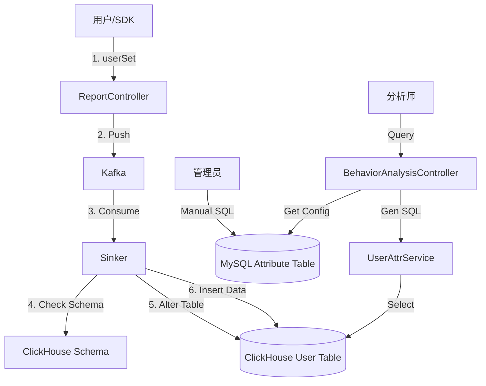

# UserAttribute 逻辑链路分析

本文档详细梳理了**用户属性 (User Properties)** 在系统中的全生命周期管理，包括元数据定义、数据上报写入、以及分析查询的完整数据流。

## 1. 核心概念

在 xwl_bi 系统中，用户属性的管理分为两个层面：
1.  **元数据 (Metadata)**: 定义有哪些属性（如 `gender`, `level`），存储在 MySQL。
2.  **属性值 (Property Value)**: 记录具体用户的属性值（如 `UserA: gender=male`），存储在 ClickHouse。

## 2. 元数据管理流 (Metadata Flow)

目前系统对用户属性元数据的管理主要依赖**手动维护**或**预定义**，通过 MySQL 的 `attribute` 表进行管理。

*   **存储位置**: MySQL 表 `attribute`
*   **关键字段**: `attribute_name` (字段名), `show_name` (显示名), `attribute_source` (1=用户属性, 2=事件属性).

### 2.1 查看属性列表 (Read)
*   **入口**: `MetaDataController.AttrManager`
*   **逻辑**: 直接查询 MySQL `attribute` 表。
*   **SQL**: `select * from attribute where app_id = ? and attribute_source = 1`

### 2.2 修改属性配置 (Update)
*   **修改可见性**: `MetaDataController.UpdateAttrInvisible` -> 更新 `status` 字段。
*   **修改显示名**: `MetaDataController.UpdateAttrShowName` -> 更新 `show_name` 字段。

### 2.3 新增属性 (Create)
*   **机制**: 目前代码中未发现自动同步元数据到 MySQL 的逻辑。
*   **操作**: 需参照 `implementation_guide.md` 手动执行 SQL 插入，或依赖系统初始化脚本。
    ```sql
    INSERT INTO `attribute` (...) VALUES (@appid, 'vip_level', 'VIP等级', '2', 2, 1, 1);
    ```

---

## 3. 属性值写入流 (Data Ingestion Flow)

这是用户属性值从 SDK 上报到最终落库 ClickHouse 的过程。

### 3.1 客户端上报 (SDK)
*   **接口**: `userSet`, `userSetOnce`, `userAdd` 等。
*   **数据包**:
    ```json
    {
        "xwl_distinct_id": "user_123",
        "vip_level": 5,
        "last_login_time": "2023-10-01 12:00:00"
    }
    ```

### 3.2 接收层 (Controller)
*   **文件**: `controller/report_controller.go`
*   **函数**: `ReportAction`
*   **逻辑**:
    1.  解析请求参数 `typ`。
    2.  调用 `report.GetReportDuck(typ)` 获取处理对象。
        *   若 `typ` 对应用户属性上报，使用 `UserReport` (`platform-basic-libs/service/report/report_interface.go`).
        *   标记 `ReportType` 为 `model.UserReportType` (通常为 2)。
        *   固定 `EventName` 为 "用户属性"。
    3.  **Debug 校验**: 若为测试设备，进行实时数据类型校验 (`sinker.GetDims` 获取 Schema 对比)。
    4.  **推送到 Kafka**: 写入 Topic (如 `xwl_bi_debug` 或正式 Topic)。

### 3.3 消费入库层 (Sinker)
*   **组件**: `Sinker` (Consumer)
*   **逻辑**:
    1.  消费 Kafka 消息。
    2.  识别 `ReportType` 为用户属性。
    3.  **Schema 自动变更**:
        *   调用 `sinker/parse/fastjson.go` 的 `GetNewKeys` 检测 JSON 中是否有 ClickHouse 表中不存在的新字段。
        *   若有，调用 `sinker/clickhouse.go` 的 `ChangeSchema` 执行 `ALTER TABLE ... ADD COLUMN ...`。
    4.  **写入 ClickHouse**:
        *   目标表: `xwl_user_{appid}` (通常是 `ReplacingMergeTree` 引擎，支持通过 `xwl_distinct_id` 覆盖更新)。
        *   SQL: `INSERT INTO xwl_user_{appid} (...) VALUES (...)`

---

## 4. 属性值分析查询流 (Analysis Query Flow)

分析师在前端查询用户属性分布时的流程。

### 4.1 接收请求 (Controller)
*   **文件**: `controller/behavior_analysis_controller.go`
*   **函数**: `UserAttrList`
*   **参数**: `UserAttrReqData` (包含指标、分组、筛选条件)。

### 4.2 逻辑处理 (Service)
*   **文件**: `platform-basic-libs/service/analysis/user_attr.go`
*   **函数**: `NewUserAttr` -> `GetList`
*   **步骤**:
    1.  **解析请求**: 反序列化 JSON。
    2.  **构建 SQL**:
        *   **指标计算**: `utils.CountTypMap` (如 `count(1)`, `uniq(xwl_distinct_id)`).
        *   **用户分群**: `utils.GetUserGroupSqlAndArgs` 处理用户群筛选。
        *   **分组**: 处理 `GroupBy` 字段。
    3.  **生成 SQL**:
        ```sql
        SELECT [GroupBy], [Metric]
        FROM xwl_user_{appid}
        WHERE [Filters]
        GROUP BY [GroupBy]
        ```
    4.  **执行查询**: `db.ClickHouseSqlx.Select`。

### 4.3 结果返回
*   将查询结果封装为 `TableRes` 结构返回前端。

## 5. 总结图


