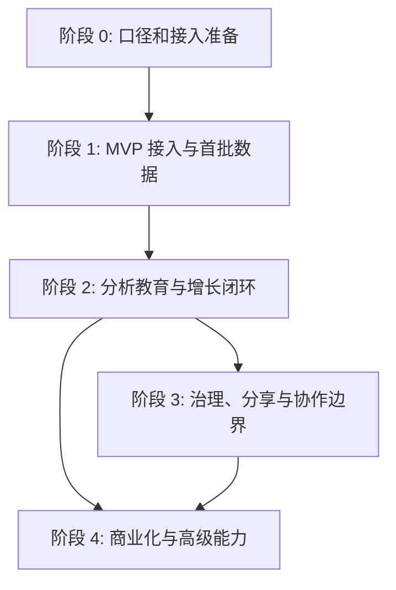

# SimpleTrack 实施路线图

> 用途：把 Litlyx 调研里的接入、事件、增长、治理、分享和商业化能力，转成 SimpleTrack 的阶段实施路径。它回答“先做什么、交付什么、怎么验收、什么时候升级到下一阶段”。

## 总体原则

1. 先让用户接入成功，再让用户看懂分析。
2. 先用 Raw Events 和 Product 验收真实数据，再做 Reports、AI 和增长闭环。
3. 先把示例态和样张做清楚，再做复杂生成和自动化。
4. 先分清外部只读分享和内部成员协作，再设计权限体系。
5. 任何会改变云端状态的动作，都必须有清楚确认和审计边界。

核心输入：

- [落地评审清单](./落地评审清单.md)
- [功能打通矩阵](./功能打通矩阵.md)
- [数据模型与事件字典](./数据模型与事件字典.md)
- [执行与复验手册](./执行与复验手册.md)
- [SimpleTrack能力优先级](./playbooks/04-SimpleTrack能力优先级.md)

## 阶段 0：口径和接入准备

目标：先把事件、字段和安装验收口径定下来，避免一边开发一边改名字。

交付物：

| 交付物 | 内容 |
| --- | --- |
| 安装入口草案 | Script、GTM、框架入口、AI prompt、Verify Installation |
| 事件字典 | 事件名、触发点、metadata 字段、禁止上报字段 |
| 工作区标识规则 | Workspace ID 只运行时使用，不写入仓库或截图 |
| 隐私规则 | 不上报邮箱、密码、token、可识别个人身份信息 |
| 验收路径 | pageview、一个自定义事件、Raw Events 明细、Product 聚合 |

验收标准：

- [数据模型与事件字典](./数据模型与事件字典.md) 已作为唯一事件口径。
- 至少定义 `signup_click`、`checkout_started`、`first_event_sent` 三类关键事件。
- 安装入口已经明确“脚本复制、GTM、验证”三件事。

不做范围：

- 不做完整 PDF 报告生成。
- 不做团队邀请。
- 不做真实分享链接创建。
- 不做域名删除或 sanitization。

## 阶段 1：MVP 接入与首批数据

目标：让用户完成“进入安装页、接入脚本、看到第一批真实事件”。

建议实现：

| 能力 | 最小范围 | 关联文档 |
| --- | --- | --- |
| 默认安装首页 | 登录后默认进入安装入口 | [01-安装与接入](./01-安装与接入.md) |
| Script / GTM | 两种最基础安装路径 | [01-安装与接入](./01-安装与接入.md) |
| 设置回查 | Settings 里可再次看到安装信息 | [01-安装与接入](./01-安装与接入.md) |
| Product 骨架 | 空态也展示 Top Events、Funnel、User Flow、Metadata | [02-采集、事件与 Product](<./02-采集、事件与 Product.md>) |
| Raw Events | 用明细表证明事件真的进库 | [02-采集、事件与 Product](<./02-采集、事件与 Product.md>) |
| Show test data | 解释未来有数状态 | [02-采集、事件与 Product](<./02-采集、事件与 Product.md>) |

验收证据：

- tracker 能加载。
- Raw Events 能看到至少一条真实事件。
- Product 能看到基础聚合。
- 示例数据和真实数据有明确区分。

升级条件：

- 用户已经能稳定看到首批事件。
- 接入失败时能通过 Raw Events 排查。
- Product 空态和示例态能解释未来价值。

## 阶段 2：分析教育与增长闭环

目标：从“数据进来了”升级到“用户知道下一步怎么行动”。

建议实现：

| 能力 | 最小范围 | 关联文档 |
| --- | --- | --- |
| Marketing | 渠道、来源、社交入口 | [03-Marketing、Reports 与 AI](<./03-Marketing、Reports 与 AI.md>) |
| UTM 生成器 | 在 Marketing 页内生成 UTM link | [03-Marketing、Reports 与 AI](<./03-Marketing、Reports 与 AI.md>) |
| Reports 模板中心 | 报告类型、周期、模板说明 | [03-Marketing、Reports 与 AI](<./03-Marketing、Reports 与 AI.md>) |
| Sample 样张 | 先看样张，再考虑生成 | [05-门槛、受限态与升级表达](<./05-门槛、受限态与升级表达.md>) |
| AI 示例问题 | 趋势、漏斗、SEO、UTM、报告 prompt | [03-Marketing、Reports 与 AI](<./03-Marketing、Reports 与 AI.md>) |

验收证据：

- Marketing 能展示空态和示例态。
- UTM 生成器能作为明确动作入口。
- Reports 至少有模板中心和 Sample 样张。
- AI 不只是空聊天框，而是有任务型 prompt。

升级条件：

- 用户开始提出“流量从哪来、怎么投、怎么总结”的问题。
- Product 事件和 Marketing 来源已经有稳定输入。
- 报告样张已经能解释高级能力价值。

## 阶段 3：治理、分享与协作边界

目标：让数据更干净，并把“谁能看、谁能进 workspace、谁能改配置”说清楚。

建议实现：

| 能力 | 最小范围 | 关联文档 |
| --- | --- | --- |
| Domains 治理 | 域名数据查看与清理入口，但先不默认执行删除 | [04-治理、分享、协作与套餐](<./04-治理、分享、协作与套餐.md>) |
| Shields | 域名 allow list、IP 排除、bot 流量过滤 | [04-治理、分享、协作与套餐](<./04-治理、分享、协作与套餐.md>) |
| Shareable links | 外部只读分享入口和撤销模型 | [04-治理、分享、协作与套餐](<./04-治理、分享、协作与套餐.md>) |
| Members | 内部协作入口和清楚的权限说明 | [04-治理、分享、协作与套餐](<./04-治理、分享、协作与套餐.md>) |
| 受限态说明 | 区分套餐、权限、系统异常 | [05-门槛、受限态与升级表达](<./05-门槛、受限态与升级表达.md>) |

验收证据：

- 数据治理动作有风险提示。
- 创建分享链接前有清楚确认。
- Members 不用 loading 代替权限说明。
- 外部只读分享和内部成员协作是两个入口。

升级条件：

- 用户确实需要与外部客户共享数据。
- 内部协作已经需要 owner、editor、viewer 等边界。
- 噪音流量已经影响分析可信度。

## 阶段 4：商业化与高级能力

目标：把高级能力做成可理解的升级路径，而不是一堆灰掉的按钮。

建议实现：

| 能力 | 最小范围 | 关联文档 |
| --- | --- | --- |
| Premium gate | 清楚说明功能价值和升级入口 | [05-门槛、受限态与升级表达](<./05-门槛、受限态与升级表达.md>) |
| Reports 生成 | 在权限满足后执行正式 PDF 生成链路 | [功能打通矩阵](./功能打通矩阵.md) |
| Plans / FAQ | 套餐边界、试用期解释、升级预期 | [05-门槛、受限态与升级表达](<./05-门槛、受限态与升级表达.md>) |
| AI 分析结果 | 从示例 prompt 升级到真实回答证据 | [03-Marketing、Reports 与 AI](<./03-Marketing、Reports 与 AI.md>) |

验收证据：

- disabled 状态必须写清原因。
- Sample 和正式生成是两个明确阶段。
- 任何生成、创建、删除动作都有明确前置条件。
- premium gate 不是空白页，而是有价值说明和下一步动作。

升级条件：

- 基础数据和报告模板已经稳定。
- 用户明确需要自动报告、AI 总结或商业化能力。
- 权限和套餐边界已经能被前端清楚表达。

## 阶段依赖图

## 每阶段退出检查

| 阶段 | 可以退出的信号 | 不能退出的信号 |
| --- | --- | --- |
| 阶段 0 | 事件、字段、隐私和验收口径已定 | Workspace ID 或敏感信息还会写进文档 |
| 阶段 1 | Raw Events 和 Product 都能看到真实事件 | 只有示例数据，没有真实入库证据 |
| 阶段 2 | Marketing、Reports、AI 能串成下一步动作 | 只有报表，没有用户可执行动作 |
| 阶段 3 | 分享、成员、治理都有清楚权限和风险边界 | loading、disabled、灰态没有解释 |
| 阶段 4 | premium gate、样张、正式生成有清晰层级 | 把生成、创建、删除动作做成默认自动执行 |

## 推荐实施顺序

1. `Install -> Verify -> Raw Events`
2. `Product -> Show test data -> Real events`
3. `Marketing -> UTM generator`
4. `Reports -> Sample -> disabled reason`
5. `AI examples -> AI result`
6. `Shields -> Shareable links -> Members`
7. `Plans -> premium gate -> formal generation`

## 与现有 Litlyx 调研资产的关系

这份路线图只负责 SimpleTrack 实施顺序，不替代证据层：

- 页面和截图证据看 [../快照索引.md](../快照索引.md)。
- 当前完成度看 [../快照进度.md](../快照进度.md)。
- 模块状态看 [功能打通矩阵.md](./功能打通矩阵.md)。
- 事件口径看 [数据模型与事件字典.md](./数据模型与事件字典.md)。
- 复验命令看 [执行与复验手册.md](./执行与复验手册.md)。
