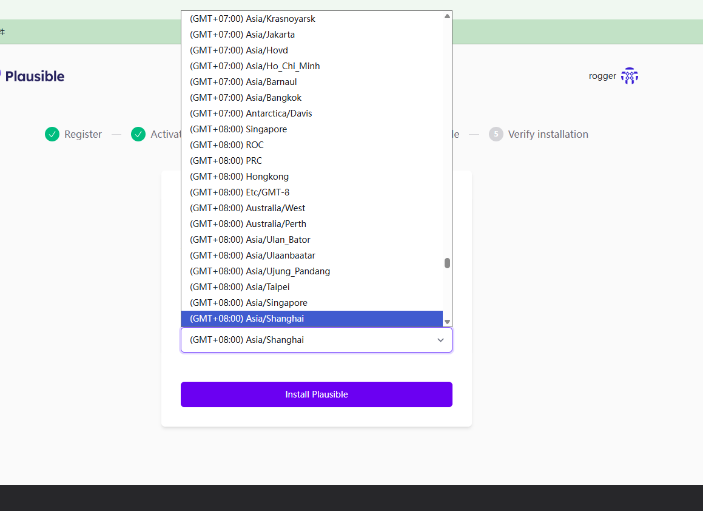

# Plausible Analytics 功能深度分析

> 隐私优先的轻量级网站分析工具完整解析
> 日期：2026年1月28日

---

## 📋 目录

1. [产品概述](#产品概述)
2. [核心功能详解](#核心功能详解)
3. [定价策略](#定价策略)
4. [技术架构](#技术架构)
5. [优势与劣势](#优势与劣势)
6. [与SimpleTrack对比](#与simpletrack对比)

---

## 🎯 产品概述

### 基本信息

**公司背景**：
- 创始人：Uku Täht 和 Marko Saric
- 成立时间：2019年
- 团队规模：10人
- 商业模式：订阅制（非风投支持，自力更生）
- 用户数量：16,000+付费订阅者（2026年初）
- 企业客户：600+

**产品定位**：
- Google Analytics的隐私友好替代品
- 轻量级、简单易用的网站分析工具
- 完全符合GDPR/CCPA等隐私法规
- 开源项目（可自托管）


**核心价值主张**：
1. **简单性**：一页显示所有关键指标，无需复杂配置
2. **隐私性**：不使用Cookie，不收集个人数据
3. **轻量级**：脚本仅1.7KB（比GA小75倍）
4. **透明性**：可公开分享数据，开源代码

---

## 🔧 核心功能详解

### 1. 基础流量分析

#### 1.1 实时仪表盘

**功能描述**：
- 单页面显示所有核心指标
- 实时数据更新（无延迟）
- 简洁的UI设计

**核心指标**：
```
- 独立访客（Unique Visitors）
- 总访问量（Total Pageviews）
- 跳出率（Bounce Rate）
- 访问时长（Visit Duration）
- 当前在线人数（Current Visitors）
```

**特点**：
- ✅ 无需创建自定义报告
- ✅ 无需学习复杂界面
- ✅ 1分钟内理解所有数据
- ✅ 支持多站点聚合视图

---

#### 1.2 页面分析

**Top Pages（热门页面）**：
```
显示内容：
- 页面URL
- 访问量
- 独立访客
- 跳出率
- 平均停留时间

排序方式：
- 按访问量
- 按独立访客
- 按停留时间
```

**Entry Pages（入口页面）**：
```
显示内容：
- 用户首次访问的页面
- 访问量
- 独立访客
- 跳出率

用途：
- 了解用户从哪里进入网站
- 优化落地页
- 改善首次体验
```

**Exit Pages（退出页面）**：
```
显示内容：
- 用户最后访问的页面
- 退出率
- 访问量

用途：
- 发现用户流失点
- 优化内容
- 改善用户体验
```

---

#### 1.3 流量来源分析

**Referrers（引荐来源）**：
```
显示内容：
- 来源网站
- 访问量
- 独立访客
- 跳出率

分类：
- 直接访问（Direct）
- 搜索引擎（Search）
- 社交媒体（Social）
- 其他网站（Referral）
```

**UTM参数追踪**：
```
支持的参数：
- utm_source（来源）
- utm_medium（媒介）
- utm_campaign（活动）
- utm_content（内容）
- utm_term（关键词）

自动分类：
- Affiliates（联盟营销）
- Display（展示广告）
- Email（邮件营销）
- Paid Search（付费搜索）
- Paid Social（付费社交）
- Referral（推荐流量）
```

---

#### 1.4 地理位置分析

**Countries（国家/地区）**：
```
显示内容：
- 国家名称
- 访问量
- 独立访客
- 跳出率

可视化：
- 地图视图
- 列表视图
- 支持深入到城市级别
```

**Regions & Cities（区域和城市）**：
```
- 州/省级别数据
- 城市级别数据
- 支持筛选和排序
```

---

#### 1.5 设备和浏览器分析

**Devices（设备类型）**：
```
分类：
- Desktop（桌面）
- Mobile（移动）
- Tablet（平板）

显示数据：
- 访问量
- 独立访客
- 跳出率
```

**Browser（浏览器）**：
```
支持的浏览器：
- Chrome
- Safari
- Firefox
- Edge
- 其他

显示版本号
```

**Operating System（操作系统）**：
```
支持的系统：
- Windows
- macOS
- Linux
- iOS
- Android
- 其他
```

**Screen Size（屏幕尺寸）**：
```
显示内容：
- 屏幕分辨率
- 访问量占比

用途：
- 响应式设计优化
- 了解用户设备
```

---

### 2. 目标转化追踪

#### 2.1 自定义事件（Custom Events）

**设置方式**：

**方法1：JavaScript API**
```javascript
// 基础事件追踪
plausible('Signup')

// 带自定义属性的事件
plausible('Purchase', {
  props: {
    amount: 99,
    plan: 'pro'
  }
})

// 追踪收入
plausible('Purchase', {
  revenue: {
    currency: 'USD',
    amount: 99.00
  }
})
```

**方法2：CSS类名（无代码）**
```html
<!-- 自动追踪点击 -->
<button class="plausible-event-name=Signup">注册</button>

<!-- 带属性的追踪 -->
<a href="/pricing"
   class="plausible-event-name=View+Pricing plausible-event-plan=pro">
  查看定价
</a>
```

**支持的事件类型**：
```
1. 页面浏览（Pageview Goals）
   - 追踪特定页面访问
   - 如：/thank-you, /checkout

2. 自定义事件（Custom Events）
   - 按钮点击
   - 表单提交
   - 视频播放
   - 文件下载
   - 任何自定义交互

3. 出站链接（Outbound Links）
   - 自动追踪外部链接点击
   - 无需手动配置

4. 文件下载（File Downloads）
   - 自动追踪PDF、ZIP等下载
   - 支持自定义文件类型

5. 404错误页面（404 Pages）
   - 自动追踪404错误
   - 帮助发现死链接
```

---

#### 2.2 目标转化分析

**转化指标**：
```
显示内容：
- 转化次数（Conversions）
- 转化率（Conversion Rate）
- 独立转化用户（Unique Conversions）

可筛选维度：
- 来源渠道
- 入口页面
- 国家/地区
- 设备类型
- 浏览器
```

**转化漏斗（Funnels）**：
```
功能：
- 定义多步骤转化路径
- 可视化每步流失率
- 分析用户旅程

示例漏斗：
Step 1: 访问首页 (100%)
  ↓ 60%
Step 2: 查看定价 (60%)
  ↓ 50%
Step 3: 注册 (30%)
  ↓ 40%
Step 4: 付费 (12%)

分析维度：
- 按来源分析
- 按设备分析
- 按时间段分析
```

---

#### 2.3 收入追踪（Revenue Tracking）

**功能描述**：
- 追踪电商收入
- 支持多币种
- 自动汇总统计

**实现方式**：
```javascript
// 追踪购买事件和收入
plausible('Purchase', {
  revenue: {
    currency: 'USD',
    amount: 99.00
  },
  props: {
    product: 'Pro Plan',
    quantity: 1
  }
})
```

**收入报告**：
```
显示内容：
- 总收入（Total Revenue）
- 平均订单价值（Average Order Value）
- 转化率（Conversion Rate）
- 按来源的收入分布

可筛选：
- 时间范围
- 产品类型
- 来源渠道
```

---

### 3. 高级功能

#### 3.1 Google Search Console集成

**功能**：
- 查看搜索关键词
- 查看搜索排名
- 查看点击率（CTR）
- 查看展示次数

**数据展示**：
```
- 搜索查询（Search Queries）
- 点击次数（Clicks）
- 展示次数（Impressions）
- 点击率（CTR）
- 平均排名（Average Position）
```

**价值**：
- 了解SEO表现
- 优化关键词策略
- 发现新机会

---

#### 3.2 自定义属性（Custom Properties）

**功能描述**：
- 为事件添加自定义维度
- 深度分析用户行为

**使用示例**：
```javascript
// 追踪注册来源
plausible('Signup', {
  props: {
    source: 'Product Hunt',
    plan: 'pro',
    trial: 'yes'
  }
})

// 追踪功能使用
plausible('Feature Used', {
  props: {
    feature: 'Export Data',
    user_type: 'paid',
    frequency: 'daily'
  }
})
```

**分析能力**：
```
可以按自定义属性筛选：
- 用户类型（免费/付费）
- 功能使用情况
- 用户行为模式
- 任何自定义维度
```

---

#### 3.3 数据过滤和分段

**过滤器（Filters）**：
```
支持的过滤维度：
- 页面（Page）
- 来源（Source）
- 国家（Country）
- 设备（Device）
- 浏览器（Browser）
- 操作系统（OS）
- 自定义属性（Custom Props）

过滤操作：
- 包含（is）
- 不包含（is not）
- 包含任意（contains）
- 不包含任意（does not contain）
```

**分段分析**：
```
示例：
1. 查看来自Product Hunt的用户转化率
2. 对比移动端和桌面端的跳出率
3. 分析付费用户的行为模式
4. 追踪特定活动的效果
```

---

#### 3.4 数据导入导出

**导入功能**：
```
支持导入：
- Google Analytics历史数据
- Universal Analytics数据
- GA4数据

导入内容：
- 页面浏览量
- 独立访客
- 来源数据
- 设备数据
```

**导出功能**：
```
导出格式：
- CSV
- JSON（通过API）

导出内容：
- 所有统计数据
- 自定义时间范围
- 筛选后的数据
```

---

#### 3.5 API访问

**Stats API**：
```
功能：
- 获取所有统计数据
- 支持自定义查询
- 实时数据访问

用途：
- 构建自定义仪表盘
- 集成到其他系统
- 自动化报告
```

**Events API**：
```
功能：
- 服务端事件追踪
- 批量数据导入
- 自定义集成

用途：
- 追踪服务端事件
- 集成第三方系统
- 自动化数据收集
```

---

### 4. 协作和分享功能

#### 4.1 团队协作

**用户角色**：
```
1. Owner（所有者）
   - 完全控制权限
   - 管理账单
   - 添加/删除成员

2. Admin（管理员）
   - 查看和编辑所有数据
   - 管理目标和设置
   - 不能管理账单

3. Viewer（查看者）
   - 只读访问
   - 查看所有报告
   - 不能修改设置
```

**团队管理**：
```
- 邀请团队成员
- 分配角色权限
- 管理访问权限
- 审计日志
```

---

#### 4.2 数据分享

**公开分享**：
```
功能：
- 生成公开链接
- 任何人可访问
- 实时数据展示

用途：
- 透明化运营
- 展示增长数据
- 建立信任
```

**私密分享**：
```
功能：
- 生成加密链接
- 密码保护
- 有效期设置

用途：
- 与客户分享
- 与投资人分享
- 临时访问授权
```

**嵌入仪表盘**：
```html
<!-- 嵌入到网站 -->
<iframe
  plausible-embed
  src="https://plausible.io/share/yourdomain.com?auth=xxx"
  loading="lazy"
  style="width: 1px; min-width: 100%; height: 1600px;">
</iframe>
```

---

#### 4.3 邮件报告

**功能**：
```
- 自动发送周报/月报
- 自定义收件人
- 选择报告内容
- 设置发送时间

报告内容：
- 流量概览
- 热门页面
- 流量来源
- 转化数据
```

---

### 5. 隐私和合规功能

#### 5.1 隐私保护

**核心特性**：
```
1. 不使用Cookie
   - 无需Cookie横幅
   - 不影响用户体验

2. 不收集个人数据
   - 不追踪个人身份
   - 不收集IP地址（匿名化）
   - 不跨站追踪

3. 数据存储
   - 所有数据存储在欧盟
   - 符合GDPR要求
   - 数据不出售给第三方
```

**匿名化处理**：
```
- IP地址哈希处理
- 不存储原始IP
- 无法识别个人身份
- 符合隐私法规
```

---

#### 5.2 合规性

**支持的法规**：
```
✅ GDPR（欧盟通用数据保护条例）
✅ CCPA（加州消费者隐私法案）
✅ PECR（英国隐私和电子通信法规）
✅ ePrivacy Directive（欧盟电子隐私指令）
```

**合规优势**：
```
- 无需Cookie同意
- 无需隐私政策更新
- 无需数据处理协议
- 降低合规成本
```

---

### 6. 性能优化功能

#### 6.1 轻量级脚本

**技术规格**：
```
- 脚本大小：1.7KB（压缩后）
- 比Google Analytics小75倍
- 异步加载
- 不阻塞页面渲染
```

**性能影响**：
```
- 页面加载速度提升
- 降低带宽消耗
- 改善SEO排名
- 减少碳排放（环保）

数据：
- 10万月访问量的网站
- 每年减少8.2kg CO2排放
```

---

#### 6.2 数据处理

**实时处理**：
```
- 无延迟数据展示
- 实时仪表盘更新
- 快速查询响应
```

**数据保留**：
```
- 永久保留所有数据
- 无数据采样
- 完整历史记录
```

---

## 💰 定价策略

### 定价层级

| 计划 | 月访问量 | 月费 | 年费 | 节省 |
|------|---------|------|------|------|
| **Growth** | 10K | $9 | $90 | 17% |
| **Startup** | 100K | $19 | $190 | 17% |
| **Business** | 200K | $29 | $290 | 17% |
| **Enterprise** | 500K | $49 | $490 | 17% |
| **Enterprise** | 1M | $69 | $690 | 17% |
| **Enterprise** | 2M | $99 | $990 | 17% |
| **Enterprise** | 5M | $149 | $1,490 | 17% |
| **Enterprise** | 10M+ | 定制 | 定制 | - |

**注意**：
- 价格基于月访问量（pageviews）
- 自定义事件也计入访问量
- 可添加多个网站（无额外费用）
- 超出流量自动升级

---

### 定价特点

**优势**：
```
✅ 简单透明
✅ 按流量计费
✅ 无隐藏费用
✅ 可随时取消
✅ 无合同锁定
✅ 年付享折扣
```

**包含功能**：
```
所有计划包含：
- 无限网站数量
- 无限团队成员
- 所有功能
- 邮件支持
- 数据导入导出
- API访问
- 永久数据保留
```

---

### 企业版（Enterprise）

**额外功能**：
```
- 更高流量限制
- 优先支持
- SLA保证
- 专属客户经理
- 定制集成
- 培训服务
- SSO单点登录
- 托管代理（Managed Proxy）
```

**定价**：
- 根据需求定制
- 联系销售团队

---

## 🏗️ 技术架构

### 技术栈

**后端**：
```
- 语言：Elixir
- 框架：Phoenix
- 数据库：PostgreSQL + ClickHouse
- 缓存：Redis
```

**前端**：
```
- 框架：React
- 状态管理：React Hooks
- 样式：Tailwind CSS
```

**基础设施**：
```
- 托管：自有服务器（欧盟）
- CDN：Cloudflare
- 监控：自建系统
```

---

### 开源项目

**代码仓库**：
```
- GitHub：plausible/analytics
- 许可证：AGPL v3
- Star数：20K+
```

**自托管选项**：
```
支持：
- Docker部署
- 完整文档
- 社区支持

适合：
- 需要完全控制数据
- 有技术团队
- 预算有限
```

---

## ⚖️ 优势与劣势

### 核心优势

**1. 隐私优先** ⭐⭐⭐⭐⭐
```
✅ 完全符合GDPR
✅ 不使用Cookie
✅ 不收集个人数据
✅ 数据存储在欧盟
✅ 无需Cookie横幅
```

**2. 简单易用** ⭐⭐⭐⭐⭐
```
✅ 单页仪表盘
✅ 无需培训
✅ 1分钟理解数据
✅ 无复杂配置
✅ 直观的UI
```

**3. 轻量级** ⭐⭐⭐⭐⭐
```
✅ 脚本仅1.7KB
✅ 不影响页面速度
✅ 改善SEO
✅ 环保（减少碳排放）
```

**4. 透明度** ⭐⭐⭐⭐⭐
```
✅ 开源代码
✅ 可公开分享数据
✅ 透明定价
✅ 无隐藏费用
```

**5. 功能完整** ⭐⭐⭐⭐
```
✅ 目标转化追踪
✅ 漏斗分析
✅ 自定义事件
✅ 收入追踪
✅ API访问
```

---

### 主要劣势

**1. 功能深度有限** ⭐⭐
```
❌ 无用户级别追踪
❌ 无会话回放
❌ 无热力图
❌ 无A/B测试
❌ 无高级分段
```

**2. AI功能缺失** ⭐
```
❌ 无AI洞察
❌ 无异常检测
❌ 无预测分析
❌ 无自动建议
```

**3. 集成有限** ⭐⭐⭐
```
❌ 第三方集成较少
❌ 无CRM集成
❌ 无营销自动化集成
```

**4. 定价对高流量网站较贵** ⭐⭐
```
❌ 100万访问/月需$69
❌ 对大型网站成本较高
❌ 按访问量计费可能不划算
```

---

## 🆚 与SimpleTrack对比

### 功能对比

| 功能 | Plausible | SimpleTrack |
|------|-----------|-------------|
| **基础追踪** | ✅ | ✅ |
| **实时数据** | ✅ | ✅ |
| **目标转化** | ✅ | ✅ |
| **漏斗分析** | ✅ | ✅ |
| **收入追踪** | ✅ | ✅ |
| **自定义事件** | ✅ | ✅ |
| **AI洞察** | ❌ | ✅ |
| **用户留存** | ❌ | ✅ |
| **异常检测** | ❌ | ✅ |
| **预测分析** | ❌ | ✅ |
| **开源** | ✅ | 计划中 |
| **自托管** | ✅ | 计划中 |

---

### 定价对比

| 流量 | Plausible | SimpleTrack | 差异 |
|------|-----------|-------------|------|
| 10K | $9/月 | $0（免费版） | -$9 |
| 100K | $19/月 | $29/月 | +$10 |
| 200K | $29/月 | $29/月 | $0 |
| 1M | $69/月 | $29/月 | -$40 |

**分析**：
- Plausible对低流量网站更便宜
- SimpleTrack对高流量网站更划算
- SimpleTrack提供免费版（Plausible无）

---

### 目标用户对比

**Plausible适合**：
```
✅ 注重隐私的网站
✅ 内容网站/博客
✅ 小型企业
✅ 需要简单分析的团队
✅ 欧洲用户（GDPR）
```

**SimpleTrack适合**：
```
✅ SaaS产品
✅ 需要深度分析的团队
✅ 需要AI洞察的创始人
✅ 高流量网站
✅ 需要用户留存分析
```

---

### 差异化机会

**SimpleTrack可以做得更好**：

**1. AI功能**
```
Plausible缺失：
- 添加AI每周洞察
- 异常检测
- 预测分析
- 自动建议

SimpleTrack优势：
- 这是核心差异化
- Plausible短期内不会添加
- 市场需求强烈
```

**2. SaaS专注**
```
Plausible定位：
- 通用网站分析

SimpleTrack定位：
- 专注SaaS
- 深度功能（留存、漏斗）
- 针对性优化
```

**3. 定价策略**
```
Plausible问题：
- 高流量网站贵
- 按访问量计费

SimpleTrack优势：
- 固定价格$29
- 更适合SaaS（事件多）
- 可预测成本
```

---

## 📊 市场表现

### 用户增长

```
2019年：创立
2020年：1,000付费用户
2021年：5,000付费用户
2022年：10,000付费用户
2024年：15,000付费用户
2026年：16,000+付费用户

增长率：稳定增长，年增长20-30%
```

### 收入估算

```
假设平均客单价$25/月：
16,000用户 × $25 = $400,000 MRR
年收入：$4.8M ARR

团队10人，利润率估计60-70%
```

### 市场认可

```
✅ Product Hunt #1 Product of the Day
✅ GitHub 20K+ stars
✅ 被Fortune 100公司使用
✅ 被政府机构使用
✅ 媒体广泛报道
```

---

## 💡 关键学习点

### 对SimpleTrack的启示

**1. 简单性很重要**
```
- Plausible的成功证明了简单的价值
- 用户不需要复杂功能
- 单页仪表盘很受欢迎
- SimpleTrack也应保持简单
```

**2. 隐私是卖点**
```
- GDPR合规是竞争优势
- 不使用Cookie是优势
- 透明度建立信任
- SimpleTrack应强调隐私
```

**3. 开源建立信任**
```
- Plausible的开源策略成功
- 建立社区
- 增加透明度
- SimpleTrack可考虑开源
```

**4. 定价要简单**
```
- Plausible定价清晰透明
- 无隐藏费用
- 用户喜欢可预测成本
- SimpleTrack应保持简单定价
```

**5. 差异化机会**
```
- AI功能是空白
- SaaS专注是机会
- 固定定价是优势
- 深度功能是差异
```

---

## 🎯 总结

### Plausible的核心竞争力

```
1. 隐私优先（最强）
2. 简单易用（很强）
3. 轻量级（很强）
4. 开源透明（强）
5. 合理定价（中等）
```

### Plausible的弱点

```
1. 功能深度不足
2. 无AI功能
3. 高流量网站贵
4. 不专注SaaS
5. 集成有限
```

### SimpleTrack的机会

```
1. 添加AI功能（Plausible没有）
2. 专注SaaS（Plausible通用）
3. 固定定价（Plausible按流量）
4. 深度功能（留存、预测）
5. 更好的集成
```

---

**结论**：

Plausible是一个优秀的产品，在隐私和简单性方面做得很好。但它为SimpleTrack留下了明显的差异化空间：

1. **AI功能**：Plausible完全没有，这是最大机会
2. **SaaS专注**：Plausible是通用工具，SimpleTrack可以更专注
3. **定价模式**：固定价格对SaaS更友好
4. **功能深度**：在保持简单的同时提供更深的分析

SimpleTrack应该学习Plausible的简单性和隐私保护，但在AI和SaaS专注度上超越它。

---

*文档版本：v1.0*
*最后更新：2026年1月28日*
*数据来源：[Plausible官网](https://plausible.io)、公开资料*
