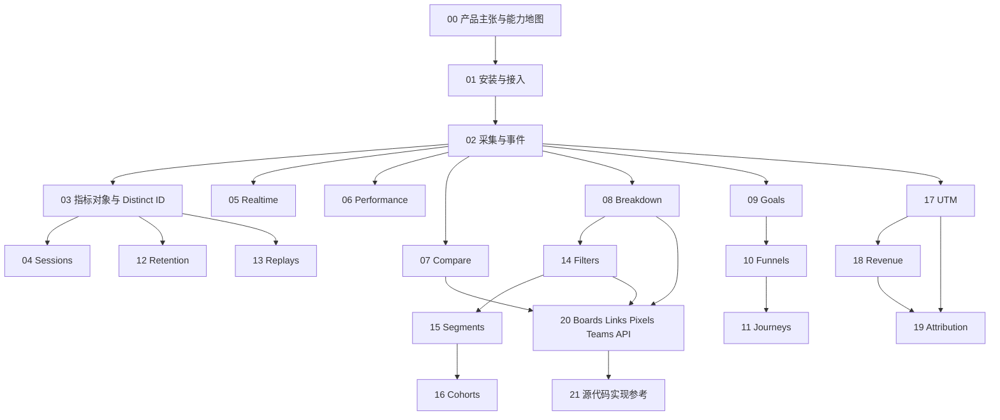

# Umami 官方文档双视角中文解读

> 目标：把 Umami 官方文档里“宣传的能力点”翻译成可落地的产品语言，既帮助理解系统架构，也帮助直接借鉴最佳实践。

## 怎么读这套文档

这套资料分成两层：

- `能力模块型`
  - 适合回答“Umami 把系统拆成了哪些能力、这些能力之间是什么关系”
  - 更偏产品架构、数据对象、分析体系
- `链路型`
  - 适合回答“如果我真的要把 Umami 用起来，应该按什么顺序走”
  - 更偏最佳实践、落地动作、容易踩的坑

如果要把这套材料用于 SimpleTrack 产品评审，直接看 [SimpleTrack 落地评审清单](./落地评审清单.md)，它把模块和链路整理成可逐项检查的准入标准。
如果要进入排期和执行，直接看 [SimpleTrack 实施路线图](./SimpleTrack实施路线图.md)，它把能力拆成阶段、交付物和验收证据。

建议的阅读顺序：

1. 先看 [00-产品主张与能力地图](./00-产品主张与能力地图.md)
2. 再看采集和对象层：`01`、`02`、`03`
3. 然后按目标选择：
   - 想做接入验收：看 `04`、`05`、`06`
   - 想做行为分析：看 `07` 到 `13`
   - 想做人群分层：看 `14` 到 `16`
   - 想做营销与增长：看 `17` 到 `19`
   - 想理解工作台、协作和扩展：看 `20`
4. 如果要进入实现对照，看 [21-源代码实现参考](./21-源代码实现参考.md)
5. 最后看 [落地评审清单](./落地评审清单.md) 和 `playbooks/`，把能力串成评审决策与实战路径

## 能力关系图

这张图可以这样理解：

- 左边是“数据怎么进来、怎么被识别”
- 中间是“怎么看、怎么分析、怎么解释”
- 右边是“怎么分享、协作、扩展出去”

## 按问题找答案

| 如果你现在想回答的问题 | 先看哪些模块 | 再看哪个 playbook |
| --- | --- | --- |
| 我刚接入，怎么确认数据真的进来了？ | `01` `02` `05` | `01-从0到首批数据` |
| 我想知道按钮点击和事件属性该怎么设计 | `02` `03` `08` [数据模型与事件字典](./数据模型与事件字典.md) | `02-从采集到事件分析` |
| 我想把用户按条件切开，并且重复复用 | `14` `15` `16` | `03-从过滤到细分用户` |
| 我想分析注册或购买流程卡在哪一步 | `09` `10` `11` | `04-从目标到漏斗到旅程` |
| 我想看投放、营收、归因怎么串起来 | `17` `18` `19` | `05-从渠道到营收到归因` |
| 我想排查“是不是页面慢了”或“用户到底怎么操作的” | `05` `06` `13` | `06-从实时异常到性能与回放排查` |
| 我想决定 SimpleTrack 的 MVP 应该做到哪 | `00` `20` | `07-SimpleTrack能力优先级` |
| 我想参考 Umami 源码怎么组织采集、存储和查询 | `01` `02` `05` `20` `21` | `02-从采集到事件分析` |

## 常见混淆概念速查

| 容易混淆的概念 | 更适合回答的问题 | 不适合直接回答的问题 |
| --- | --- | --- |
| `Realtime` vs `Sessions` vs `Replays` | `Realtime` 先看“现在有没有数据”；`Sessions` 看“这个访问者这次做了什么”；`Replays` 看“他在页面上到底怎么操作的” | `Realtime` 不适合解释长期趋势；`Sessions` 不适合做总体转化判断；`Replays` 不适合替代聚合分析 |
| `Compare` vs `Breakdown` | `Compare` 看时间前后变化；`Breakdown` 看同一时间段里的结构差异 | `Compare` 不能替代分组分析；`Breakdown` 不能直接说明环比同比 |
| `Goals` vs `Funnels` vs `Journeys` vs `Retention` | `Goals` 看单个目标是否达成；`Funnels` 看步骤流失；`Journeys` 看真实路径；`Retention` 看用户后续会不会回来 | `Goals` 不解释为什么掉；`Funnels` 不适合看自由路径；`Journeys` 不适合当强顺序漏斗；`Retention` 不回答单次转化是否成功 |
| `Filters` vs `Segments` vs `Cohorts` | `Filters` 是临时切片；`Segments` 是保存后的常用筛选；`Cohorts` 是带时间边界的人群定义 | `Filters` 不适合长期复用；`Segments` 不是留存分析；`Cohorts` 不是普通快捷筛选 |
| `UTM` vs `Revenue` vs `Attribution` | `UTM` 看流量标签；`Revenue` 看金额；`Attribution` 看功劳分配 | `UTM` 不等于归因；`Revenue` 不等于渠道贡献；`Attribution` 不能脱离转化事件单独成立 |
| `Dashboard` vs `Boards` | `Dashboard` 更像默认总览工作台；`Boards` 更像专题化自定义看板系统 | 不要把“修改默认首页”和“新建专题看板”混成同一件事 |

如果你只想先抓住一个判断原则，可以记成：

- `有没有数据` 先看 `Realtime`
- `是谁、这一趟做了什么` 看 `Sessions`
- `成功没成功` 看 `Goals`
- `卡在哪一步` 看 `Funnels`
- `用户真实怎么走` 看 `Journeys`
- `回来没有` 看 `Retention`
- `这波流量值不值` 看 `UTM + Revenue + Attribution`

## 推荐阅读路径

### 路线 A：先把接入跑通

1. [01-安装与接入](./01-安装与接入.md)
2. [02-采集与事件](./02-采集与事件.md)
3. [05-Realtime](./05-Realtime.md)
4. [01-从0到首批数据](./playbooks/01-从0到首批数据.md)

### 路线 B：先把分析体系搭起来

1. [03-指标对象与Distinct-ID](./03-指标对象与Distinct-ID.md)
2. [08-Breakdown](./08-Breakdown.md)
3. [09-Goals](./09-Goals.md)
4. [10-Funnels](./10-Funnels.md)
5. [11-Journeys](./11-Journeys.md)
6. [04-从目标到漏斗到旅程](./playbooks/04-从目标到漏斗到旅程.md)

### 路线 C：先做增长与商业化分析

1. [14-Filters](./14-Filters.md)
2. [17-UTM](./17-UTM.md)
3. [18-Revenue](./18-Revenue.md)
4. [19-Attribution](./19-Attribution.md)
5. [05-从渠道到营收到归因](./playbooks/05-从渠道到营收到归因.md)

## 实证覆盖速览

| 模块 | 当前证据强度 | 主要本地证据 | 适合怎么引用 |
| --- | --- | --- | --- |
| `01 安装与接入` | 高 | `P01-*`、`P02-S01`、`P02-S02`、`tracking-demo` | 可直接作为建站和接入路径参考 |
| `02 采集与事件` | 高 | `P03-S01`、`P03-S09`、`tracking-demo/app.js`、`send-event.mjs`、`bulk-send.mjs` | 可直接作为事件采集与 API send 实操参考 |
| `03 指标对象与 Distinct-ID` | 中高 | `P03-S10`、`P03-S11`、`P03-S12`、`identify()` demo | 可作为“事件/属性/身份”边界参考 |
| `04 Sessions` | 高 | `P07-S01` 已有真实会话列表和 session count | 可直接作为会话分析结果态参考 |
| `05 Realtime` | 高 | `P06-S05`、`P06-S06` | 可直接作为接入验收页参考 |
| `06 Performance` | 高 | `P07-S03` 已有 LCP / FCP / TTFB 等性能指标 | 可直接作为性能分析结果态参考 |
| `07 Compare` | 高 | `P07-S04` 已有当前周期指标和路径对比数据 | 可直接作为周期对比能力参考 |
| `08 Breakdown` | 高 | `P07-S05`、`Properties` 视图、`P03-S12`、`P05-C14` | 可作为“按维度拆分”能力参考 |
| `09 Goals` | 高 | `P07-S06` 已有 `Checkout Completed Goal` 结果态 | 可直接作为目标配置和转化率参考 |
| `10 Funnels` | 高 | `P06-S02`、`P06-S07`、`P06-S08`、`P06-S09`、`P08-S01` | 可直接作为漏斗配置与三倍样本结果参考 |
| `11 Journeys` | 高 | `P06-S03`、`P06-S10` | 可直接作为路径分析参考 |
| `12 Retention` | 中高 | `P08-S03` 已有留存矩阵和 cohort 数据，`P06-S04` 可证实入口 | 可作为 cohort 留存结构参考，长窗口结论仍需更长样本 |
| `13 Replays` | 中 | `P08-S04` 已验证入口和 Business plan 限制 | 引用时应明确“当前账号受套餐限制，未验证回放播放态” |
| `14 Filters` | 高 | `P03-S07`、`P05-C14`、`P05-C15`、`P07-S08` | 可直接作为过滤器结构与应用后重算参考 |
| `15 Segments` | 高 | `P05-C16` Filter 结构 + `P07-S08` 应用态 + `P08-S05 / P08-S05A` 保存对象与配置态 | 可作为“可保存筛选”设计参考；列表页不直接展示人数，应用到分析页后会重算指标 |
| `16 Cohorts` | 中高 | `P08-S06 / P08-S06A` 保存对象与事件 cohort 配置态 | 可作为 Cohort 对象规划参考；人数展示需要结合 Retention 等结果页 |
| `17 UTM` | 高 | `P08-S07` 已有 6 组 campaign 的非零 views | 可作为增长来源分析结果态参考 |
| `18 Revenue` | 高 | `P08-S08` 已有收入总额、订单和 revenue session 证据 | 可作为收入事件入库和报表结果态参考；注意当前数值是多轮重跑累积 |
| `19 Attribution` | 高 | `P08-S09` 已切到 `Triggered event / checkout_completed` 并显示非零渠道分布 | 可作为归因输入、模型选择和结果态参考 |
| `20 Boards / Links / Pixels / Teams / API` | 中高 | Boards 相关 `P04-*`、`P05-*` 已强验证；Links/Pixels/Teams 仍偏官方解读 | 可直接引用 Boards 结论；其余子能力要标注证据边界 |

简单理解：

- `高`：已经有页面截图、操作流或 demo 直接支撑
- `中`：有部分支撑，但还不够把整页能力说成“完全跑通”
- `低`：当前主要依赖官方文档解读，适合做设计输入，不适合写成已验证事实

## 引用口径建议

如果你要把这套材料拿去写评审结论、PRD、方案说明，建议按证据强度选措辞：

| 证据强度 | 建议措辞 | 不建议的措辞 |
| --- | --- | --- |
| `高` | “已在本地 Umami Cloud 实操中验证” “已有截图和操作流证据” | “看起来可能是这样” |
| `中` | “已验证入口或部分流程，完整能力仍需补图/补样本” | “已经完整跑通” |
| `低` | “基于官方文档解读，当前尚未在本地 Cloud 完整复验” | “我们已经确认它在当前环境可用” |

一句话判断：

- 要写“已验证”，至少要有本地截图、操作流或 demo 请求证据
- 只有官方文档时，应写成“官方能力说明”或“设计输入”
- 如果只有入口截图，没有结果态截图，就不要把它写成“完整跑通”

## 证据入口速查

| 模块 | 优先回看的快照阶段 | 主分析文档里的对应章节 | 备注 |
| --- | --- | --- | --- |
| `01 安装与接入` | `Phase 01` `Phase 02` | `## 2. 最短使用链路` `## 10. Website 编辑页各部分都是什么` | 最适合回看建站、Tracking code、settings 结构 |
| `02 采集与事件` | `Phase 03` | `## 3. 数据采集方式` `## 4. 验证样例设计` | 最适合回看 demo、事件上报和 API send |
| `03 指标对象与 Distinct-ID` | `Phase 03` | `## 3. 数据采集方式` `## 11. Events、Funnels、Journeys、Retention、Realtime 分别在看什么` | 主要靠事件属性和 `identify()` 证据支撑 |
| `04 Sessions` | `Phase 07` | `## 14. growth-baseline-x3 仿真站打通计划` | `P07-S01` 是最新真实会话证据 |
| `05 Realtime` | `Phase 06` | `## 11. Events、Funnels、Journeys、Retention、Realtime 分别在看什么` | `P06-S05` `P06-S06` 是最快入口 |
| `06 Performance` | `Phase 07` | `## 14. growth-baseline-x3 仿真站打通计划` | `P07-S03` 是最新性能结果态 |
| `07 Compare` | `Phase 07` | `## 14. growth-baseline-x3 仿真站打通计划` | `P07-S04` 是最新对比结果态 |
| `08 Breakdown` | `Phase 03` `Phase 05` | `## 8. Filter 里的 Fields 是怎么用的` | 可回看 Properties、Fields、Filter 结构 |
| `09 Goals` | `Phase 07` | `## 14. growth-baseline-x3 仿真站打通计划` | `P07-S06` 已验证 checkout 目标结果 |
| `10 Funnels` | `Phase 06` | `## 11. Events、Funnels、Journeys、Retention、Realtime 分别在看什么` | `P06-S07` 到 `P06-S09` 是关键证据 |
| `11 Journeys` | `Phase 06` | `## 11. Events、Funnels、Journeys、Retention、Realtime 分别在看什么` | `P06-S10` 是关键路径图证据 |
| `12 Retention` | `Phase 06` `Phase 08` | `## 11. Events、Funnels、Journeys、Retention、Realtime 分别在看什么` `## 14. growth-baseline-x3 仿真站打通计划` | `P08-S03` 已有留存矩阵 |
| `13 Replays` | `Phase 08` | `## 14. growth-baseline-x3 仿真站打通计划` | `P08-S04` 已验证套餐限制 |
| `14 Filters` | `Phase 03` `Phase 05` | `## 8. Filter 里的 Fields 是怎么用的` | `P03-S07` `P05-C14` `P05-C15` 最关键 |
| `15 Segments` | `Phase 05` `Phase 07` `Phase 08` | `## 9. Filter 里的 Segments 和 Cohorts 是怎么用的` | `P07-S08` 已验证应用态，`P08-S05 / P08-S05A` 已验证保存对象和 campaign 配置 |
| `16 Cohorts` | `Phase 08` | `## 9. Filter 里的 Segments 和 Cohorts 是怎么用的` | `P08-S06 / P08-S06A` 已验证保存对象和 event cohort 配置 |
| `17 UTM` | `Phase 08` | `## 14. growth-baseline-x3 仿真站打通计划` | `P08-S07` 已有 campaign 结果态 |
| `18 Revenue` | `Phase 08` | `## 14. growth-baseline-x3 仿真站打通计划` | `P08-S08` 已有收入结果态 |
| `19 Attribution` | `Phase 08` | `## 14. growth-baseline-x3 仿真站打通计划` | `P08-S09` 已验证 checkout_completed 归因结果态 |
| `20 Boards / Links / Pixels / Teams / API` | `Phase 04` `Phase 05` | `## 5. Dashboard 和 Boards 的区别、联系、以及对 SimpleTrack 的意义` `## 6. Board Type 是什么、怎么用、对 SimpleTrack 有什么意义` | Boards 证据最强，Links/Pixels/Teams/API 证据较弱 |

如果你是从“截图或页面现象”往回追概念：

- 先看这张表定位到阶段
- 再回看 [../Umami功能深度分析.md](../Umami功能深度分析.md) 的对应章节
- 最后再看具体 phase 的 `README.md` 和 `flow.md`

## 复验入口速查

| 模块 | 本地入口 | 优先命令或动作 | 适合复验什么 |
| --- | --- | --- | --- |
| `01 安装与接入` | [../tracking-demo/README.md](../tracking-demo/README.md) | `python -m http.server 4173` 后打开 `http://localhost:4173/site/index.html?...` | tracker 是否加载、website id 是否接入成功 |
| `02 采集与事件` | [../tracking-demo/debug.html](../tracking-demo/debug.html) [../tracking-demo/app.js](../tracking-demo/app.js) | 页面里手动点 `track()` / `identify()`，或运行 `node send-event.mjs --website-id ...` | DOM 事件、JS 事件、API send 是否进入 Umami |
| `03 指标对象与 Distinct-ID` | [../tracking-demo/debug.js](../tracking-demo/debug.js) [../tracking-demo/bulk-send.mjs](../tracking-demo/bulk-send.mjs) | `identify()` + `bulk-send.mjs` | 事件属性、session data、distinct id 边界是否清晰 |
| `04 Sessions` | [../tracking-demo/run-browser-flows.mjs](../tracking-demo/run-browser-flows.mjs) | `npx --yes -p playwright node run-browser-flows.mjs --website-id ... --base-url http://localhost:4173/site` | 真实 persona 是否形成会话列表与访问历史 |
| `05 Realtime` | [../tracking-demo/send-event.mjs](../tracking-demo/send-event.mjs) [../tracking-demo/run-browser-flows.mjs](../tracking-demo/run-browser-flows.mjs) | 先发单事件，再跑浏览器 persona | Realtime 是否最快出现页面、国家、事件变化 |
| `06 Performance` | [../tracking-demo/debug.html](../tracking-demo/debug.html) [../tracking-demo/run-browser-flows.mjs](../tracking-demo/run-browser-flows.mjs) | 带 `performance=1` 打开 `site/` 页面并跑浏览器流量 | `data-performance="true"` 后 Performance 页是否开始出数 |
| `07 Compare` `08 Breakdown` `09 Goals` | [../tracking-demo/bulk-send.mjs](../tracking-demo/bulk-send.mjs) | `node bulk-send.mjs --website-id ... --hostname localhost --base-url http://localhost:4173/site` | 当样本量上来后，对比、拆分、目标是否进入可评审状态 |
| `10 Funnels` `11 Journeys` `12 Retention` | [../tracking-demo/bulk-send.mjs](../tracking-demo/bulk-send.mjs) [../tracking-demo/run-browser-flows.mjs](../tracking-demo/run-browser-flows.mjs) | 先跑 persona，再跑批量事件 | 路径、漏斗、留存是否有足够样本支撑 |
| `13 Replays` | [../tracking-demo/run-browser-flows.mjs](../tracking-demo/run-browser-flows.mjs) | 真实浏览器流量优先，必要时加 `--headed` | 只有真实浏览器行为时，回放层才最有意义 |
| `14 Filters` `15 Segments` `16 Cohorts` | [../tracking-demo/site/index.html](../tracking-demo/site/index.html) [../tracking-demo/bulk-send.mjs](../tracking-demo/bulk-send.mjs) | 先让页面、campaign、cohort、plan 属性稳定进入数据 | 过滤、人群切片、cohort 定义是否可用 |
| `17 UTM` `18 Revenue` `19 Attribution` | [../tracking-demo/run-browser-flows.mjs](../tracking-demo/run-browser-flows.mjs) [../tracking-demo/bulk-send.mjs](../tracking-demo/bulk-send.mjs) | 带 UTM 参数打开页面，再跑收入相关批量事件 | 流量标签、金额事件、归因输入是否完整 |
| `20 Boards / Links / Pixels / Teams / API` | [../tracking-demo/site/](../tracking-demo/site/) [../tracking-demo/send-event.mjs](../tracking-demo/send-event.mjs) | 结合 `Phase 04/05` 的已有截图与当前 demo | Boards 最适合直接复验；Links/Pixels/Teams/API 更适合结合官方文档复验 |

复验顺序建议：

1. 先确认本地静态服务和 `website id` 都准备好
2. 先跑单点调试，再跑浏览器 persona，最后跑批量事件
3. 先验 `Realtime / Events`，再去看 `Funnels / Journeys / UTM / Revenue / Attribution`

## 能力模块索引

### 产品定位与接入

- [00-产品主张与能力地图](./00-产品主张与能力地图.md)
- [01-安装与接入](./01-安装与接入.md)
- [02-采集与事件](./02-采集与事件.md)
- [03-指标对象与Distinct-ID](./03-指标对象与Distinct-ID.md)

### 观测与诊断

- [04-Sessions](./04-Sessions.md)
- [05-Realtime](./05-Realtime.md)
- [06-Performance](./06-Performance.md)
- [13-Replays](./13-Replays.md)

### 分析与转化

- [07-Compare](./07-Compare.md)
- [08-Breakdown](./08-Breakdown.md)
- [09-Goals](./09-Goals.md)
- [10-Funnels](./10-Funnels.md)
- [11-Journeys](./11-Journeys.md)
- [12-Retention](./12-Retention.md)

### 分群与筛选

- [14-Filters](./14-Filters.md)
- [15-Segments](./15-Segments.md)
- [16-Cohorts](./16-Cohorts.md)

### 增长与营销

- [17-UTM](./17-UTM.md)
- [18-Revenue](./18-Revenue.md)
- [19-Attribution](./19-Attribution.md)

### 协作与扩展

- [20-Boards-Links-Pixels-Teams-API](./20-Boards-Links-Pixels-Teams-API.md)

### 源码实现参考

- [21-源代码实现参考](./21-源代码实现参考.md)

## SimpleTrack 仿真站执行归档

- [SimpleTrack 落地评审清单](./落地评审清单.md)
- [SimpleTrack 实施路线图](./SimpleTrack实施路线图.md)
- [SimpleTrack 数据模型与事件字典](./数据模型与事件字典.md)
- [真实业务数据方案](./真实业务数据方案.md)
- [高品质仿真站设计规范](./高品质仿真站设计规范.md)
- [功能打通矩阵](./功能打通矩阵.md)
- [执行与复验手册](./执行与复验手册.md)

## 链路实践索引

- [01-从0到首批数据](./playbooks/01-从0到首批数据.md)
- [02-从采集到事件分析](./playbooks/02-从采集到事件分析.md)
- [03-从过滤到细分用户](./playbooks/03-从过滤到细分用户.md)
- [04-从目标到漏斗到旅程](./playbooks/04-从目标到漏斗到旅程.md)
- [05-从渠道到营收到归因](./playbooks/05-从渠道到营收到归因.md)
- [06-从实时异常到性能与回放排查](./playbooks/06-从实时异常到性能与回放排查.md)
- [07-SimpleTrack能力优先级](./playbooks/07-SimpleTrack能力优先级.md)

## 这套文档和现有调研资产的关系

- 这里是“官方文档解读层”
- [../Umami功能深度分析.md](../Umami功能深度分析.md) 是“Cloud 实操与证据层”
- `snapshots/`、`快照索引.md`、`快照进度.md` 是“截图与操作流证据层”
- `../../../references/umami/` 和 [21-源代码实现参考](./21-源代码实现参考.md) 是“官方源码实现参考层”

推荐的使用方式：

- 先在这里理解概念、能力边界和最佳实践
- 再去主分析文档和快照里看已经验证过的页面、入口和操作路径

## 官方来源索引

2026-04-26 已对本文档集中引用的 `docs.umami.is` 官方链接做状态复验：共 55 个官方文档 URL，均返回 `200`。这只证明链接可达，不替代各能力页里的中文解读和本地 Cloud 实操证据边界。

### 总览

- [Introduction](https://docs.umami.is/docs)
- [Insights](https://docs.umami.is/docs/insights)
- [API Overview](https://docs.umami.is/docs/api)

### 接入与采集

- [Installation](https://docs.umami.is/docs/install)
- [Tracker configuration](https://docs.umami.is/docs/tracker-configuration)
- [Tracker functions](https://docs.umami.is/docs/tracker-functions)
- [Track events](https://docs.umami.is/docs/track-events)
- [Distinct IDs](https://docs.umami.is/docs/distinct-ids)
- [Monitor Core Web Vitals](https://docs.umami.is/docs/guides/monitor-web-vitals)

### 观测与分析

- [Sessions](https://docs.umami.is/docs/sessions)
- [Performance](https://docs.umami.is/docs/performance)
- [Replays](https://docs.umami.is/docs/replays)
- [Filters](https://docs.umami.is/docs/filters)
- [Compare](https://docs.umami.is/docs/compare)
- [Breakdown](https://docs.umami.is/docs/breakdown)
- [Goals](https://docs.umami.is/docs/goals)
- [Funnel](https://docs.umami.is/docs/funnel)
- [Journey](https://docs.umami.is/docs/journey)
- [Retention](https://docs.umami.is/docs/retention)
- [Segments](https://docs.umami.is/docs/segments)
- [Cohorts](https://docs.umami.is/docs/cohorts)

### 增长与运营

- [UTM](https://docs.umami.is/docs/utm)
- [Revenue](https://docs.umami.is/docs/revenue)
- [Attribution](https://docs.umami.is/docs/attribution)
- [Build a conversion funnel](https://docs.umami.is/docs/guides/build-a-funnel)
- [Measure campaigns](https://docs.umami.is/docs/guides/measure-campaigns)

### 协作与扩展

- [Using boards](https://docs.umami.is/docs/using-boards)
- [Links](https://docs.umami.is/docs/links)
- [Pixels](https://docs.umami.is/docs/pixels)
- [Manage a team](https://docs.umami.is/docs/manage-a-team)
