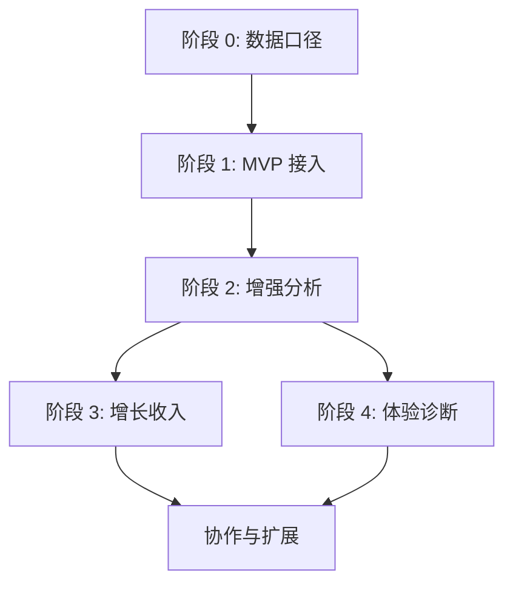

# SimpleTrack 实施路线图

> 用途：把 Umami 官方能力解读、落地评审清单、数据模型与事件字典转成 SimpleTrack 的阶段实施路径。它回答“先做什么、交付什么、怎么验收、什么时候升级到下一阶段”。

## 总体原则

1. 先让数据可信，再让分析丰富。
2. 先统一事件和字段，再做漏斗、归因、留存。
3. 先做单站点和单用户路径，再做团队协作和公开分享。
4. 先用 Realtime 验收采集，再用 Events / Properties 验收事件，再用 Reports 验收洞察。
5. 任何未经过 Cloud UI 截图或操作流复验的能力，只能写成“官方能力说明”或“待复验”。

核心输入：

- [落地评审清单](./落地评审清单.md)
- [数据模型与事件字典](./数据模型与事件字典.md)
- [07-SimpleTrack能力优先级](./playbooks/07-SimpleTrack能力优先级.md)
- [执行与复验手册](./执行与复验手册.md)

## 阶段 0：接入口径准备

目标：在写产品代码前，先把数据语义定下来。

交付物：

| 交付物 | 内容 |
| --- | --- |
| 事件字典 | 事件名、触发条件、必带属性、可选属性 |
| 字段字典 | `plan`、`campaign`、`cohort`、`role`、`workspaceSize`、`currency` |
| 隐私规则 | 不上报邮箱、手机号、姓名、cookie、token、原始订单明细 |
| UTM 规则 | `source / medium / campaign` 必填，命名全小写、下划线 |
| Revenue 规则 | 只在支付成功或订阅确认后产生收入事件 |

验收标准：

- [数据模型与事件字典](./数据模型与事件字典.md) 已作为唯一事件口径。
- 至少定义 `signup_completed`、`first_event_sent`、`checkout_completed` 三类关键事件。
- `Distinct ID` 不使用直接可识别个人身份的信息。

不做范围：

- 不设计复杂 attribution model。
- 不做多币种收入。
- 不做完整团队权限。

## 阶段 1：MVP 接入与信任建立

目标：让用户能完成“创建站点、复制代码、看到第一批数据”。

建议实现：

| 能力 | 最小范围 | 关联文档 |
| --- | --- | --- |
| Website 创建 | 站点名称、域名、website id | [01-安装与接入](./01-安装与接入.md) |
| Tracking code | snippet、域名限制、隐私开关说明 | [01-安装与接入](./01-安装与接入.md) |
| Pageview | 自动页面访问采集 | [02-采集与事件](./02-采集与事件.md) |
| Event | DOM / JS / API 三类事件入口 | [02-采集与事件](./02-采集与事件.md) |
| Realtime | 最近数据、事件样例、页面或来源变化 | [05-Realtime](./05-Realtime.md) |
| Events / Properties | 事件列表、事件属性分布 | [08-Breakdown](./08-Breakdown.md) |
| 基础 Filters | 页面、来源、UTM、事件属性过滤 | [14-Filters](./14-Filters.md) |
| Simple Goal | 一个页面型或事件型目标 | [09-Goals](./09-Goals.md) |

验收证据：

- tracker 能加载。
- Realtime 能看到最近 pageview 或事件。
- Events 能看到至少一个关键事件。
- Properties 能看到 `plan`、`campaign` 或 `cohort` 等属性。
- Goal 能解释分母和成功动作。

升级条件：

- 用户已经能稳定看到 Overview / Realtime / Events。
- 事件命名开始收敛，不再反复改名。
- 基础 Filters 能复现常用分析切片。

## 阶段 2：增强分析与转化诊断

目标：从“数据进来了”升级到“能解释为什么变化、哪里掉了、用户怎么走”。

建议实现：

| 能力 | 最小范围 | 关联文档 |
| --- | --- | --- |
| Breakdown | 按路径、来源、设备、事件属性拆分 | [08-Breakdown](./08-Breakdown.md) |
| Compare | previous period / previous year 对比 | [07-Compare](./07-Compare.md) |
| Sessions | 会话列表、访客详情、活动历史、属性 | [04-Sessions](./04-Sessions.md) |
| Segments | 保存常用 Filter，展示条件摘要 | [15-Segments](./15-Segments.md) |
| Funnels | 2 到 7 步顺序漏斗 | [10-Funnels](./10-Funnels.md) |
| Journeys | 起点、终点、高频路径探索 | [11-Journeys](./11-Journeys.md) |
| 基础 UTM | source、medium、campaign 报表和筛选 | [17-UTM](./17-UTM.md) |
| Website Board | 用已有组件组成专题看板 | [20-Boards-Links-Pixels-Teams-API](./20-Boards-Links-Pixels-Teams-API.md) |

验收证据：

- Funnel 能显示步骤流失。
- Journey 能显示真实路径或高频路径。
- Compare 能显示涨跌比例。
- Segment 能保存并复用过滤条件。
- Sessions 不把匿名 visitor 误写成实名用户。

升级条件：

- 用户开始明确要求渠道效果、收入归因、留存或性能诊断。
- 事件、UTM、Goal、Funnel step 已经稳定。
- 看板组件已经有复用价值，而不是只为展示而展示。

## 阶段 3：增长、收入与生命周期

目标：把渠道、转化、收入、留存串起来，服务增长和商业化判断。

建议实现：

| 能力 | 最小范围 | 前置条件 |
| --- | --- | --- |
| Cohorts | 基于时间范围和行为创建人群 | 稳定事件和时间窗口 |
| Retention | 按 cohort 看回访趋势 | 足够观察周期 |
| Revenue | 聚合 `revenue/currency` 事件字段 | 收入事件和订单状态确认 |
| Attribution | First-Click / Last-Click + conversion step | UTM、Goal、Revenue 稳定 |
| Links | 外链点击和重定向跟踪 | 明确投放或外链追踪需求 |
| Pixels | 外部嵌入或轻量曝光追踪 | 明确 pixel 使用场景 |

验收证据：

- Revenue 只能在支付成功或订阅确认后产生。
- Attribution 报表必须显示当前模型和 conversion step。
- Retention 的观察窗口足够，不用当天数据判断 7 日留存。
- Cohort 标注是否静态，以及对应时间范围。

特别边界：

- Revenue 已有 Cloud UI 结果态，当前截图显示累积站点收入和订单；引用时要说明数值包含多轮重跑。
- Attribution 已在 `Triggered event / checkout_completed` 口径下显示非零渠道分布，可作为首触/末触模型参考；归因结果仍不能直接写成因果 ROI。
- Retention 已有 cohort 留存矩阵结果态，但长期留存结论仍需要更长时间窗口。

## 阶段 4：体验诊断与协作扩展

目标：补齐异常排查、体验诊断、团队协作和外部集成。

建议实现：

| 能力 | 最小范围 | 前置条件 |
| --- | --- | --- |
| Performance | Core Web Vitals、p75、页面和环境拆分 | tracker 开启 `data-performance="true"` |
| Replays | 采样率、遮罩、最长时长、保留周期 | 隐私和成本策略明确 |
| Teams | 成员、角色、邀请状态、网站归属 | 权限模型明确 |
| Share URL | 公开分享范围和撤销机制 | 看板价值稳定 |
| API Key | 创建、轮换、撤销、权限边界 | API 访问场景明确 |

验收证据：

- Performance 有页面或环境维度数据。
- Replays 不承诺历史回填，只解释启用后采集到的会话。
- Teams 不只是成员列表，还包含网站归属和角色语义。
- API Key 不默认拥有全部能力。

特别边界：

- Performance 已有独立页面截图和 LCP / FCP / TTFB 等结果态。
- Replays 已有独立页面截图；当前账号显示 `Business plan` 限制，尚未验证回放播放态。
- Links / Pixels / Teams 当前更多依赖官方文档和入口/原型证据。

## 阶段依赖图

## 每阶段退出检查

| 阶段 | 可以退出的信号 | 不能退出的信号 |
| --- | --- | --- |
| 阶段 0 | 事件字典、字段字典、隐私规则已定 | 事件名还在随意变化 |
| 阶段 1 | Realtime / Events / Properties 都能解释首批数据 | 仍在排查 tracker 为什么不进数据 |
| 阶段 2 | Funnel、Journey、Segment 能回答真实业务问题 | 只有页面壳，没有稳定事件输入 |
| 阶段 3 | Revenue / Attribution / Retention 有清晰前置条件和证据边界 | 把归因直接写成因果 ROI |
| 阶段 4 | 采样、权限、API Key、公开分享都有边界 | 回放、团队、API 只补 UI 不补规则 |

## 推荐实施顺序

1. 先做 `Website -> Tracking code -> Realtime`。
2. 再做 `Events -> Properties -> Filters`。
3. 然后做 `Goals -> Funnels -> Journeys`。
4. 再做 `Segments -> Compare -> Boards`。
5. 之后做 `UTM -> Revenue -> Attribution`。
6. 最后按需求补 `Retention / Performance / Replays / Teams / API`。

## 与现有 Umami 调研资产的关系

这份路线图只负责 SimpleTrack 实施顺序，不替代证据层：

- 页面和截图证据仍看 [Umami功能深度分析](../Umami功能深度分析.md)。
- Cloud 复验顺序仍看 [执行与复验手册](./执行与复验手册.md)。
- 截图状态仍看 `快照索引.md` 和 `快照进度.md`。
- 事件和字段命名仍以 [数据模型与事件字典](./数据模型与事件字典.md) 为准。
