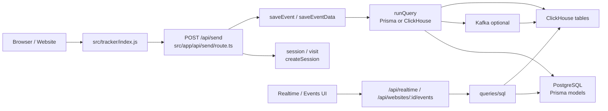
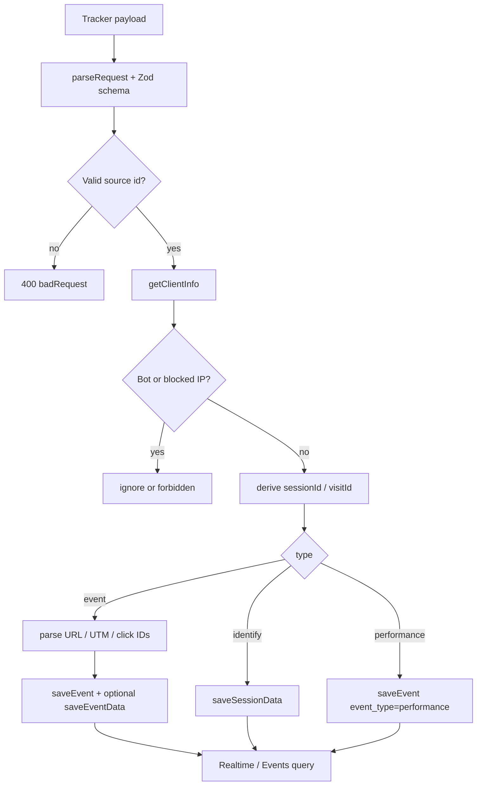

# 01-整体架构与模块交互

## 结论

Umami P1 数据管道可以拆成五层：浏览器 tracker、采集 API、写入查询层、数据库/队列、产品读侧页面。它的实现路径很短，适合解释“数据如何从页面进入 Realtime 和 Events”。但它也是典型 Next.js 单体，采集 API 承担了过多职责，SimpleTrack 应吸收数据流，不吸收边界形态。

## 整体架构图

## 模块和周边服务

| 模块 | 关键源码 | 输入 | 输出 | P1 价值 |
| --- | --- | --- | --- | --- |
| 浏览器 tracker | `references/umami/src/tracker/index.js` | 页面 URL、标题、referrer、DOM 事件、identify、performance | `{ type, payload }` | 最短接入链路参考 |
| 采集 API | `references/umami/src/app/api/send/route.ts` | JSON 请求、header cache、客户端信息 | `sessionId`、`visitId`、cache token、写入动作 | collect 标准化参考 |
| 写入层 | `references/umami/src/queries/sql/events/saveEvent.ts` | 规范化事件字段 | `website_event` 明细、`event_data` 属性 | 事件落表字段参考 |
| 属性展开 | `references/umami/src/lib/data.ts`、`saveEventData.ts` | 嵌套 event data | `data_key`、typed values | 自定义属性查询模型参考 |
| 存储选择 | `references/umami/src/lib/db.ts` | 环境变量和 query map | Prisma / ClickHouse / Kafka 分支 | 可审视但不照搬 |
| 读侧 API | `references/umami/src/app/api/realtime/[websiteId]/route.ts`、`src/app/api/websites/[websiteId]/events/route.ts` | websiteId、query filters | Realtime 数据、Events 分页 | 接入验收页面参考 |
| 查询层 | `references/umami/src/queries/sql/` | filters、date range、search、pagination | SQL 结果 | `EventQueryBuilder` 对照参考 |

## 数据点分析

| 数据点 | 定义位置 | 类型 | 用途 |
| --- | --- | --- | --- |
| `type` | `src/app/api/send/route.ts` schema | enum: `event` / `identify` / `performance` | 控制服务端进入事件、用户属性或性能指标分支 |
| `payload.website/link/pixel` | `src/app/api/send/route.ts` schema | UUID 三选一 | 表示采集源；P1 主要参考 website |
| `sessionId` | `src/app/api/send/route.ts` | UUID/hash | 访客会话身份，用于聚合 visitors、sessions、activity |
| `visitId` | `src/app/api/send/route.ts` | UUID/hash | 30 分钟访问窗口，用于 visits 和路径分析 |
| `website_event` | `prisma/schema.prisma`、`db/clickhouse/schema.sql` | 明细事件表 | 承载 pageview、custom event、performance |
| `event_data` | `prisma/schema.prisma`、`db/clickhouse/schema.sql` | 属性表 | 承载动态事件属性 |
| `session_data` | `prisma/schema.prisma`、`db/clickhouse/schema.sql` | 用户/会话属性表 | 承载 identify 数据 |

## 处理动作分析

| 处理动作 | 涉及数据点 | 数据变化 |
| --- | --- | --- |
| tracker 采集 | URL、title、referrer、screen、language、name、data | 页面上下文变成 JSON payload |
| collect 校验 | `type`、`payload`、source id | 非法请求被拒绝，合法请求进入识别阶段 |
| client info enrich | IP、UA、browser、os、device、geo | 请求补齐环境维度；`analytics-core` 可以吸收这类 enrich 逻辑，但应放在 collect/ingestion stage，而不是 ClickHouse writer |
| session/visit 生成 | source id、IP、UA、salt、cache token | 请求被归入稳定 session 和 30 分钟 visit；它是隐私友好匿名识别的一部分，详见 [session/visit 是否就是隐私友好的用户识别](./Q&A/10-session隐私机制是什么.md) |
| event 分支 | URL、referrer、UTM、click IDs、name、data | 事件字段标准化并写入明细 |
| identify 分支 | `data`、`id` | 用户/会话属性写入 `session_data` |
| performance 分支 | LCP、INP、CLS、FCP、TTFB | 性能指标作为 `event_type = 5` 的事件写入 |
| read API 查询 | filters、date range、websiteId | 明细事件转为 Realtime 或 Events 响应；查询要和写入模型一起设计，才能为 `analytics-core` 后续高性能 ClickHouse 组件打基础 |

## 数据流控制逻辑

## Code-review 视角

| 分类 | 结论 |
| --- | --- |
| 可借鉴 | 采集链路短、字段口径集中、Realtime 和 Events 能快速验证入库 |
| 不可照搬 | `src/app/api/send/route.ts` 同时做 HTTP、识别、过滤、写入分发，边界过重 |
| SimpleTrack 风险 | 如果照搬单体 route，会绕开 `analytics-core` 的 EventBus、ingestion、幂等和可恢复写入 |

## 给 SimpleTrack 的启发

SimpleTrack P1 应围绕一条可演示闭环设计产品：用户创建站点，拿到 snippet，页面产生 pageview/custom event，Realtime 马上显示，Events 能查到原始事件。高级分析页面可以后置，但接入验收页不能后置。

## 给 analytics-core 的启发

`analytics-core` 应把 Umami 的整体流拆回自己的边界：`collect.Handler` 只做标准化和发布，EventBus 负责削峰，ingestion worker 负责写入和 ack，storage adapter 负责 ClickHouse/MySQL 细节，query builder 负责读侧 SQL。客户端环境补齐、session/visit 派生、ClickHouse 明细表和聚合表优化都可以吸收，但必须通过可测试 stage 和 adapter 进入核心。
