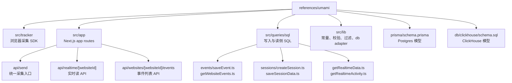

# 02-代码结构与目录地图

## 结论

阅读 Umami 源码时，不需要从完整产品页面开始。P1 数据管道优先看 `src/tracker`、`src/app/api/send`、`src/queries/sql`、`src/lib`、`prisma`、`db/clickhouse`。这些目录已经覆盖采集、校验、写入、查询和表模型。

## 整体代码结构图

## 目录职责

| 目录或文件 | 职责 | P1 阅读重点 |
| --- | --- | --- |
| `src/tracker/index.js` | 浏览器端自动采集和发送 | payload 构造、SPA 路由监听、DOM 事件、identify、performance |
| `src/app/api/send/route.ts` | 无认证采集入口 | schema、source id 三选一、session/visit、event/identify/performance 分支 |
| `src/app/api/batch/route.ts` | 批量采集入口 | 循环复用单条 `/api/send`，了解批量语义 |
| `src/app/api/realtime/[websiteId]/route.ts` | Realtime API | 30 分钟窗口、权限、query filters、`getRealtimeData` |
| `src/app/api/websites/[websiteId]/events/route.ts` | Events API | 权限、过滤、分页、`getWebsiteEvents` |
| `src/queries/sql/events/` | 事件写入和事件读侧 | `saveEvent`、`saveEventData`、`getWebsiteEvents` |
| `src/queries/sql/sessions/` | session 写入和 session 读侧 | `createSession`、`saveSessionData` |
| `src/queries/sql/getRealtimeData.ts` | Realtime 聚合输出 | activity、pageviews、sessions 合并 |
| `src/lib/constants.ts` | 枚举、字段白名单、长度限制 | `COLLECTION_TYPE`、`EVENT_TYPE`、`DATA_TYPE`、`FILTER_COLUMNS` |
| `src/lib/request.ts` | 请求解析和 query filters | Zod 结果、认证、date range、segment/cohort、过滤参数 |
| `src/lib/prisma.ts` | PostgreSQL 查询 helper | filter SQL、date SQL、pagedRawQuery |
| `src/lib/clickhouse.ts` | ClickHouse 查询 helper | filter SQL、date SQL、insert、rawQuery |
| `prisma/schema.prisma` | Postgres schema | `Session`、`WebsiteEvent`、`EventData`、`SessionData` |
| `db/clickhouse/schema.sql` | ClickHouse schema | 明细表、属性表、session_data、小时聚合 MV |

## 数据点分析

| 数据点 | 目录归属 | 代码段位置 | 类型和用途 |
| --- | --- | --- | --- |
| 采集源 ID | `src/app/api/send/route.ts` | schema 中 `website/link/pixel` | UUID 三选一，决定 source |
| 事件枚举 | `src/lib/constants.ts` | `EVENT_TYPE` | 数字枚举，区分 pageview/custom/link/pixel/performance |
| 属性类型 | `src/lib/constants.ts` | `DATA_TYPE` | 数字枚举，驱动 typed value 存储 |
| 字段白名单 | `src/lib/constants.ts` | `FILTER_COLUMNS` | UI/filter 参数到数据库列名的映射 |
| Postgres 明细 | `prisma/schema.prisma` | `WebsiteEvent` model | 自托管默认关系型存储 |
| ClickHouse 明细 | `db/clickhouse/schema.sql` | `website_event` table | 高吞吐和聚合存储 |

## 处理动作分析

| 动作 | 起点 | 终点 | 说明 |
| --- | --- | --- | --- |
| browser send | `src/tracker/index.js` | `/api/send` | 前端只做轻量采集，不做复杂业务判断 |
| request normalize | `/api/send` | `saveEvent` / `saveSessionData` | 服务端集中完成字段派生 |
| storage dispatch | `runQuery` | Prisma / ClickHouse / Kafka | 环境变量决定后端；通俗解释见 [runQuery 和 storage dispatch 是什么](./Q&A/09-runQuery和storage-dispatch是什么.md) |
| query parse | `parseRequest` / `getQueryFilters` | `parseFilters` | 读侧过滤参数统一成 SQL 片段 |
| product render | hooks / pages | Realtime / Events UI | React Query 定时拉取或分页读取 |

## Code-review 视角

| 分类 | 结论 |
| --- | --- |
| 可借鉴 | 目录按 tracker、API、query、lib、schema 分层，读源码路径清楚 |
| 不可照搬 | `src/lib/db.ts` 用环境变量在运行时选择 Prisma/ClickHouse/Kafka，适合应用单体，不适合核心库 |
| SimpleTrack 风险 | 如果 storage dispatch 散落在业务层，后续 Redis Stream、Kafka、ClickHouse、MySQL 幂等会变得难测 |

## 给 SimpleTrack 的启发

SimpleTrack 产品文档也应按这条路径组织：先解释 tracker，再解释 collect，再解释 Realtime/Events 如何证明接入成功。这样用户不用理解完整分析平台，也能完成首个价值闭环。浏览器自动采集应由 SimpleTrack Web SDK / tracker 提供，后续再扩展多语言和多框架 SDK，详见 [自动采集和 SDK 能否借鉴到 SimpleTrack](./Q&A/07-自动采集和SDK如何借鉴到SimpleTrack.md)。

## 给 analytics-core 的启发

`analytics-core` 目录已经比 Umami 更接近数据面核心：`collect`、`eventbus`、`ingestion`、`storage`、`analysis`。后续补功能时应继续保持这个方向，把 Umami 的 `src/queries/sql` 经验拆进 `storage/clickhouse` 和 `analysis/*`，不要新增一个应用单体式 `lib/db` 分发层。`analytics-core` 本身不做浏览器自动采集，但要提供稳定 collect 协议，让 Web SDK、server SDK、mobile SDK 后续都能接入。
