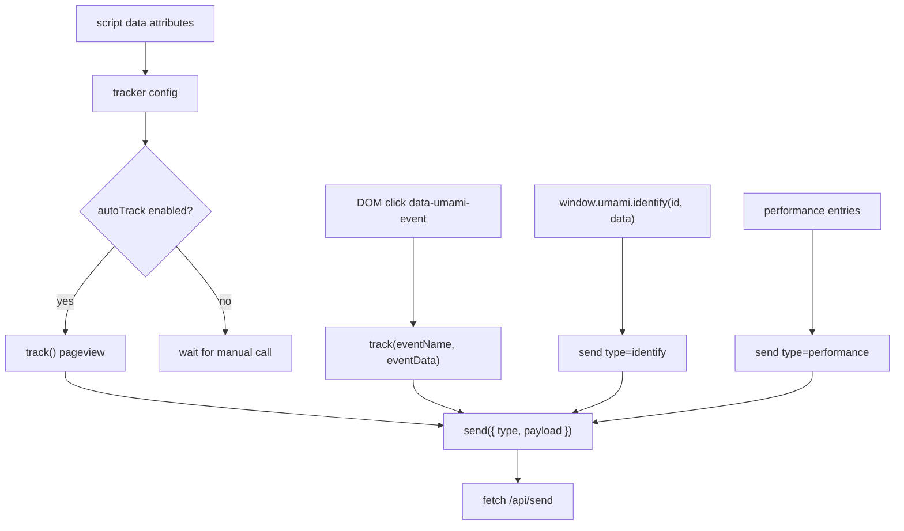

# 03-Tracker 采集 SDK 数据流

## 结论

Umami tracker 的核心价值是克制：它主要收集页面上下文、事件名、事件属性、identify 数据和性能指标，然后统一发到 `/api/send`。SimpleTrack P1 的 tracker 也应保持短链路，先解决 pageview、自定义事件和可选 identify。

## 源码证据

| 主题 | 源码位置 | 说明 |
| --- | --- | --- |
| 配置读取 | `references/umami/src/tracker/index.js` | 从 script data attribute 读取 website id、host、auto-track、do-not-track、performance 等 |
| payload 构造 | `references/umami/src/tracker/index.js` | 组合 website、hostname、screen、language、title、url、referrer |
| SPA 路由监听 | `references/umami/src/tracker/index.js` | hook `history.pushState` / `replaceState`，URL 变化后延迟 track |
| DOM 事件 | `references/umami/src/tracker/index.js` | 识别 `data-umami-event` 和 `data-umami-event-*` |
| 手动 API | `references/umami/src/tracker/index.js` | 暴露 `track` 和 `identify` |
| Performance | `references/umami/src/tracker/index.js` | 读取 web vitals / performance entry 后发送 `performance` |

## 数据点分析

| 数据点 | 代码段位置 | 类型 | 用途 |
| --- | --- | --- | --- |
| `website` | tracker config | UUID/string | 目标站点 ID，服务端 source id |
| `hostname` | `location.hostname` 或配置 | string | 区分真实访问 host |
| `screen` | `window.screen` | string | 会话维度 |
| `language` | navigator language | string | 会话维度 |
| `title` | `document.title` | string | pageview 展示和搜索 |
| `url` | 当前 normalized URL | string | page path、query、UTM 和 click id 的来源 |
| `referrer` | document referrer / currentRef | string | referrer path/query/domain 的来源 |
| `name` | `track(name, data)` 或 DOM attribute | string | 自定义事件名 |
| `data` | JS object / DOM data attributes | object | 事件属性，后续展开到 `event_data` |
| `id` | `identify(id, data)` | string | distinct id，关联 session/user |
| `lcp/inp/cls/fcp/ttfb` | performance branch | number | Core Web Vitals 指标 |

## 处理动作分析

| 动作 | 涉及数据点 | 数据变化 |
| --- | --- | --- |
| 初始化 | script data attributes | 读取配置并决定是否 auto track |
| 自动 pageview | URL、title、referrer | 构造无 `name` payload，服务端识别为 pageview |
| SPA 监听 | currentUrl、currentRef | URL 变化后更新 referrer 并重新发送 pageview |
| DOM 事件 | event name、event data | HTML attribute 转为 `track(eventName, eventData)` |
| 手动 track | name、data 或自定义 payload | 合并基础 payload 后发送 `type=event` |
| identify | id、data | 发送 `type=identify`，服务端写 `session_data` |
| performance send | metrics、URL、title | 发送 `type=performance`，服务端写 performance event |
| beforeSend | type、payload | 用户回调可修改或取消 payload |

## 数据流图

## Code-review 视角

| 分类 | 结论 |
| --- | --- |
| 可借鉴 | SDK 小而完整，内置 auto pageview、DOM event、manual track、identify、performance |
| 不可照搬 | DOM attribute 命名、全局对象名和 endpoint 名称应使用 SimpleTrack 自有命名 |
| SimpleTrack 风险 | `beforeSend` 能修改 payload，服务端仍必须完整校验，不能信任 tracker |

## SimpleTrack 取舍

自动 `track()` 可以借鉴到 SimpleTrack，尤其是自动 pageview 和 SPA 路由监听。P1 推荐先做自动 pageview、手动 custom event、可选 identify；DOM attribute 事件可以做轻量版；performance、beforeSend、多语言 SDK 放到后续阶段。详细取舍见 [自动采集和 SDK 能否借鉴到 SimpleTrack](./Q&A/07-自动采集和SDK如何借鉴到SimpleTrack.md)。

## 给 SimpleTrack 的启发

SimpleTrack docs/quickstart 应提供三段最短示例：安装 snippet、发送自定义事件、调用 identify。产品空态应明确告诉用户“打开页面后先看 Realtime，再点按钮看 Events”。自动采集默认开启，但要给开发者清楚的关闭和调试方式。

## 给 analytics-core 的启发

`collect.Request` 需要能承接 tracker payload 的最小字段：source id、event name、distinct id、session id 可选、event time、properties、user properties、URL/referrer/UTM/performance。即使 tracker 后续变化，`EventEnvelope` 也要稳定。
