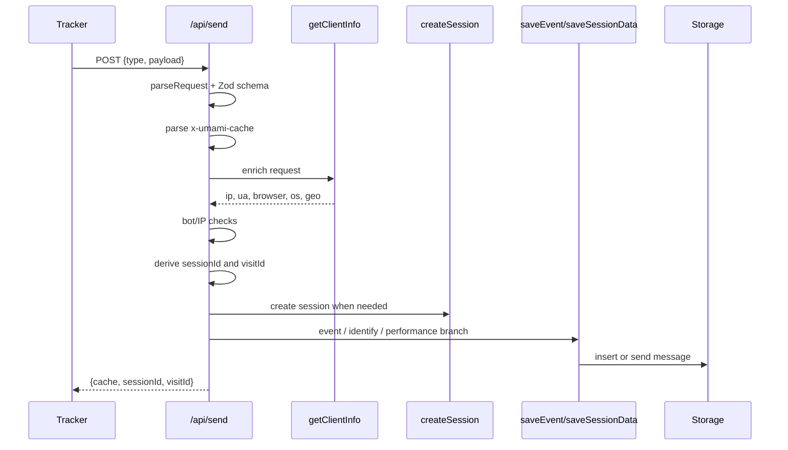

# 04-Collect API 与会话识别

## 结论

`src/app/api/send/route.ts` 是 Umami 数据管道最关键的服务端入口。它完成请求校验、缓存 token 解析、客户端信息补充、bot/IP 过滤、session/visit 生成、URL/UTM/click id 解析和写入调用。bot/IP 过滤和 Zod 的通俗解释见 [bot/IP 过滤和 Zod 是什么](./Q&A/08-bot-IP过滤和Zod是什么.md)。它很适合做数据点参考，但不适合做 `analytics-core` 的边界参考。

## 源码证据

| 主题 | 源码位置 | 说明 |
| --- | --- | --- |
| schema | `references/umami/src/app/api/send/route.ts` | `type` 和 `payload` 由 Zod 校验 |
| source id 三选一 | `references/umami/src/app/api/send/route.ts` | `website`、`link`、`pixel` 必须且只能有一个 |
| cache token | `references/umami/src/app/api/send/route.ts` | `x-umami-cache` 解析出 websiteId/sessionId/visitId/iat |
| client info | `references/umami/src/lib/detect.ts`、`src/app/api/send/route.ts` | IP、UA、browser、os、device、geo |
| session/visit | `references/umami/src/app/api/send/route.ts` | session 由 source、id 或 IP/UA/salt 派生；visit 30 分钟过期 |
| event 分支 | `references/umami/src/app/api/send/route.ts` | page/custom/link/pixel 统一写 `saveEvent` |
| identify 分支 | `references/umami/src/app/api/send/route.ts` | 写 `saveSessionData` |
| performance 分支 | `references/umami/src/app/api/send/route.ts` | 写 `event_type=performance` |

## 数据点分析

| 数据点 | 代码段位置 | 类型 | 用途 |
| --- | --- | --- | --- |
| `type` | Zod schema | enum | 控制处理分支 |
| `payload.website/link/pixel` | Zod refine | UUID | 采集对象 ID |
| `cache` | `x-umami-cache` header | JWT-like token | 复用 session/visit，减少重复计算 |
| `ip/userAgent` | `getClientInfo` | string | session hash、bot 判断和地理信息 |
| `createdAt` | `timestamp` 或 server time | Date | 事件时间和 salt 计算 |
| `sessionSalt` | `getSalt` | string | session hash 的时间轮换输入 |
| `sessionId` | `uuid(sourceId, id)` 或 `uuid(sourceId, ip, userAgent, sessionSalt)` | UUID | 访客身份 |
| `visitId` | `uuid(sessionId, visitSalt)` | UUID | 30 分钟访问窗口 |
| `utmSource/utmMedium/...` | URL search params | string | 增长来源维度 |
| `gclid/fbclid/...` | URL search params | string | 广告点击 ID |
| `eventType` | link/pixel/name 判定 | number | pageview/custom/link/pixel/performance 分类 |

## 处理动作分析

| 动作 | 涉及数据点 | 数据变化 |
| --- | --- | --- |
| Zod 校验 | `type`、`payload` | 非法请求直接 400 |
| cache 解析 | header token | 命中后复用 sessionId/visitId/iat |
| client enrich | request、payload | 补齐 IP、UA、设备、浏览器、地域 |
| bot/IP gate | userAgent、ip | bot 返回无害响应，blocked IP 返回 forbidden |
| session create | sessionId、client info | 非 ClickHouse 模式下创建 `session` 行 |
| visit expiry | iat、now | 超过 1800 秒重建 visitId |
| URL parse | url、referrer、hostname | 派生 path/query/domain/UTM/click IDs |
| eventType 判定 | linkId、pixelId、name | 决定 pageview/custom/link/pixel |
| token 返回 | websiteId、sessionId、visitId、iat | 前端后续请求带 cache |

## Collect 时序图

## Code-review 视角

| 分类 | 结论 |
| --- | --- |
| 可借鉴 | session/visit 生成规则清晰，cache token 对 tracker 友好 |
| 不可照搬 | 一个 route 同时承担校验、识别、过滤、URL 解析、写入分发，职责过重 |
| SimpleTrack 风险 | SimpleTrack / `analytics-core` 不可以让 collect API 直接入库；否则会绕开 EventBus ack/retry/dead-letter 和 ingestion 幂等设计 |

## 给 SimpleTrack 的启发

SimpleTrack 可以借鉴 Umami 的安装体验：tracker 第一次发送后返回 cache，后续请求更轻；UI 上把 session/visit 当成内部能力，不暴露给新用户，只让用户看到“当前有人访问”和“事件已进入列表”。

## 给 analytics-core 的启发

`analytics-core` 应把这份 route 拆成阶段：HTTP adapter 解码，collect handler 标准化，identity/session resolver 派生 session，EventBus 发布，ingestion 写入。`sessionId`、`visitId`、UTM、click ID 的派生规则可以参考 Umami，但应在可测试的纯函数或服务内实现。写库必须发生在 ingestion / `EventWriter` 边界内，而不是 HTTP collect route 内。
