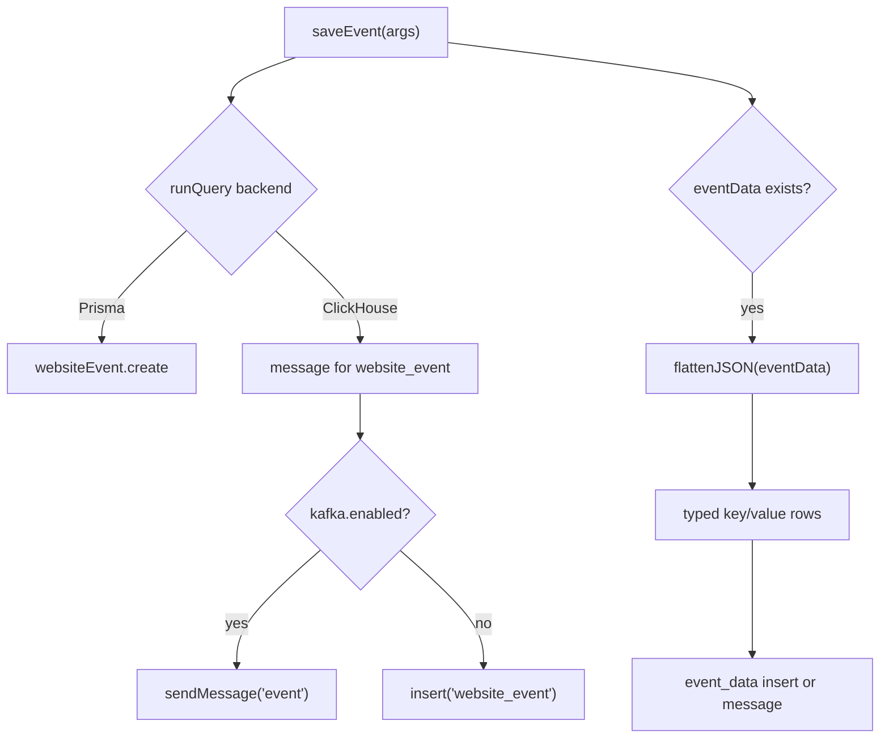

# 05-事件写入与属性展开

## 结论

Umami 的事件写入由 `saveEvent` 承接，动态属性由 `saveEventData` 和 `flattenJSON` 展开。这个设计对 SimpleTrack 很关键：事件明细不要把所有属性塞成不可查询 JSON，P1 至少要为事件属性保留可查询模型。

## 源码证据

| 主题 | 源码位置 | 说明 |
| --- | --- | --- |
| 写入入口 | `references/umami/src/queries/sql/events/saveEvent.ts` | 定义 `SaveEventArgs` 并分发 relational / ClickHouse |
| Postgres 写入 | `references/umami/src/queries/sql/events/saveEvent.ts` | Prisma 创建 `websiteEvent` |
| ClickHouse 写入 | `references/umami/src/queries/sql/events/saveEvent.ts` | 构造 snake_case message 插入 `website_event` |
| 属性展开 | `references/umami/src/lib/data.ts` | `flattenJSON` 把嵌套 object 转为 dot key |
| 事件属性写入 | `references/umami/src/queries/sql/events/saveEventData.ts` | 写入 `event_data` |
| session 属性写入 | `references/umami/src/queries/sql/sessions/saveSessionData.ts` | 写入 `session_data` |
| 存储后端选择 | `references/umami/src/lib/db.ts` | `CLICKHOUSE_URL` 存在时走 Kafka/ClickHouse，否则走 Prisma |

## 数据点分析

| 数据点 | 定义位置 | 类型 | 用途 |
| --- | --- | --- | --- |
| `SaveEventArgs.websiteId` | `saveEvent.ts` | string | 数据边界 |
| `SaveEventArgs.sessionId` | `saveEvent.ts` | string | session 维度 |
| `SaveEventArgs.visitId` | `saveEvent.ts` | string | visit 维度 |
| `SaveEventArgs.eventType` | `saveEvent.ts` | number | pageview/custom/performance 分类 |
| `SaveEventArgs.eventName` | `saveEvent.ts` | string nullable | 自定义事件名 |
| `SaveEventArgs.eventData` | `saveEvent.ts` | object | 动态事件属性 |
| `data_key` | `saveEventData.ts` | string | 展开后的属性名，支持嵌套 dot path |
| `string_value` | `saveEventData.ts` | string nullable | 文本、boolean、array 字符串值 |
| `number_value` | `saveEventData.ts` | decimal nullable | 数值属性 |
| `date_value` | `saveEventData.ts` | datetime nullable | 日期属性 |
| `data_type` | `constants.ts` | number | 属性类型枚举 |

## 处理动作分析

| 动作 | 涉及数据点 | 数据变化 |
| --- | --- | --- |
| `saveEvent` 分发 | `SaveEventArgs` | 根据存储环境进入 Prisma 或 ClickHouse |
| 关系型写入 | event fields | camelCase 字段进入 Prisma `websiteEvent` |
| ClickHouse 写入 | event fields | snake_case message 进入 `website_event` 或 Kafka |
| 长度截断 | URL、title、eventName | 防止字段超过 schema 限制 |
| 属性 flatten | nested object | `{ plan: { id: 1 } }` 变成 `plan.id` |
| 类型归一 | value | number/date/boolean/array/string 映射到 `DATA_TYPE` |
| event_data 写入 | flattened keys | 一条事件可生成多条属性记录 |
| revenue side effect | eventData.revenue/currency | Umami 额外写 revenue；P1 不采用 |

## 写入数据流

## Code-review 视角

| 分类 | 结论 |
| --- | --- |
| 可借鉴 | 明细事件和动态属性分表，兼顾原始事件列表和属性过滤 |
| 不可照搬 | `runQuery` 由环境变量选择后端，且 `saveEvent` 同时处理 revenue side effect |
| SimpleTrack 风险 | Kafka 发送失败如果只在底层打印而调用侧不可感知，会破坏 at-least-once 语义 |

## 给 SimpleTrack 的启发

SimpleTrack Events 页面应显示事件是否带属性，并支持点击查看属性。P1 不必实现完整 Breakdown，但必须确保自定义属性能入库、能查、能用于后续过滤。

## 给 analytics-core 的启发

`EventWriter` 需要支持明细事件和属性行的同一提交语义。Umami 的 `event_data` 结构可以作为字段参考，但 `analytics-core` 应把幂等 claim、batch append、commit/rollback、ack 串成可恢复链路，不能让属性写入变成明细写入之后的不可控副作用。

