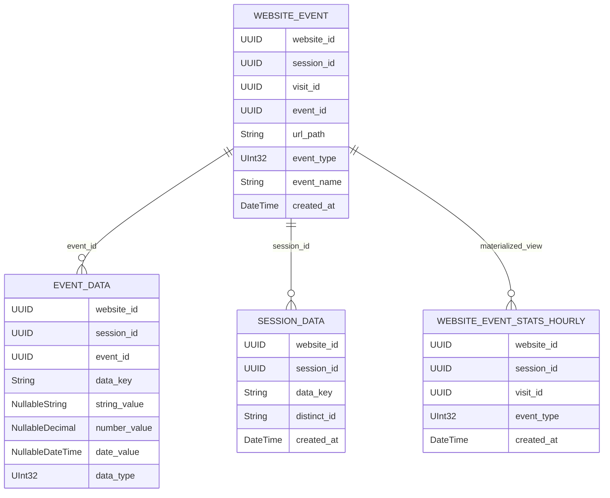

# 06-数据模型：Postgres 与 ClickHouse

## 结论

Umami 同时维护 Prisma/PostgreSQL 模型和 ClickHouse schema。两边字段口径高度相似：核心都是 `website_event` 明细、`event_data` 属性、`session_data` 用户/会话属性。ClickHouse 额外用 materialized view 和聚合表优化读侧；`analytics-core` 后续可以深入借鉴这类 ClickHouse 优化策略，为高性能查询组件打基础。

## 源码证据

| 主题 | 源码位置 | 说明 |
| --- | --- | --- |
| Session | `references/umami/prisma/schema.prisma` | browser/os/device/screen/language/country/region/city/distinctId |
| WebsiteEvent | `references/umami/prisma/schema.prisma` | URL、UTM、referrer、eventType、eventName、performance |
| EventData | `references/umami/prisma/schema.prisma` | dataKey + typed values |
| SessionData | `references/umami/prisma/schema.prisma` | session-level typed values |
| ClickHouse 明细 | `references/umami/db/clickhouse/schema.sql` | `website_event` MergeTree |
| ClickHouse 属性 | `references/umami/db/clickhouse/schema.sql` | `event_data`、`session_data` |
| 小时聚合 | `references/umami/db/clickhouse/schema.sql` | `website_event_stats_hourly` + MV |

## 数据点分析

| 数据点 | Postgres 模型 | ClickHouse 模型 | 用途 |
| --- | --- | --- | --- |
| website id | `Website.id` / `websiteId` | `website_id UUID` | 站点边界 |
| session id | `Session.id` / `WebsiteEvent.sessionId` | `session_id UUID` | visitor/session 聚合 |
| visit id | `WebsiteEvent.visitId` | `visit_id UUID` | visit 聚合和路径 |
| URL path/query | `WebsiteEvent.urlPath/urlQuery` | `url_path/url_query` | 页面分析和搜索 |
| UTM | `utmSource` 等 | `utm_source` 等 | campaign 分析 |
| referrer | `referrerPath/referrerQuery/referrerDomain` | `referrer_path/referrer_query/referrer_domain` | 来源分析 |
| performance | `lcp/inp/cls/fcp/ttfb` | 同名列 | Core Web Vitals |
| event type/name | `eventType/eventName` | `event_type/event_name` | pageview/custom/performance 分类 |
| distinct id | `Session.distinctId` | `distinct_id` | 用户识别 |
| event data | `EventData` | `event_data` | 事件属性 |
| session data | `SessionData` | `session_data` | identify 属性 |

## 处理动作分析

| 动作 | 数据变化 | 存储结果 |
| --- | --- | --- |
| 创建 session | client info + distinct id | `session` 或 ClickHouse 明细中的 session 维度 |
| 写 pageview | URL/referrer/UTM + eventType=1 | `website_event` |
| 写 custom event | eventName + eventType=2 + eventData | `website_event` + `event_data` |
| 写 identify | distinct id + user props | `session_data` |
| 写 performance | metrics + eventType=5 | `website_event` |
| ClickHouse 聚合 | 明细事件按小时聚合 | `website_event_stats_hourly` |

## ClickHouse 表关系图

## Code-review 视角

| 分类 | 结论 |
| --- | --- |
| 可借鉴 | 字段口径稳定，Postgres 和 ClickHouse 都围绕同一事件语义 |
| 不可照搬 | Umami 以 `website_id` 为中心，`analytics-core` 需要 tenant/project/source 三层通用边界 |
| SimpleTrack 风险 | 如果只存 JSON 属性，后续 Filters、Segments、Breakdown 会缺少高效查询基础；解决办法见 [只存 JSON 属性的风险如何解决](./Q&A/11-只存JSON属性的风险如何解决.md) |

## 给 SimpleTrack 的启发

产品上应把事件属性和用户属性区分清楚：事件属性解释“这次行为是什么上下文”，用户属性解释“这个人是谁/属于哪类”。这会影响 UI 文案、事件字典和 docs/quickstart。

## 给 analytics-core 的启发

`analytics-core` 的 ClickHouse 表可以参考 Umami 字段集、materialized view、聚合表和常用查询排序键，但必须替换为 `tenant_id/project_id/source_id`，并通过 `TableRouter` 管理物理表。事件属性表或等价结构应尽早纳入 P1/P1.5，否则 Events 只能排障，无法支撑后续分析。
