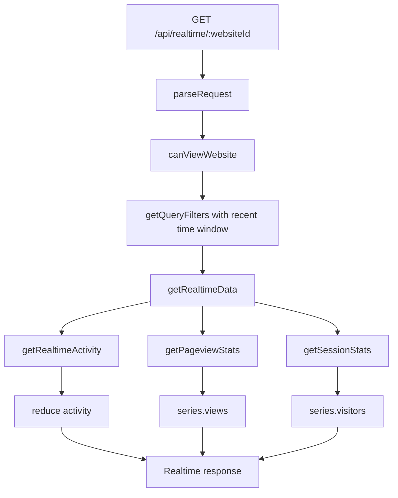
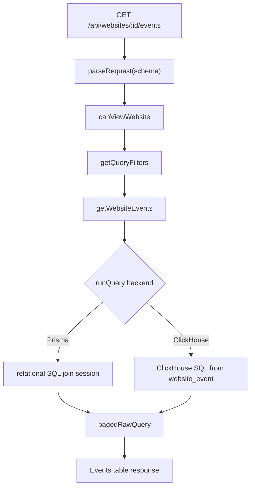

# 07-Realtime 与 Events 读侧查询

## 结论

Realtime 和 Events 是 Umami 最适合 SimpleTrack P1 借鉴的两个读侧能力。Realtime 证明“现在数据进来了”，Events 证明“原始事件可查、可排障、可看到属性”。两者都复用 query filters 和 SQL 查询层。

## 源码证据

| 主题 | 源码位置 | 说明 |
| --- | --- | --- |
| Realtime API | `references/umami/src/app/api/realtime/[websiteId]/route.ts` | 固定最近 `REALTIME_RANGE` 分钟 |
| Realtime hook | `references/umami/src/components/hooks/queries/useRealtimeQuery.ts` | 使用 `REALTIME_INTERVAL` 自动刷新 |
| Realtime 聚合 | `references/umami/src/queries/sql/getRealtimeData.ts` | 合并 activity、pageviews、sessions |
| Realtime activity | `references/umami/src/queries/sql/getRealtimeActivity.ts` | 最近事件流 |
| Events API | `references/umami/src/app/api/websites/[websiteId]/events/route.ts` | 权限、filters、分页 |
| Events SQL | `references/umami/src/queries/sql/events/getWebsiteEvents.ts` | Postgres / ClickHouse 双查询 |

## 数据点分析

| 数据点 | 代码位置 | 类型 | 用途 |
| --- | --- | --- | --- |
| `REALTIME_RANGE` | `src/lib/constants.ts` | number minutes | Realtime 短窗口 |
| `REALTIME_INTERVAL` | `src/lib/constants.ts` | ms | 前端刷新间隔 |
| `filters.startAt/endAt` | Realtime API | timestamp | API 强制覆盖成最近窗口 |
| `activity` | `getRealtimeActivity` | event rows | Realtime log 原始活动 |
| `pageviews` | `getPageviewStats` | series | Realtime views 图 |
| `sessions` | `getSessionStats` | series | Realtime visitors 图 |
| `countries/urls/referrers/events` | `getRealtimeData` | object/list | Realtime 卡片和日志 |
| `hasData` | `getWebsiteEvents` | boolean | Events 行是否存在属性 |
| `page/pageSize/order/search` | Events filters | query params | 分页和搜索 |

## 处理动作分析

| 动作 | 涉及数据点 | 数据变化 |
| --- | --- | --- |
| Realtime API 构造窗口 | `Date.now`、`REALTIME_RANGE` | query filters 被限制到最近窗口 |
| Realtime 并行查询 | activity、pageviews、sessions | 三类查询并发执行 |
| Realtime reduce | activity rows | 生成 countries、urls、referrers、events、totals |
| Events 权限检查 | auth、websiteId | 未授权直接拒绝 |
| Events filter parse | query params | 生成 date/filter/cohort/search SQL |
| Events hasData | event_id + event_data | 标记事件是否有动态属性 |
| Events pagination | page/pageSize | 返回分页数据和总数 |

## Realtime 数据流

## Events 数据流

## Code-review 视角

| 分类 | 结论 |
| --- | --- |
| 可借鉴 | Realtime 固定短窗口，Events 支持分页搜索和属性标记，P1 价值非常直接 |
| 不可照搬 | SQL 拼接虽然有 helper，但仍需严格依赖字段白名单和参数化 |
| SimpleTrack 风险 | 如果 Realtime 和 Events 使用两套查询模型，接入验收与排障口径会不一致 |

## 给 SimpleTrack 的启发

P1 页面优先级应是 Realtime > Events > Goal 最小闭环。Realtime 适合新用户确认“刚才打开页面是否出数”，Events 适合开发者排查“哪个 payload 入库了，属性有没有丢”。

## 给 analytics-core 的启发

`EventQueryBuilder` 需要先覆盖 Realtime 和 Events，而不是先做完整 Funnels/Retention。Realtime 可以固定短窗口，Events 必须支持时间范围、事件名、搜索、分页、属性存在标记。

