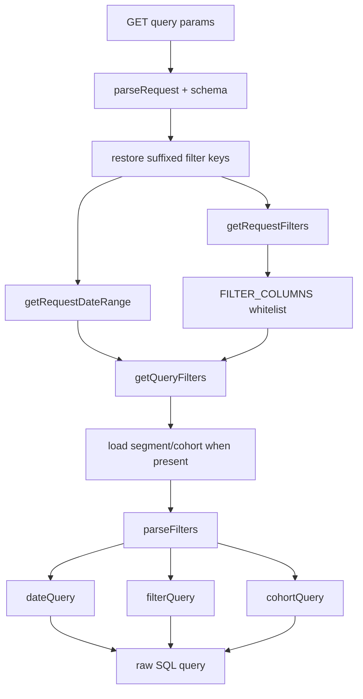

# 08-过滤参数与查询构建

## 结论

Umami 的读侧关键不只是 SQL，而是把 query params 限制在字段白名单和 operator 映射里。SimpleTrack 后续 Filters、Segments、Cohorts、Breakdown 都会依赖这个基础，因此 `analytics-core` 的 query builder 必须尽早建立白名单和结构化 plan。

## 源码证据

| 主题 | 源码位置 | 说明 |
| --- | --- | --- |
| 字段白名单 | `references/umami/src/lib/constants.ts` | `FILTER_COLUMNS` 把 UI 字段映射到数据库列 |
| operator | `references/umami/src/lib/constants.ts` | `OPERATORS` 定义 eq/neq/contains/regex 等 |
| 请求过滤提取 | `references/umami/src/lib/request.ts` | `getRequestFilters` 只接受白名单字段 |
| query filters | `references/umami/src/lib/request.ts` | `getQueryFilters` 合并 date range、segment、cohort、pagination |
| Postgres filter SQL | `references/umami/src/lib/prisma.ts` | `parseFilters` 生成 date/filter/cohort SQL |
| ClickHouse filter SQL | `references/umami/src/lib/clickhouse.ts` | ClickHouse 版本的同类 helper |
| 参数转换 | `references/umami/src/lib/params.ts` | filters array/object 互转 |

## 数据点分析

| 数据点 | 定义位置 | 类型 | 用途 |
| --- | --- | --- | --- |
| `FILTER_COLUMNS.path` | `constants.ts` | map | UI `path` 映射到 `url_path` |
| `FILTER_COLUMNS.event` | `constants.ts` | map | UI event 映射到 `event_name` |
| `FILTER_COLUMNS.utmSource` | `constants.ts` | map | UTM filter 映射到 `utm_source` |
| `OPERATORS.equals` | `constants.ts` | string code | filter 操作符 |
| suffixed filter params | `request.ts` | query key | 支持 `browser1`、`os2` 等多个同类条件 |
| `match` | `getQueryFilters` | string | 多过滤条件的匹配模式 |
| `segment` | `getQueryFilters` | id | 加载保存过滤条件 |
| `cohort_*` | `getQueryFilters` | derived filters | cohort 条件命名空间 |
| `dateQuery/filterQuery/cohortQuery` | `parseFilters` | SQL snippets | 查询层复用的 SQL 片段 |

## 处理动作分析

| 动作 | 涉及数据点 | 数据变化 |
| --- | --- | --- |
| schema parse | GET query | 基础参数被 Zod 约束 |
| suffixed filter 恢复 | rawQuery、query | Zod 去掉的 `browser1` 等参数被补回 |
| filter 白名单过滤 | query keys、`FILTER_COLUMNS` | 非白名单字段不会进入 filters |
| date range 计算 | startAt/endAt/unit/timezone | 生成 startDate/endDate/unit |
| segment 展开 | segment id | 保存的 filters 合并进当前 query |
| cohort 展开 | cohort id | 生成 `cohort_` 前缀过滤和 cohort date range |
| SQL helper 转换 | filters | 生成 date/filter/cohort SQL |
| pagination | page/pageSize | 生成 limit/offset 和 count |

## 查询控制流

## Code-review 视角

| 分类 | 结论 |
| --- | --- |
| 可借鉴 | 字段白名单和 operator 映射是动态查询的基本安全线 |
| 不可照搬 | SQL 片段仍由字符串组合，`analytics-core` 应尽量输出结构化 query plan 并集中渲染 |
| SimpleTrack 风险 | 只要允许前端字段名直接穿透 SQL，就会带来注入、错列、跨表查询和性能风险 |

## 给 SimpleTrack 的启发

产品上要把 Filters 设计成“有限字段 + 有限操作符”，而不是任意 SQL/任意属性表达式。P1 的 Events 可以先只支持时间范围、事件名、路径、来源等少量字段，后续再扩展。

## 给 analytics-core 的启发

`EventQueryBuilder` 应建立自己的字段白名单、operator enum、排序白名单和分页上限。Umami 的 `FILTER_COLUMNS` 可以作为初始字段清单，但 `analytics-core` 必须用 Go 类型和 plan 约束 SQL 生成。

