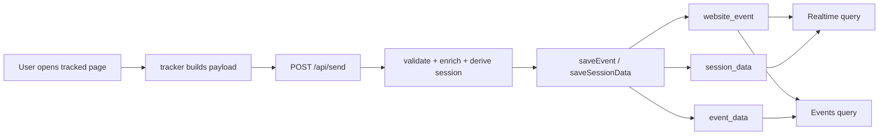
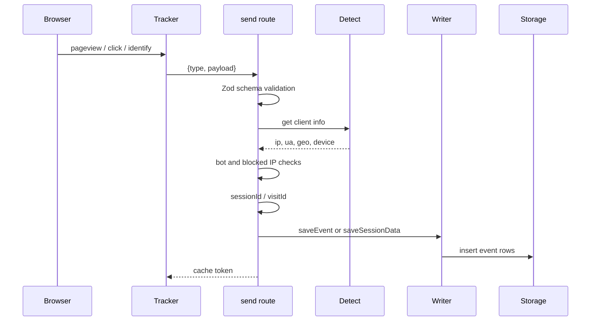
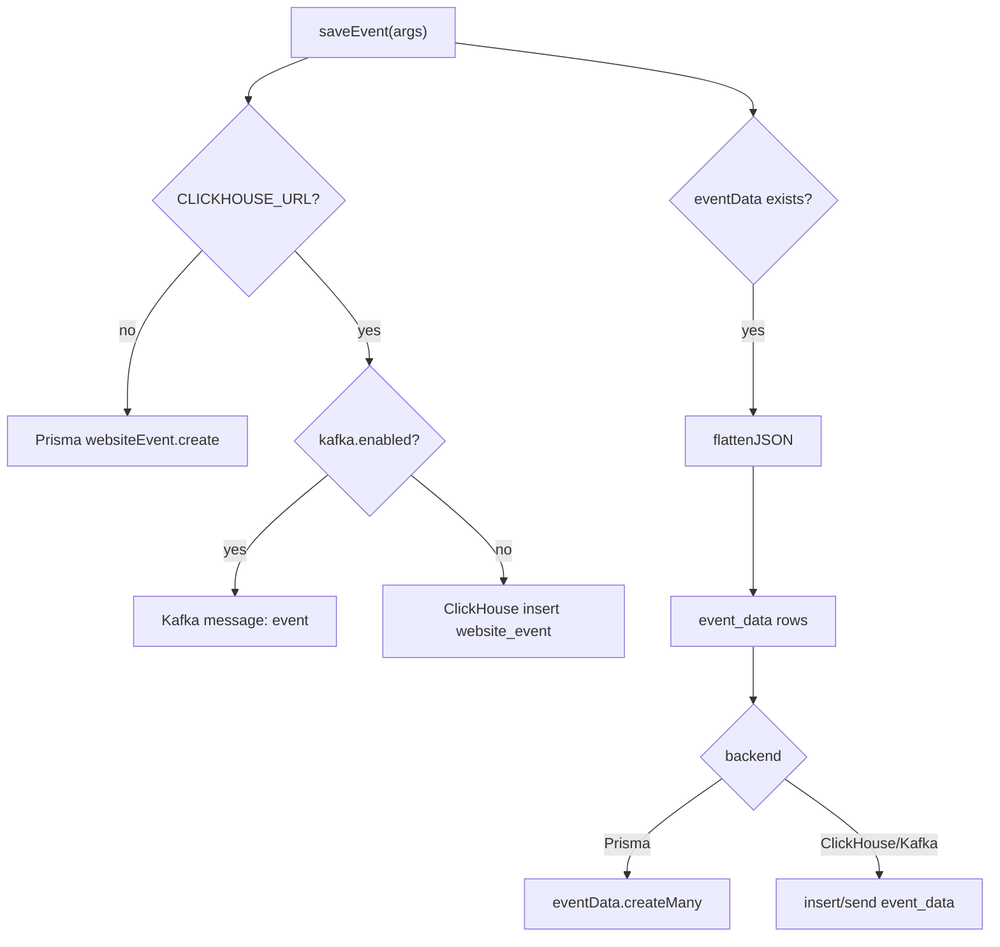
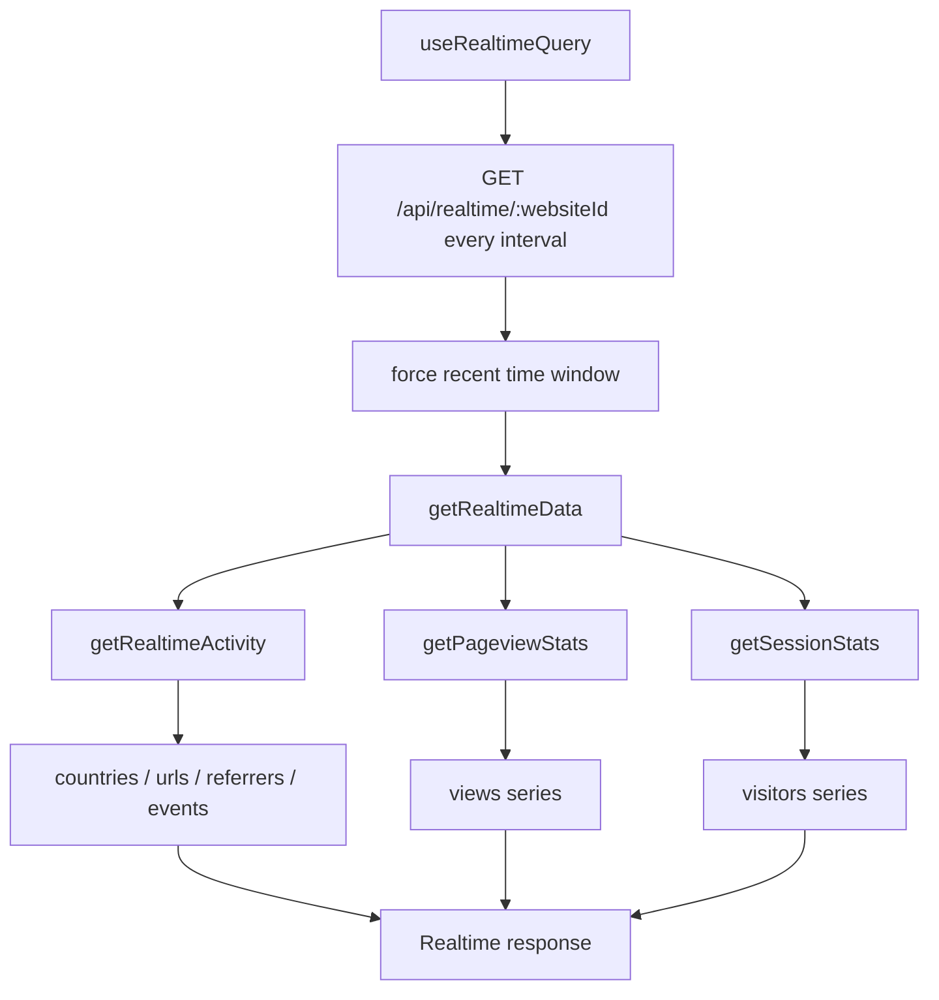
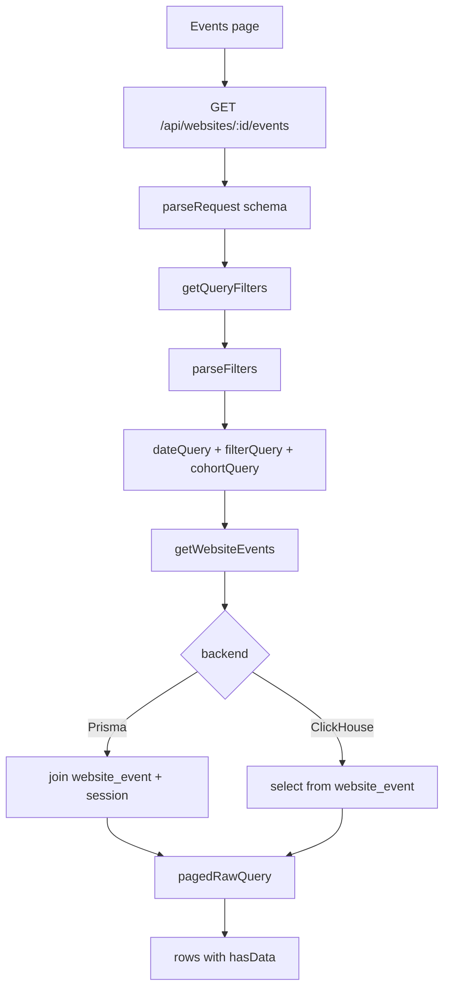
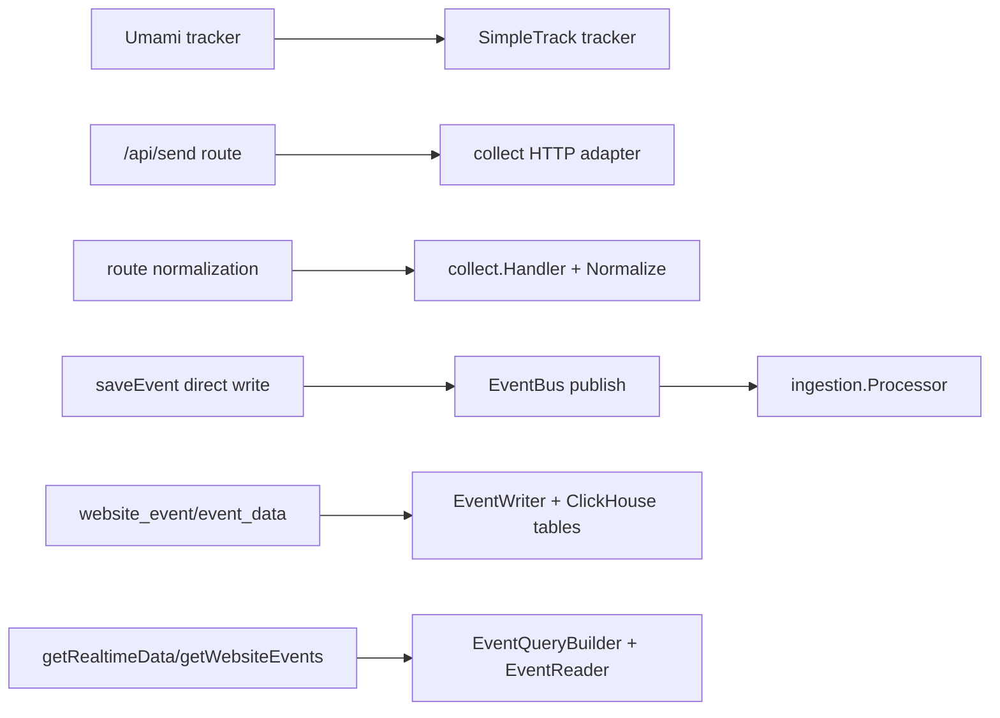

# 09-时序图与数据流图集

## 结论

本章把前面章节的数据点和处理动作收束成图，便于在 SimpleTrack P1 评审、研发拆解和 `analytics-core` 接口设计时直接引用。

## 图 1：端到端数据流

## 图 2：Collect 服务端时序

## 图 3：写入分支

## 图 4：Realtime 查询

## 图 5：Events 查询

## 图 6：Umami 到 analytics-core 对照数据流

## 数据点覆盖表

| 数据点 | 图中位置 |
| --- | --- |
| tracker payload | 图 1、图 2 |
| collection type | 图 2 |
| cache token | 图 2 |
| sessionId / visitId | 图 2 |
| URL/referrer/UTM/click IDs | 图 2、图 3 |
| eventData/sessionData | 图 1、图 3 |
| website_event/event_data/session_data | 图 1、图 3 |
| query filters | 图 5 |
| realtime response | 图 4 |

## 给 SimpleTrack 的启发

这些图可以直接进入 SimpleTrack P1 技术方案和 docs/quickstart：用户侧讲图 1，研发侧讲图 2 到图 5，架构评审讲图 6。

## 给 analytics-core 的启发

图 6 是最重要的边界图：Umami 的 route 内部步骤需要拆进 `collect`、EventBus、ingestion、storage、query builder。实现时每条箭头都应该对应一个可测试接口或函数。

