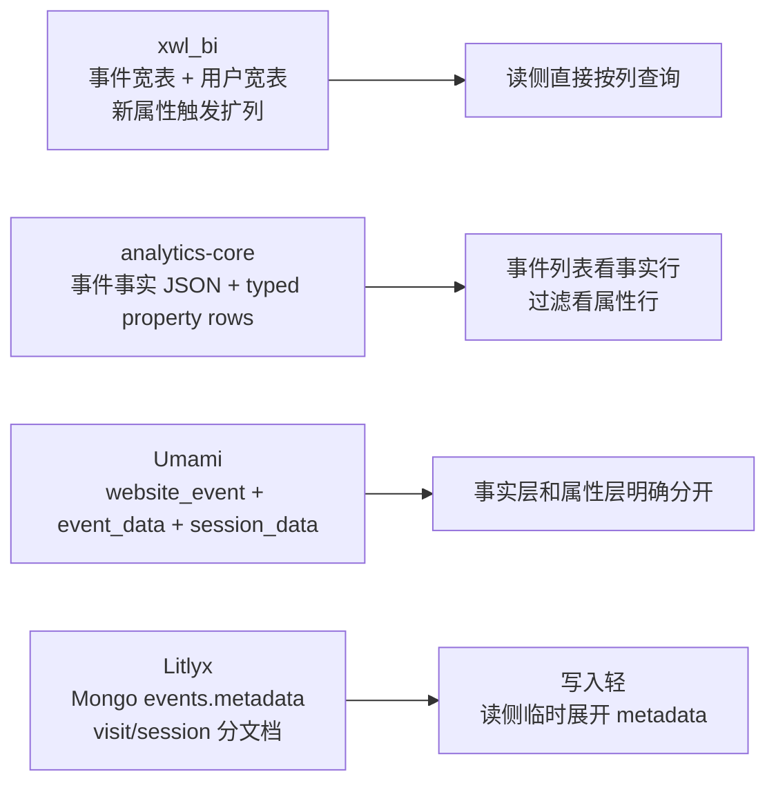
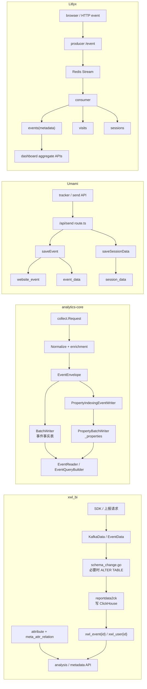
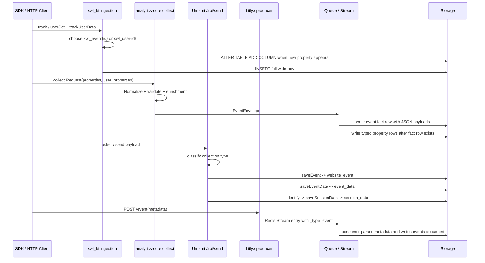
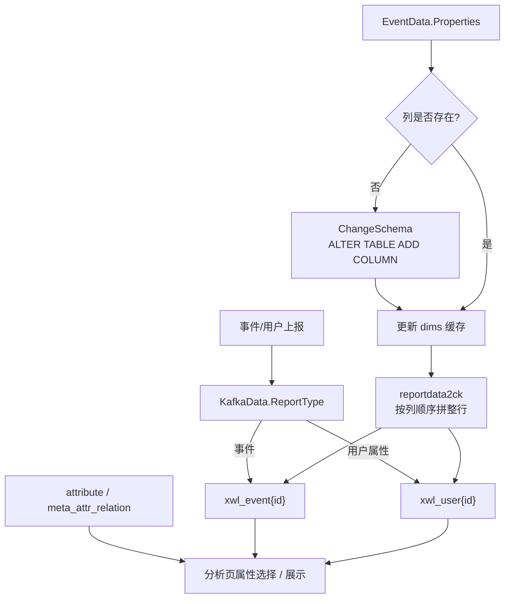
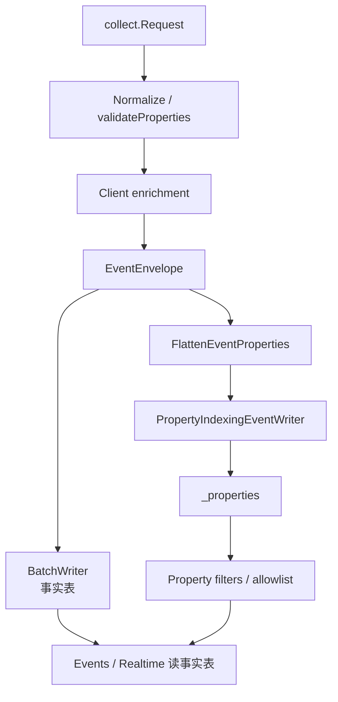
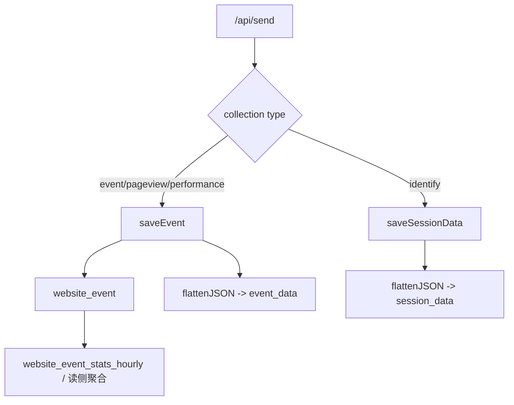
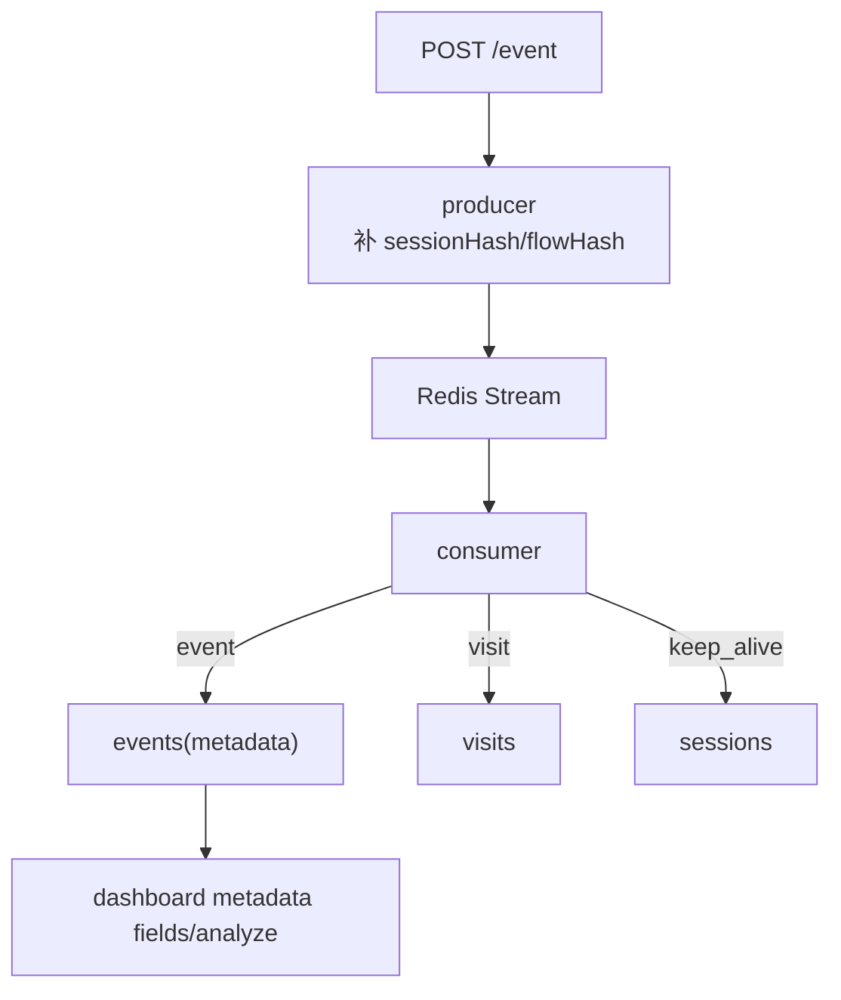

# analytics-core、xwl_bi、Umami、Litlyx 事件与属性存储方案对比

> 目标：把四套实现放在同一张桌子上，只回答“事件、事件属性、用户属性到底该怎么存”这个问题，并给出 SimpleTrack / `analytics-core` 当前最稳的落点。

## 一句话结论

这四套方案本质上是四种不同的取舍：

- `xwl_bi`：宽表扩列模型。事件表和用户表分开，属性第一次出现时直接扩 ClickHouse 列。
- `analytics-core`：混合模型。事件事实行保留原始属性 JSON，同时再写一份 typed property rows。
- Umami：事实表 + KV 行模型。`website_event` 负责事件事实，`event_data` / `session_data` 负责动态属性。
- Litlyx：文档模型。事件 metadata 直接内嵌在 Mongo 文档里，读侧再临时拆 key/value。

如果只问“SimpleTrack 现在应该选哪条主线”，结论是：

**继续走 `analytics-core` 现在的混合模型最稳，不要退回 `xwl_bi` 式首写扩列，也不要退化成 Litlyx 式纯 metadata 文档。**

## 证据边界

- 文档性质：源码调研与决策建议，不等同于已确认的实施决策库状态变更；如果后续正式采用这里的结论，需要同步更新 `simpletrack/docs/实施决策/`
- `analytics-core` 引用基于子仓库 HEAD `1ea78f36a5381abe718d5024486c5ec6fadf95c5`
- `xwl_bi` 引用基于本地参考快照来源 commit `90636d80def26cf6eb1f53e0cba2c415835b6973`
- Umami 引用基于只读快照 `references/umami/`，来源 commit `c78ff36db0c82e13c86e5073020472c6546313a3`
- Litlyx 引用基于上游仓库 commit `3881c67b9350ce96f630d69a0e7bf1f49ac95876`；本轮源码曾临时解压到 `.tmp/litlyx-source/`，该目录不作为长期入库资产，文中的 Litlyx `file:` 均按上游仓库内相对路径书写
- 所有源码 `file:` 路径和行号都以对应 commit / 快照为准；未来上游路径调整时，应先检出对应 commit 复验，不要直接套用当前 HEAD 行号
- 最后复验：`2026-05-10`

## 先看四种模型的本质差别



## 同一个事件在四套系统里会变成什么

假设业务侧输入是：

```json
{
  "event_name": "signup_clicked",
  "distinct_id": "user_42",
  "properties": {
    "button": "hero",
    "plan": "pro"
  },
  "user_properties": {
    "role": "founder"
  }
}
```

### xwl_bi

- 事件进入 `xwl_event{appid}`，`button`、`plan` 会变成真正的表列
- 用户属性进入 `xwl_user{appid}`，`role` 也会变成真正的表列
- 如果列还不存在，写入前会触发 `ALTER TABLE ... ADD COLUMN IF NOT EXISTS`

源码证据：仓库: `xwl_bi`, commit: `90636d80def26cf6eb1f53e0cba2c415835b6973`, file: `platform-basic-libs/service/app/app_service.go:71-124`; 仓库: `xwl_bi`, commit: `90636d80def26cf6eb1f53e0cba2c415835b6973`, file: `platform-basic-libs/sinker/schema_change.go:16-72`; 仓库: `xwl_bi`, commit: `90636d80def26cf6eb1f53e0cba2c415835b6973`, file: `model/event_data.go:55-83`

### analytics-core

- 事件事实行保留 `properties` / `user_properties` 两个序列化字段
- 同时把属性展开成 typed rows：`(event, button, string, hero)`、`(event, plan, string, pro)`、`(user, role, string, founder)`

源码证据：仓库: `analytics-core`, commit: `1ea78f36a5381abe718d5024486c5ec6fadf95c5`, file: `contracts/event.go:5-20`; 仓库: `analytics-core`, commit: `1ea78f36a5381abe718d5024486c5ec6fadf95c5`, file: `storage/property.go:105-248`; 仓库: `analytics-core`, commit: `1ea78f36a5381abe718d5024486c5ec6fadf95c5`, file: `storage/clickhouse/schema.go:14-50`

### Umami

- `website_event` 只保留事件骨架
- 事件属性拆进 `event_data`
- identify / session 上下文拆进 `session_data`

但要注意：Umami 没有“跟着每个事件一起提交的 `user_properties` 属性袋”，更接近“事件属性”和“identify/session 属性”两条写入分支。源码证据：仓库: `umami`, commit: `c78ff36db0c82e13c86e5073020472c6546313a3`, file: `src/app/api/send/route.ts:217-280`; 仓库: `umami`, commit: `c78ff36db0c82e13c86e5073020472c6546313a3`, file: `prisma/schema.prisma:99-194`

### Litlyx

- `events` 文档直接保存 `metadata`
- `visits` / `sessions` 负责访问和会话维度
- 没有独立 typed property rows，也没有首写扩列

源码证据：仓库: `litlyx`, commit: `3881c67b9350ce96f630d69a0e7bf1f49ac95876`, file: `producer/src/index.ts:27-48`; 仓库: `litlyx`, commit: `3881c67b9350ce96f630d69a0e7bf1f49ac95876`, file: `consumer/src/index.ts:181-200`; 仓库: `litlyx`, commit: `3881c67b9350ce96f630d69a0e7bf1f49ac95876`, file: `shared_global/schema/metrics/EventSchema.ts:13-23`

## 四套方案的核心差异表

| 维度 | xwl_bi | analytics-core | Umami | Litlyx |
| --- | --- | --- | --- | --- |
| 事件事实层 | `xwl_event{appid}` 宽表 | 事件事实表，保留 `properties` / `user_properties` JSON | `website_event` | `events` 文档 |
| 事件属性层 | 直接扩事件表列 | typed property rows，`property_scope=event` | `event_data` typed KV | `events.metadata` 内嵌对象 |
| 用户属性层 | `xwl_user{appid}` 宽表 | typed property rows，`property_scope=user`，暂未独立 profile 表 | `session_data`，更像 session/identify KV | 本轮证据未见独立 analytics user-property 表 |
| schema 演化 | 首写扩列 | 固定事实表 + 固定属性行 schema | 固定事实表 + 固定 KV schema | 文档天然灵活，读侧再适配 |
| 查询方式 | 直接按列查 | 事件列表读事实表，属性过滤读 `_properties` | 事件列表读事实表，属性分析读 `event_data` / `session_data` | Mongo 聚合按 `$metadata.field` / `$objectToArray`，并重度依赖文档扫描与动态聚合 |
| 治理抓手 | `attribute`、`meta_attr_relation` 元数据表 | collect 校验 + property allowlist | flatten + typed rows，但字段治理仍要另做 | 主要靠读侧发现 metadata 字段 |
| 主要风险 | 虽然按 app 隔离了物理表，但不受控的新属性仍会把 ClickHouse 的 DDL / mutation 压力前置到写入链路，命名漂移还会直接污染该租户表的物理结构，并把元数据压力推向集群 | 双写一致性、属性索引重试语义；事实表和 `_properties` 之间可能出现部分成功，需要重试与幂等兜底 | 事件属性和 session 属性需要边界清晰 | 缺少列式存储优势，复杂查询的聚合计算和索引成本被整体推迟到读侧 |

## 证据

### 1. xwl_bi 是“宽表扩列”

- 事件表 `xwl_event{tableId}` 和用户表 `xwl_user{tableId}` 是两张独立表。源码证据：仓库: `xwl_bi`, commit: `90636d80def26cf6eb1f53e0cba2c415835b6973`, file: `platform-basic-libs/service/app/app_service.go:71-124`
- `EventData.Properties` 是一个通用 map，但真正落库时会按当前表字段顺序取值。源码证据：仓库: `xwl_bi`, commit: `90636d80def26cf6eb1f53e0cba2c415835b6973`, file: `model/event_data.go:55-83`; 仓库: `xwl_bi`, commit: `90636d80def26cf6eb1f53e0cba2c415835b6973`, file: `platform-basic-libs/service/consumer_data/reportdata2ck.go:125-147`
- 新字段会触发 `ALTER TABLE ... ADD COLUMN IF NOT EXISTS`。源码证据：仓库: `xwl_bi`, commit: `90636d80def26cf6eb1f53e0cba2c415835b6973`, file: `platform-basic-libs/sinker/schema_change.go:16-72`
- 元数据治理依赖 `attribute` 和 `meta_attr_relation`。源码证据：仓库: `xwl_bi`, commit: `90636d80def26cf6eb1f53e0cba2c415835b6973`, file: `platform-basic-libs/service/meta_data/meta_data.go:139-180`; 仓库: `xwl_bi`, commit: `90636d80def26cf6eb1f53e0cba2c415835b6973`, file: `platform-basic-libs/service/meta_data/meta_data.go:262-279`; 仓库: `xwl_bi`, commit: `90636d80def26cf6eb1f53e0cba2c415835b6973`, file: `platform-basic-libs/service/analysis/behavior_analysis_service.go:19-66`
- SDK 使用上也明确区分“事件属性”和“用户属性上报”，`userSet()` 后必须再 `trackUserData()`。源码证据：仓库: `xwl_bi`, commit: `90636d80def26cf6eb1f53e0cba2c415835b6973`, file: `docs/implementation_guide.md:33-62`; 仓库: `xwl_bi`, commit: `90636d80def26cf6eb1f53e0cba2c415835b6973`, file: `docs/implementation_guide.md:80-121`; 仓库: `xwl_bi`, commit: `90636d80def26cf6eb1f53e0cba2c415835b6973`, file: `docs/implementation_guide.md:171-177`

### 2. analytics-core 是“事件事实 JSON + typed property rows”

- collect 协议一开始就显式区分 `properties` 和 `user_properties`。源码证据：仓库: `analytics-core`, commit: `1ea78f36a5381abe718d5024486c5ec6fadf95c5`, file: `collect/request.go:57-72`; 仓库: `analytics-core`, commit: `1ea78f36a5381abe718d5024486c5ec6fadf95c5`, file: `collect/request.go:131-166`
- enrich 阶段会把 browser / os / device / geo 等派生维度写回事件属性，但只存 IP hash，不存原始 IP。源码证据：仓库: `analytics-core`, commit: `1ea78f36a5381abe718d5024486c5ec6fadf95c5`, file: `collect/enrichment.go:11-21`; 仓库: `analytics-core`, commit: `1ea78f36a5381abe718d5024486c5ec6fadf95c5`, file: `collect/enrichment.go:83-140`
- `FlattenEventProperties` 会先展平 event scope，再展平 user scope，并给每条属性记录一个 typed slot。源码证据：仓库: `analytics-core`, commit: `1ea78f36a5381abe718d5024486c5ec6fadf95c5`, file: `storage/property.go:16-65`; 仓库: `analytics-core`, commit: `1ea78f36a5381abe718d5024486c5ec6fadf95c5`, file: `storage/property.go:105-248`
- ClickHouse 事实表保留 `properties` / `user_properties` 两个 `String` 列，同时存在独立 `_properties` 表。源码证据：仓库: `analytics-core`, commit: `1ea78f36a5381abe718d5024486c5ec6fadf95c5`, file: `storage/clickhouse/schema.go:9-29`; 仓库: `analytics-core`, commit: `1ea78f36a5381abe718d5024486c5ec6fadf95c5`, file: `storage/clickhouse/schema.go:31-89`
- typed property rows 通过独立 `PropertyBatchWriter` 写入，并按 tenant/project/source 路由。源码证据：仓库: `analytics-core`, commit: `1ea78f36a5381abe718d5024486c5ec6fadf95c5`, file: `storage/clickhouse/property_writer.go:16-87`; 仓库: `analytics-core`, commit: `1ea78f36a5381abe718d5024486c5ec6fadf95c5`, file: `storage/clickhouse/property_writer.go:117-179`
- Events 读侧属性过滤不是 JSON 提取，而是走 `_properties` 子查询，并且受 allowlist 限制。源码证据：仓库: `analytics-core`, commit: `1ea78f36a5381abe718d5024486c5ec6fadf95c5`, file: `storage/event_query.go:67-181`; 仓库: `analytics-core`, commit: `1ea78f36a5381abe718d5024486c5ec6fadf95c5`, file: `storage/clickhouse/query_builder.go:86-129`; 仓库: `analytics-core`, commit: `1ea78f36a5381abe718d5024486c5ec6fadf95c5`, file: `storage/clickhouse/query_builder.go:340-394`; 仓库: `analytics-core`, commit: `1ea78f36a5381abe718d5024486c5ec6fadf95c5`, file: `storage/clickhouse/query_builder.go:467-487`; 仓库: `analytics-core`, commit: `1ea78f36a5381abe718d5024486c5ec6fadf95c5`, file: `storage/clickhouse/query_builder.go:670-681`

### 3. Umami 是“事实表 + 事件属性行 + session 属性行”

- `website_event`、`event_data`、`session_data` 三层在 Prisma 和 ClickHouse schema 里都是显式存在的。源码证据：仓库: `umami`, commit: `c78ff36db0c82e13c86e5073020472c6546313a3`, file: `prisma/schema.prisma:99-194`; 仓库: `umami`, commit: `c78ff36db0c82e13c86e5073020472c6546313a3`, file: `db/clickhouse/schema.sql:2-91`
- collect 入口按 `saveEvent` 和 `saveSessionData` 分流。源码证据：仓库: `umami`, commit: `c78ff36db0c82e13c86e5073020472c6546313a3`, file: `src/app/api/send/route.ts:217-280`
- 嵌套属性通过 `flattenJSON` 展平成 dot-key，再写 `event_data` / `session_data`。源码证据：仓库: `umami`, commit: `c78ff36db0c82e13c86e5073020472c6546313a3`, file: `src/lib/data.ts:4-24`; 仓库: `umami`, commit: `c78ff36db0c82e13c86e5073020472c6546313a3`, file: `src/queries/sql/events/saveEventData.ts:27-79`; 仓库: `umami`, commit: `c78ff36db0c82e13c86e5073020472c6546313a3`, file: `src/queries/sql/sessions/saveSessionData.ts:25-104`

### 4. Litlyx 是“事件文档内嵌 metadata”

- README 直接把 `metadata` 暴露为事件 payload 的一部分。源码证据：仓库: `litlyx`, commit: `3881c67b9350ce96f630d69a0e7bf1f49ac95876`, file: `README.md:70-103`
- Producer 只补 `sessionHash` / `flowHash` 后写流，不拆 metadata。源码证据：仓库: `litlyx`, commit: `3881c67b9350ce96f630d69a0e7bf1f49ac95876`, file: `producer/src/index.ts:27-48`; 仓库: `litlyx`, commit: `3881c67b9350ce96f630d69a0e7bf1f49ac95876`, file: `producer/src/utils.ts:10-21`
- Consumer 解析 metadata 后直接写 `EventModel.metadata`。源码证据：仓库: `litlyx`, commit: `3881c67b9350ce96f630d69a0e7bf1f49ac95876`, file: `consumer/src/index.ts:181-200`; 仓库: `litlyx`, commit: `3881c67b9350ce96f630d69a0e7bf1f49ac95876`, file: `shared_global/schema/metrics/EventSchema.ts:13-23`
- metadata 字段发现和分析主要靠 Mongo 聚合。源码证据：仓库: `litlyx`, commit: `3881c67b9350ce96f630d69a0e7bf1f49ac95876`, file: `dashboard/server/api/data/event_metadata_fields.ts:15-36`; 仓库: `litlyx`, commit: `3881c67b9350ce96f630d69a0e7bf1f49ac95876`, file: `dashboard/server/api/data/event_metadata_analyze.ts:16-35`

## 推论

### 推论 1：xwl_bi 解决的是“业务分析列尽快可查”，代价是 schema 漂移直接进入物理表

证据已经很明确：它把 `attribute` 元数据治理和 `ALTER TABLE ADD COLUMN` 绑在同一条主线上。对“单租户、字段比较稳定、报表更像宽表 BI”很有效；但对今天的 SimpleTrack 来说，这会把早期命名波动直接转成 ClickHouse 表结构波动。

### 推论 2：analytics-core 当前模型在架构折中上实现了更优的平衡，同时避开两边最大的坑

- 兼容 Umami：事实层和属性层分开
- 兼容 xwl_bi：保留“事件属性”和“用户属性”两个 scope，以及后续做 catalog / allowlist 的可能
- 避开 xwl_bi：不让“第一次见到字段”直接改物理表
- 避开 Litlyx：通过 typed property rows 保住查询性能和类型安全，不把海量数据的动态解析与聚合压力整体推迟到读侧

### 推论 3：Litlyx 更像“产品验证友好型模型”，不是“强治理分析面模型”

它非常适合快速看到 Product / Raw Events 的结果，但如果继续往稳定的 property filters、event dictionary、projection / MV 优化走，就迟早要补 typed property 中间层。

## 未知和边界

- Litlyx 仓库其他业务域可能存在用户、订阅、工作区对象，但在本轮读取的 analytics ingestion path 里，没有看到独立的 analytics user-property 表。
- Umami 的 `session_data` 更像 session/identify 上下文层，不等同于完整用户画像系统。
- `analytics-core` 目前已经有 typed property rows 和 allowlist，但“属性目录 / 事件属性关系 / 产品化管理界面”还没有像 `xwl_bi` 那样完整落地。

## 对 SimpleTrack / analytics-core 的决策建议

### 1. 主线保持 `analytics-core` 现有混合模型

理由：

- 事件事实表保留 JSON，有利于 Raw Events / debug / 追溯
- typed property rows 支撑 Realtime / Events / Filters / Breakdown 的长期读侧
- 不需要首写扩列，也不需要把所有属性问题都压给读侧 JSON 解析

### 2. 不采用 `xwl_bi` 式“首写即扩列”作为默认写入策略

可以借鉴它的元数据治理思路，但不要借鉴它的物理 schema 演化策略。更合适的做法是：

- 先把属性落成 typed rows
- 再基于稳定 query pattern 决定哪些属性值得做 projection / MV / 小范围结构化加速

### 3. 继续强化 `analytics-core` 的 property governance

优先级建议：

1. collect 阶段继续收紧 key/value 合同
2. 在读侧继续坚持 allowlist
3. 后续补“属性目录 + 事件属性关系”的治理层
4. 等 query pattern 稳定后，再决定是否把少数高频维度前移成专门优化结构

### 4. 借鉴 Umami 的边界，不借它的单体实现

Umami 最值得借鉴的是“事件事实 vs 事件属性 vs session/identify 属性”的分层，不是 Next.js route 里直写库的应用结构。

### 5. 借鉴 Litlyx 的首屏体验，不借它的最终数据面

可以借它“接入后尽快看到 Product / Raw Events 结果”的产品策略，但不要把 `metadata: Mixed` 当成最终存储答案。

## 延伸阅读

- Umami 单点分析：[umami/docs/事件与属性存储模型源码分析.md](./umami/docs/事件与属性存储模型源码分析.md)
- Litlyx 单点分析：[litlyx/docs/事件与属性存储模型源码分析.md](./litlyx/docs/事件与属性存储模型源码分析.md)

## 附录：按架构、代码结构、数据点和数据流继续拆开看

这一节不是再重复前面的结论，而是按你给的“软件过程 / 数据流分析”框架，把四套实现拆得更工程一点。

## 统一输入样例

为了把四套方案讲清楚，后面都用同一个业务语义来对照：

```json
{
  "event_name": "signup_clicked",
  "distinct_id": "user_42",
  "properties": {
    "button": "hero",
    "plan": "pro"
  },
  "user_properties": {
    "role": "founder"
  }
}
```

但要先注意一个边界：

- 在 `analytics-core` 里，这个 payload 可以一次性同时包含 `properties` 和 `user_properties`
- 在 `xwl_bi` 里，“事件属性”和“用户属性”通常不是一条上报同时完成，而是 `track(...)` 和 `userSet() + trackUserData()` 分两步
- 在 Umami 里，“事件属性”和 identify / session 属性也不是同一条写入分支
- 在 Litlyx 里，本轮可见的主模型里没有独立 `user_properties` ingestion path，只有 `metadata`、`visits`、`sessions`

## 四套方案的整体架构速览



## 典型写入时序图



## xwl_bi：宽表扩列方案的完整样子

### 1. 模块和周边服务

从本轮能直接读到的源码看，`xwl_bi` 的事件存储主线大致是：

1. 上报请求先被整理成 `KafkaData` / `EventData`
2. `ReportType` 决定本次要落到 `xwl_event{id}` 还是 `xwl_user{id}`
3. 如果事件里出现了表中还没有的属性列，就先走 `ChangeSchema`
4. 再由 `reportdata2ck` 按当前表结构顺序把整行写进 ClickHouse
5. 读侧再结合 `attribute`、`meta_attr_relation` 去做属性展示、事件属性选择和分析页面配置

这不是“只有 ClickHouse 表”这么简单，它其实是：

- ClickHouse 负责物理存储
- MySQL 元数据表负责“哪些字段可见、属于事件还是用户、和哪个事件有关”

源码证据：仓库: `xwl_bi`, commit: `90636d80def26cf6eb1f53e0cba2c415835b6973`, file: `model/event_data.go:14-41`; 仓库: `xwl_bi`, commit: `90636d80def26cf6eb1f53e0cba2c415835b6973`, file: `platform-basic-libs/service/app/app_service.go:71-124`; 仓库: `xwl_bi`, commit: `90636d80def26cf6eb1f53e0cba2c415835b6973`, file: `platform-basic-libs/sinker/schema_change.go:16-72`; 仓库: `xwl_bi`, commit: `90636d80def26cf6eb1f53e0cba2c415835b6973`, file: `platform-basic-libs/service/meta_data/meta_data.go:139-180`

### 2. 关键代码结构

| 文件 | 职责 |
| --- | --- |
| `platform-basic-libs/service/app/app_service.go` | 新 app 建表，创建 `xwl_event{id}` 和 `xwl_user{id}` |
| `model/event_data.go` | 定义 `KafkaData`、`EventData`、`ReportType` 和物理表名选择 |
| `platform-basic-libs/sinker/schema_change.go` | 新属性首次出现时的动态扩列 |
| `platform-basic-libs/service/consumer_data/reportdata2ck.go` | 按当前列缓存顺序把数据拼成整行并写 ClickHouse |
| `platform-basic-libs/service/meta_data/meta_data.go` | 管理属性元数据、事件属性关系、分析侧可选项 |
| `platform-basic-libs/service/analysis/behavior_analysis_service.go` | 把事件属性 / 用户属性按分析页面需求组织出来 |
| `docs/implementation_guide.md` | SDK 侧对“事件属性”和“用户属性”的产品使用方式说明 |

### 3. 关键数据点

| 数据点 | 定义位置 | 类型 | 用途 |
| --- | --- | --- | --- |
| `KafkaData.ReportType` | `model/event_data.go:19` | int | 决定写事件表还是用户表 |
| `KafkaData.GetTableName()` | `model/event_data.go:29-41` | function | 把 `ReportType + TableId` 映射到 `xwl_event{id}` / `xwl_user{id}` |
| `EventData.Properties` | `model/event_data.go:55-83` | `map[string]interface{}` | 上报前的开放属性袋 |
| `attribute.attribute_source` | `docs/implementation_guide.md:33-35` | enum | `1=用户属性`, `2=事件属性` |
| `meta_attr_relation.event_attr` | `meta_data.go:174-180`, `226-279` | relation row | 描述某个事件允许 / 关联哪些事件属性 |
| `xwl_event{id}` 固定列 | `app_service.go:74-99` | ClickHouse columns | 系统内置事件维度，如 `xwl_part_event`、`xwl_ip`、`xwl_city` |
| `xwl_user{id}` 固定列 | `app_service.go:110-124` | ClickHouse columns | 用户侧基础维度，如 `xwl_distinct_id`、`xwl_update_time` |

### 4. 主要处理动作

| 动作 | 涉及数据点 | 数据如何变化 |
| --- | --- | --- |
| 初始建表 | `xwl_event{id}`、`xwl_user{id}` | 先建系统固定列 |
| 首次见到新属性 | `EventData.Properties`、`ChangeSchema` | 把 map 里的新 key 变成真实列 |
| 类型决定 | `ChangeSchema` | 第一次出现时把业务类型映射成 ClickHouse 类型 |
| 整行写入 | `reportdata2ck` | 按当前 dims 顺序把一整条事件转成一整行 |
| 元数据治理 | `attribute`、`meta_attr_relation` | 给读侧定义“这是事件属性还是用户属性、是否显示、属于哪个事件” |
| 分析侧查询 | `behavior_analysis_service.go` | 直接对 `xwl_event{id}` / `xwl_user{id}` 的列做查询 |

### 5. 数据流图



### 6. 用简单数据示例把它讲透

如果你在 `xwl_bi` 里上报事件：

```json
{
  "event_name": "signup_clicked",
  "properties": {
    "button": "hero",
    "plan": "pro"
  }
}
```

第一次上报时更接近下面这个过程：

1. `xwl_event{id}` 里已经有系统列，比如 `xwl_part_event`
2. 发现 `button`、`plan` 这两个列还不存在
3. 先做：

```sql
ALTER TABLE xwl_event{id} ADD COLUMN IF NOT EXISTS button String
ALTER TABLE xwl_event{id} ADD COLUMN IF NOT EXISTS plan String
```

4. 再写一整行：

| xwl_part_event | button | plan | xwl_distinct_id | ... |
| --- | --- | --- | --- | --- |
| `signup_clicked` | `hero` | `pro` | `user_42` | ... |

如果用户属性是：

```json
{
  "role": "founder"
}
```

它通常会在 `userSet()` 后，再通过 `trackUserData()` 进 `xwl_user{id}`，最终像这样：

| xwl_distinct_id | role | xwl_update_time | ... |
| --- | --- | --- | --- |
| `user_42` | `founder` | `2026-05-09 19:00:00` | ... |

源码证据：仓库: `xwl_bi`, commit: `90636d80def26cf6eb1f53e0cba2c415835b6973`, file: `docs/implementation_guide.md:80-121`; 仓库: `xwl_bi`, commit: `90636d80def26cf6eb1f53e0cba2c415835b6973`, file: `docs/implementation_guide.md:171-177`

### 7. 优点、缺点、以及怎么用别的方案补它

| 项目 | 结论 | 可以借谁来补 |
| --- | --- | --- |
| 优点 | 直接按列查，分析 SQL 心智负担低 | 不需要补 |
| 优点 | 事件属性、用户属性分得非常直观 | 不需要补 |
| 缺点 | 首写扩列会把长尾字段和命名漂移直接变成物理表漂移 | 借 `analytics-core` / Umami 的 typed-row 思路承接长尾属性 |
| 缺点 | 第一次上报就决定类型，后续纠错成本高 | 借 `analytics-core` 的 collect 合同校验先收紧输入 |
| 缺点 | 多租户高频 DDL 压力大 | 借 Umami / `analytics-core` 的固定 schema + 行索引思路 |

## analytics-core：混合模型的完整样子

### 1. 模块和周边服务

`analytics-core` 的存储主线比 `xwl_bi` 更分层：

1. collect 输入先进入 `Request`
2. `Normalize` 验证 `properties` / `user_properties`
3. enrichment 阶段按需补 browser / os / device / geo 等派生事件属性
4. `EventEnvelope` 进入主事件写入
5. 主事件写入把原始 `properties` / `user_properties` 序列化成 JSON 字符串写入事实表
6. 属性索引写入再把同一份事件展开成 typed property rows
7. 读侧 `EventQueryBuilder` 再通过 `_properties` 表做 allowlisted 属性过滤

源码证据：仓库: `analytics-core`, commit: `1ea78f36a5381abe718d5024486c5ec6fadf95c5`, file: `collect/request.go:57-72`; 仓库: `analytics-core`, commit: `1ea78f36a5381abe718d5024486c5ec6fadf95c5`, file: `collect/request.go:88-166`; 仓库: `analytics-core`, commit: `1ea78f36a5381abe718d5024486c5ec6fadf95c5`, file: `collect/enrichment.go:61-140`; 仓库: `analytics-core`, commit: `1ea78f36a5381abe718d5024486c5ec6fadf95c5`, file: `storage/clickhouse/batch_writer.go:194-233`; 仓库: `analytics-core`, commit: `1ea78f36a5381abe718d5024486c5ec6fadf95c5`, file: `storage/property_indexing_writer.go:11-93`

### 2. 关键代码结构

| 文件 | 职责 |
| --- | --- |
| `contracts/event.go` | 统一事件信封 `EventEnvelope` |
| `collect/request.go` | collect 协议、输入验证、`properties` / `user_properties` 合同 |
| `collect/enrichment.go` | 补派生事件属性，如 `client.browser`、`geo.country` |
| `storage/property.go` | 把事件属性 / 用户属性展平成 typed rows |
| `storage/clickhouse/schema.go` | 事件事实表和 `_properties` 表 DDL |
| `storage/clickhouse/batch_writer.go` | 主事件事实行写入 |
| `storage/property_indexing_writer.go` | 事件写入成功后再做属性索引 |
| `storage/clickhouse/property_writer.go` | `_properties` 表批量写入 |
| `storage/event_query.go` + `storage/clickhouse/query_builder.go` | 读侧 allowlist 属性过滤和查询证据 |

### 3. 关键数据点

| 数据点 | 定义位置 | 类型 | 用途 |
| --- | --- | --- | --- |
| `Request.Properties` | `collect/request.go:68` | `map[string]any` | 事件属性输入 |
| `Request.UserProps` | `collect/request.go:69` | `map[string]any` | 用户属性输入 |
| `validateProperties(...)` | `collect/request.go:244-266` | function | 在 collect 边界限制属性数量、key、value 类型 |
| `EventEnvelope.Properties` / `UserProps` | `contracts/event.go:18-19` | map | 统一传到后续存储边界 |
| `EventPropertyRecord.Scope` | `storage/property.go:59-65` | enum-like string | 区分 `event` 和 `user` |
| `properties` / `user_properties` 列 | `schema.go:26-27` | String | 事实表里的原始 JSON 载荷 |
| `_properties.property_scope` | `schema.go:44-49` | String + typed slots | 读侧属性过滤索引 |
| `AllowedPropertySelectors` | `event_query.go:110-125` | allowlist config | 防止无限制属性过滤 |

### 4. 主要处理动作

| 动作 | 涉及数据点 | 数据如何变化 |
| --- | --- | --- |
| collect 校验 | `Request.Properties`、`Request.UserProps` | 先保证是有边界的 scalar property bag |
| enrichment | `envelope.Properties` | 可额外补 `client.browser`、`geo.city` 等生成属性 |
| 事实表写入 | `eventInsertValues(...)` | 把 `properties` / `user_properties` 序列化成 JSON 字符串 |
| typed row 展平 | `FlattenEventProperties(...)` | 把 event/user 两个 scope 变成一行一个属性 |
| 属性索引写入 | `PropertyBatchWriter` | 写到 `_properties` 表 |
| 读侧属性过滤 | `buildPropertyFilterPredicate(...)` | 按 `property_scope + property_name + typed slot` 做过滤 |

### 5. 数据流图



### 6. 用简单数据示例把它讲透

同样是：

```json
{
  "event_name": "signup_clicked",
  "properties": {
    "button": "hero",
    "plan": "pro"
  },
  "user_properties": {
    "role": "founder"
  }
}
```

在 `analytics-core` 里会同时留下两层结果。

第一层，事件事实表一行：

| event_name | properties | user_properties | distinct_id | ... |
| --- | --- | --- | --- | --- |
| `signup_clicked` | `{"button":"hero","plan":"pro"}` | `{"role":"founder"}` | `user_42` | ... |

第二层，`_properties` 表三行：

| event_name | property_scope | property_name | property_type | string_value |
| --- | --- | --- | --- | --- |
| `signup_clicked` | `event` | `button` | `string` | `hero` |
| `signup_clicked` | `event` | `plan` | `string` | `pro` |
| `signup_clicked` | `user` | `role` | `string` | `founder` |

所以它不是“只存行，不存事件本体”，而是：

- **事实行保留原貌**
- **属性行负责查询**

源码证据：仓库: `analytics-core`, commit: `1ea78f36a5381abe718d5024486c5ec6fadf95c5`, file: `storage/clickhouse/batch_writer.go:194-233`; 仓库: `analytics-core`, commit: `1ea78f36a5381abe718d5024486c5ec6fadf95c5`, file: `storage/property.go:105-248`; 仓库: `analytics-core`, commit: `1ea78f36a5381abe718d5024486c5ec6fadf95c5`, file: `storage/clickhouse/property_writer.go:139-159`

### 7. 优点、缺点、以及怎么用别的方案补它

| 项目 | 结论 | 可以借谁来补 |
| --- | --- | --- |
| 优点 | 事实表和属性索引两层都保留了 | 不需要补 |
| 优点 | 不需要首写扩列，长尾属性更安全 | 不需要补 |
| 优点 | allowlist + typed slot 更适合长期做 Filters / Breakdown | 不需要补 |
| 缺点 | ClickHouse 不提供跨表事务，事件事实行和 `_properties` 属性索引存在部分成功风险；如果事实写入成功、属性写入失败，就会出现“事件存在但按属性搜不到”的漏索状态 | 依赖 EventBus 至少一次重试、属性写入 guard、幂等去重和补偿修复；再借 Umami 的“明确层级”和 `xwl_bi` 的“属性目录”思路把治理做强 |
| 缺点 | 目前还没有像 `xwl_bi` 那样完整的属性目录 / 事件属性关系产品面 | 借 `xwl_bi` 的 `attribute + meta_attr_relation` 设计补治理 |
| 缺点 | 用户属性目前还是“随事件进入的 user scope”，不是独立 profile 主模型 | 借 Umami 的 session/identify 边界定义继续收紧语义 |

## Umami：事实表 + 事件属性行 + session 属性行

### 1. 模块和周边服务

Umami 的事件存储主线非常清楚：

1. tracker 或 HTTP payload 进 `/api/send`
2. route 根据 collection type 决定写 `saveEvent` 还是 `saveSessionData`
3. `saveEvent` 负责 `website_event`，并在有 `eventData` 时继续写 `event_data`
4. `saveSessionData` 负责 `session_data`
5. ClickHouse 再在 `website_event` 之上维护小时聚合

源码证据：仓库: `umami`, commit: `c78ff36db0c82e13c86e5073020472c6546313a3`, file: `src/app/api/send/route.ts:217-280`; 仓库: `umami`, commit: `c78ff36db0c82e13c86e5073020472c6546313a3`, file: `src/queries/sql/events/saveEvent.ts:72-168`; 仓库: `umami`, commit: `c78ff36db0c82e13c86e5073020472c6546313a3`, file: `src/queries/sql/events/saveEvent.ts:170-276`; 仓库: `umami`, commit: `c78ff36db0c82e13c86e5073020472c6546313a3`, file: `db/clickhouse/schema.sql:93-170`

### 2. 关键代码结构

| 文件 | 职责 |
| --- | --- |
| `src/app/api/send/route.ts` | collect 入口、type 分流 |
| `src/lib/data.ts` | `flattenJSON`，把嵌套对象展平成 dot-key |
| `src/queries/sql/events/saveEvent.ts` | 写事件事实层 |
| `src/queries/sql/events/saveEventData.ts` | 写事件属性层 |
| `src/queries/sql/sessions/saveSessionData.ts` | 写 identify / session 属性层 |
| `prisma/schema.prisma` | Postgres 关系模型 |
| `db/clickhouse/schema.sql` | ClickHouse 事实层、属性层、聚合层 |

### 3. 关键数据点

| 数据点 | 定义位置 | 类型 | 用途 |
| --- | --- | --- | --- |
| `eventType` | `route.ts:217-223` | enum-like int | 区分 pageview / custom event / link / pixel |
| `eventData` | `saveEvent.ts:86`, `143-152` | object | 事件动态属性 |
| `sessionData` | `saveSessionData.ts:10-16` | object | identify / session 属性 |
| `EventData.dataKey` | `prisma/schema.prisma:156` | string | 展平后的属性名 |
| `SessionData.distinctId` | `prisma/schema.prisma:183` | string | 把 identify 和 session 挂起来 |
| `website_event_stats_hourly` | `schema.sql:94-170` | aggregated table | 后续查询优化 |

### 4. 主要处理动作

| 动作 | 涉及数据点 | 数据如何变化 |
| --- | --- | --- |
| type 分流 | `eventType` / `COLLECTION_TYPE` | 决定走事件写入还是 identify 写入 |
| flatten | `eventData` / `sessionData` | 嵌套对象变 dot-key + typed value |
| 事件事实写入 | `website_event` | 保留事件骨架和上下文 |
| 事件属性写入 | `event_data` | 一次事件变多条属性行 |
| session 属性写入 | `session_data` | 更像 session/identify KV |
| 聚合层维护 | `website_event_stats_hourly` | 在事实层之上做更快查询 |

### 5. 数据流图



### 6. 用简单数据示例把它讲透

如果用户点了 `signup_clicked`，同时又做了 identify：

- 事件本身进入 `website_event`
- `button`、`plan` 进 `event_data`
- `role=founder` 这种 identify 上下文进 `session_data`

这和 `analytics-core` 的一个关键区别是：

- `analytics-core` 的 `user_properties` 可以和事件一起作为统一 envelope 进入
- Umami 更像“事件属性”和“identify/session 属性”两条分开的产品语义

### 7. 优点、缺点、以及怎么用别的方案补它

| 项目 | 结论 | 可以借谁来补 |
| --- | --- | --- |
| 优点 | 事实层、事件属性层、session 属性层边界非常清楚 | 不需要补 |
| 优点 | 对 Events、Breakdown、Revenue 这类读侧非常友好 | 不需要补 |
| 缺点 | identify 属性更像 session 上下文，不是完整用户画像 | 可借 `analytics-core` 的 user scope 或未来独立 profile 设计 |
| 缺点 | 仍然需要额外的字段治理层 | 可借 `xwl_bi` 的属性目录思路 |
| 缺点 | 写入路径是单体应用式分发，不适合原样搬到 `analytics-core` | `analytics-core` 自己已有更适合的 EventBus / storage 分层 |

## Litlyx：文档内嵌 metadata 的方案

### 1. 模块和周边服务

Litlyx 这条线是：

1. 浏览器或 HTTP 请求打到 producer `/event`
2. producer 只补 `sessionHash` / `flowHash`，写 Redis Stream
3. consumer 再按 `_type` 分发成 `event`、`visit`、`keep_alive`
4. 最终进 Mongo `events`、`visits`、`sessions`
5. dashboard API 再用聚合管道分析 `metadata`

源码证据：仓库: `litlyx`, commit: `3881c67b9350ce96f630d69a0e7bf1f49ac95876`, file: `producer/src/index.ts:27-48`; 仓库: `litlyx`, commit: `3881c67b9350ce96f630d69a0e7bf1f49ac95876`, file: `consumer/src/index.ts:55-200`; 仓库: `litlyx`, commit: `3881c67b9350ce96f630d69a0e7bf1f49ac95876`, file: `dashboard/server/api/data/event_metadata_fields.ts:15-36`; 仓库: `litlyx`, commit: `3881c67b9350ce96f630d69a0e7bf1f49ac95876`, file: `dashboard/server/api/data/event_metadata_analyze.ts:16-35`

### 2. 关键代码结构

| 文件 | 职责 |
| --- | --- |
| `producer/src/index.ts` | 接事件、算 hash、写 stream |
| `producer/src/utils.ts` | 生成 `sessionHash` / `flowHash` |
| `consumer/src/index.ts` | 分流 `event` / `visit` / `keep_alive` 并写 Mongo |
| `shared_global/schema/metrics/EventSchema.ts` | `events` 文档结构 |
| `shared_global/schema/metrics/VisitSchema.ts` | `visits` 文档结构 |
| `shared_global/schema/metrics/SessionSchema.ts` | `sessions` 文档结构 |
| `dashboard/server/api/data/event_metadata_fields.ts` | 枚举 metadata 里有哪些 key |
| `dashboard/server/api/data/event_metadata_analyze.ts` | 对单个 metadata 字段做聚合分析 |

### 3. 关键数据点

| 数据点 | 定义位置 | 类型 | 用途 |
| --- | --- | --- | --- |
| `metadata` | `README.md:75-103` | JSON string in payload | 上报时的事件上下文 |
| `sessionHash` | `producer/src/utils.ts:10-15` | derived string | 会话归属 |
| `flowHash` | `producer/src/utils.ts:17-21` | derived string | 行为流归属 |
| `EventSchema.metadata` | `EventSchema.ts:16` | `Schema.Types.Mixed` | 事件文档里的动态属性 |
| `VisitSchema.utm_*` | `VisitSchema.ts:47-51` | strings | 流量来源维度 |
| `SessionSchema.duration` | `SessionSchema.ts:19` | number | 会话停留时长 |

### 4. 主要处理动作

| 动作 | 涉及数据点 | 数据如何变化 |
| --- | --- | --- |
| producer 预处理 | `sessionHash`、`flowHash` | 给事件补会话 / 流信息 |
| event 落库 | `metadata` | 直接 parse 成对象后写 `events` |
| visit 落库 | `utm_*`、geo、page | 访问维度单独写 `visits` |
| keep_alive 落库 | `duration` | 用 `upsert` 持续累加 session 时长 |
| metadata 字段发现 | `$objectToArray` | 读侧动态找出 metadata keys |
| metadata 分析 | `$metadata.<field>` | 读侧动态按字段聚合 |

### 5. 数据流图



### 6. 用简单数据示例把它讲透

同样是：

```json
{
  "name": "signup_clicked",
  "metadata": "{\"button\":\"hero\",\"plan\":\"pro\"}"
}
```

在 Litlyx 里最接近：

```json
{
  "name": "signup_clicked",
  "metadata": {
    "button": "hero",
    "plan": "pro"
  },
  "session": "md5(...)",
  "flowHash": "md5(...)",
  "website": "demo.example"
}
```

所以它不是“先拆索引再存”，而是“先把完整文档存下来，读的时候再拆”。

### 7. 优点、缺点、以及怎么用别的方案补它

| 项目 | 结论 | 可以借谁来补 |
| --- | --- | --- |
| 优点 | 写入最轻，早期接入门槛低 | 不需要补 |
| 优点 | 很适合先验证 Product / Raw Events 是否跑通 | 不需要补 |
| 缺点 | metadata 治理滞后 | 借 `xwl_bi` 的属性目录和 `analytics-core` 的 allowlist |
| 缺点 | 复杂分析依赖读侧动态聚合 | 借 Umami / `analytics-core` 的 typed row 索引层 |
| 缺点 | 当前主模型里没有独立 user-property 主线 | 可借 Umami 的 session/identify 分层或 `analytics-core` 的 user scope |

## 最后把四套方案真正放到一张决策表里

### 如果只追求“最快看到数据”

优先级：

1. Litlyx
2. Umami
3. `analytics-core`
4. `xwl_bi`

原因很简单：

- Litlyx 最少 schema 负担
- Umami 已经把事件和属性拆开，但心智仍然清晰
- `analytics-core` 额外多了 typed row 和 allowlist 治理
- `xwl_bi` 在早期就要承受 schema 决策和 DDL 成本

### 如果追求“长期做稳定分析产品”

优先级：

1. `analytics-core`
2. Umami
3. `xwl_bi`
4. Litlyx

原因是：

- `analytics-core` 目前最平衡：既保留事实原貌，又为后续分析预留 typed row
- Umami 在事件 / 属性 / session 分层上非常成熟，但它的应用边界不适合直接搬
- `xwl_bi` 适合固定字段比较多的 BI 宽表体系，不适合长尾属性很多的 SaaS
- Litlyx 很适合早期验证，但不是长期数据面的终局

### 对 SimpleTrack 的最终建议

建议分成三层采纳：

1. **主存储骨架继续保持 `analytics-core` 当前混合模型**
   - 事件事实表保留 JSON
   - typed property rows 负责查询

2. **治理层借 `xwl_bi`**
   - 做属性目录
   - 做事件属性关系
   - 做 source-scoped allowlist / suggestion

3. **用户属性边界借 Umami**
   - 明确哪些是“随事件进入的 user scope”
   - 哪些应该演进成独立 profile / identify / session 模型

4. **接入体验借 Litlyx**
   - 先让用户最快看到“数据进来了”
   - 再把治理、过滤、字典逐层打开

一句话收口：

**不要退回 `xwl_bi` 式首写扩列，不要停在 Litlyx 式纯 metadata 文档；继续把 `analytics-core` 做成“事实原貌 + typed property index + 治理层”的三段式，会更稳。**
