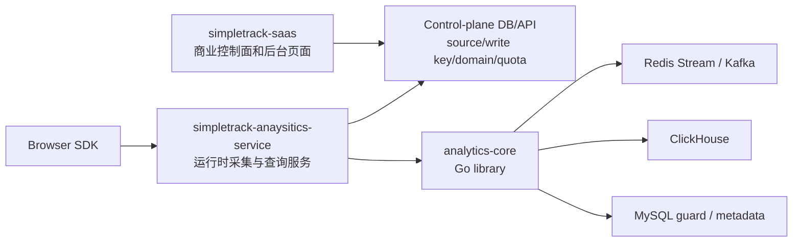

# SimpleTrack 分析服务职责边界

> 状态：已确定
> 最近更新：2026-05-07
> 作用：明确 `simpletrack-saas`、`simpletrack-anaysitics-service` 和 `analytics-core` 的职责边界，避免控制面与数据面重复建设。

## 结论

SimpleTrack 后端分成三层：

1. `simpletrack-saas` 是商业控制面和产品后台。
2. `simpletrack-anaysitics-service` 是分析数据面的运行时服务。
3. `analytics-core` 是业务无关 Go 第三方库。

`analytics-core` 不作为独立业务服务运行，也不托管 Browser SDK。`simpletrack-anaysitics-service` 通过 Go module 引用 `analytics-core` 的根目录公共包，并负责把 SimpleTrack 的运行时配置映射到通用分析核心。

## 架构关系



## `simpletrack-saas` 负责什么

`simpletrack-saas` 继续承接 Supastarter 已提供的商业控制面能力：

- 用户登录、组织、成员和权限页面。
- 套餐、订阅、支付入口和 subscription gate。
- Website / Source 创建、展示和管理。
- write key 生成、轮换、禁用和展示。
- domain allowlist、internal traffic 规则、quota / plan limit 等配置的管理页面。
- Realtime、Events、Websites、Goal 等产品后台页面。

它不接收高频事件，不直接写 ClickHouse 明细事件，也不复制 ingestion worker。

## `simpletrack-anaysitics-service` 负责什么

`simpletrack-anaysitics-service` 是运行时数据面服务，负责执行已经由控制面产生的配置：

- `GET /healthz`：进程健康检查。
- `GET /tracker.js`：托管 P1 Browser SDK 静态资产。
- `OPTIONS /collect`：浏览器 CORS preflight。
- `POST /collect`：事件上报入口。
- 根据 `write_key` 读取 runtime source config。
- 可用本地 `MemoryResolver` 或 SaaS 控制面 HTTP resolver 读取 runtime source config；HTTP resolver 只读、带 bearer token、短 TTL 缓存并通过 `ETag` / `If-None-Match` 条件重验证可变授权状态，不提供配置 CRUD，默认要求 HTTPS，本地 loopback HTTP 必须显式 opt-in。
- 执行 source enabled、Origin/domain allowlist、CORS、internal traffic、bot 过滤。
- 使用控制面提供的 server-only `session_salt`、`visit_salt`、`visit_window_seconds` 和 `client_hash_salt` 做匿名 session、canonical visit key 和 client hash 派生，不允许从公开 write key 派生隐私 salt。
- 不信任客户端传来的 `tenant_id`、`project_id`、`source_id`、`source_type`，统一由控制面配置覆盖。
- 把 SimpleTrack 的 workspace/site/source 映射为 `analytics-core` 的 `tenant_id/project_id/source_id`。
- 调用 `analytics-core` 的 collect pipeline、EventBus、ingestion、storage、query 能力。
- 显式开启后运行同进程 ingestion worker，消费 Redis Stream，并复用 MySQL checkpoint guard、ClickHouse native writer 和 typed property indexing；启动时默认校验已启用 source 的 ClickHouse event/property 表存在，本地/小部署可显式开启 ClickHouse auto migrate 创建当前 runtime config 内所有启用 source 的 routed tables 后再继续。

它不创建站点，不邀请成员，不处理购买套餐，不提供 Admin 页面，不拥有配置生命周期。

## `analytics-core` 负责什么

`analytics-core` 是 Go 第三方库，外部服务通过根目录公共包引用：

```go
import "github.com/simpletrack/analytics-core/collect"
import "github.com/simpletrack/analytics-core/eventbus/redisstream"
import "github.com/simpletrack/analytics-core/storage"
```

它负责：

- collect 请求标准化和字段校验。
- session resolver、visit resolver、client enrichment、bot/internal traffic filter 等可测试 stage。
- EventBus 抽象与 Redis Stream / Kafka adapter。
- ingestion processor。
- ClickHouse writer、table router、query builder、event reader。
- 事件属性和用户属性的 typed row 展开、写入和过滤边界。

它不负责：

- SimpleTrack 用户、组织、套餐、订阅、账单、权限。
- write key 生命周期和配置管理页面。
- Browser SDK 托管。
- 产品后台页面。
- 独立 `cmd/server` 业务服务。

## 配置权责

配置的 CRUD 在 `simpletrack-saas`，配置的 runtime enforcement 在 `simpletrack-anaysitics-service`。

| 配置项 | 创建/修改方 | 运行时执行方 |
| --- | --- | --- |
| Source / Website | `simpletrack-saas` | `simpletrack-anaysitics-service` |
| write key | `simpletrack-saas` | `simpletrack-anaysitics-service` |
| domain allowlist | `simpletrack-saas` | `simpletrack-anaysitics-service` |
| internal traffic rules | `simpletrack-saas` | `simpletrack-anaysitics-service` |
| server-only privacy salts | `simpletrack-saas` | `simpletrack-anaysitics-service` |
| visit window | `simpletrack-saas` | `simpletrack-anaysitics-service` |
| quota / plan limit | `simpletrack-saas` | `simpletrack-anaysitics-service` |
| collect validation / queue / storage | `analytics-core` library | `simpletrack-anaysitics-service` 调用 |

## 当前落地状态

- `src/analytics-core` 已调整为根目录公共 Go 包形态，Browser SDK 已从 core 移出。
- `src/analytics-service` 已创建本地 Go 仓库，服务展示名为 `simpletrack-anaysitics-service`；当前提供 `/healthz`、`/tracker.js`、`OPTIONS /collect`、`POST /collect`，并可显式开启同进程 ingestion worker。
- 初版 `MemoryResolver` 只用于本地开发和测试；HTTP resolver 已接入 `simpletrack-saas` 的内部 runtime-source API，默认 HTTPS 且 fail-closed；缓存命中也会用控制面返回的 `ETag` 条件重验证，避免 disabled/source salt/origin/visit window 变更被本地 TTL 陈旧态掩盖；同进程 ingestion 下 HTTP 返回 source 仍受启动 `ANALYTICS_SERVICE_SOURCES_JSON` schema surface 约束，后续需要继续完善 quota、domain allowlist、internal traffic 和 salt 轮换策略。
- ClickHouse per-source event/property table schema 自动创建已提供本地/小部署开关；当前默认仍做启动就绪校验，生产级 schema 管理和回滚进入后续 runtime migration / schema 管理任务。
- Events / Realtime 查询 HTTP API 已进入 `P1-005D`，当前以 `/v1/realtime` 和 `/v1/events` 的内部 bearer-token 读回放形式落地，并补齐浏览器/SaaS 页面调用需要的 `OPTIONS` preflight；`simpletrack-saas` 页面已通过 server-side readback helper 和 client-safe Website selector 初版接入，内部 query token 不暴露到浏览器，Events 现在还能在服务端补 `event_name`、`distinct_id`、`visit_id`、`limit`、`offset`、`sort_field`、`sort_direction` 白名单与分页；`simpletrack-anaysitics-service` 已支持 query token 短窗口轮换 allowlist、结构化 `id/not_before/expires_at` 生命周期元数据，并把 source runtime config 的 `allowed_property_filters` 映射到 typed property filters；运行时会拒绝过期或未生效 token，并对轮换命中和拒绝场景打审计日志；`visit_id` 现在由写入链路持久化，读侧直接读取存储字段；后续继续补更复杂的查询筛选交互。
